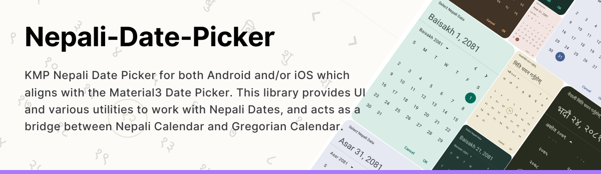

# Nepali Date Picker - Swift Package Manager (iOS, macOS engine)

<p align="center">
  
</p>

A **Bikram Sambat (Nepali) date picker** for iOS, plus a headless **BS ↔ AD conversion, comparison
and formatting engine** for iOS and macOS. The pickers are the same Material3-aligned Compose
Multiplatform UI that ships to Android, hosted inside a `UIViewController` so SwiftUI and UIKit can
embed them directly.

<p align="center">
  <a href="https://github.com/shivathapaa/Nepali-Date-Picker-SPM/releases">
    </a>&nbsp;
  <a href="https://github.com/shivathapaa/Nepali-Date-Picker/blob/main/LICENSE">
    </a>&nbsp;
  <a href="https://shivathapaa.github.io/Nepali-Date-Picker/api/">
    </a>
</p>

> **Where the code lives.** The library is developed in
> [shivathapaa/Nepali-Date-Picker](https://github.com/shivathapaa/Nepali-Date-Picker). The Swift
> package is published to [shivathapaa/Nepali-Date-Picker-SPM](https://github.com/shivathapaa/Nepali-Date-Picker-SPM),
> which carries only a `Package.swift` and the release assets. Both are regenerated automatically on
> every release, so open issues and pull requests against the main repository.

> **Other platforms.** The same calendar tables power
> [`nepali_calendar_utils`](https://github.com/shivathapaa/nepali_calendar_utils) on PyPI and
> [`@nepali-date-picker/core`](https://www.npmjs.com/package/@nepali-date-picker/core) /
> [`@nepali-date-picker/web-component`](https://www.npmjs.com/package/@nepali-date-picker/web-component)
> on npm, so results match across Swift, Kotlin, Python and JavaScript. Their guides are the
> [main README](https://github.com/shivathapaa/Nepali-Date-Picker/blob/main/README.md) for Kotlin
> Multiplatform and Android, and
> [README-js.md](https://github.com/shivathapaa/Nepali-Date-Picker/blob/main/README-js.md) for the
> web.

<br>

<details>
  <summary><b>Table of Contents</b></summary>

* [Requirements](#requirements)
* [Which product to pick](#which-product-to-pick)
* [Installation](#installation)
* [Required Xcode configuration](#required-xcode-configuration)
* [Swift naming conventions](#swift-naming-conventions)
* [Part 1 - The pickers](#part-1---the-pickers)
    * [How hosting works](#how-hosting-works)
    * [Step 1 - paste the support file](#step-1---paste-the-support-file)
    * [Step 2 - paste the representables](#step-2---paste-the-representables)
    * [Sizing](#sizing)
    * [Options](#options)
    * [What cannot cross the bridge](#what-cannot-cross-the-bridge)
    * [Calendar picker](#calendar-picker)
    * [Range picker](#range-picker)
    * [Docked picker](#docked-picker)
    * [Wheel picker](#wheel-picker)
    * [Dialogs](#dialogs)
    * [Typed entry fields](#typed-entry-fields)
    * [Picker state](#picker-state)
    * [Defaults](#defaults)
    * [Restricting selectable dates](#restricting-selectable-dates)
    * [Localization and appearance](#localization-and-appearance)
* [Part 2 - The engine](#part-2---the-engine)
    * [Types](#types)
    * [Enums](#enums)
    * [Today and current time](#today-and-current-time)
    * [Conversion](#conversion)
    * [Month and day counts](#month-and-day-counts)
    * [Arithmetic](#arithmetic)
    * [Compare and count between](#compare-and-count-between)
    * [Names](#names)
    * [Formatting a date](#formatting-a-date)
    * [Formatting time](#formatting-time)
    * [ISO 8601](#iso-8601)
    * [Digits](#digits)
    * [Working days and holidays](#working-days-and-holidays)
    * [NepaliCalendarModel](#nepalicalendarmodel)
    * [Calendar tables](#calendar-tables)
* [Troubleshooting](#troubleshooting)
* [Sample app](#sample-app)
* [Support](#support)
* [License](#license)
</details>

<br>

## Requirements

| | |
| --- | --- |
| Minimum deployment target | iOS 14, macOS 12 (engine only) |
| Architectures, `nepali-date-picker` | `ios-arm64` (device), `ios-arm64-simulator` (Apple silicon) |
| Architectures, `nepali-date-picker-core` | the same two, plus `macos-arm64` |
| Swift tools | 5.5+ |
| Supported range | BS **1970–2100**, AD **1913–2043** |

The archives ship **arm64 only**. There is no `x86_64` simulator slice, so an Intel Mac, or an
Apple silicon Mac building for the Rosetta simulator, cannot link the framework. See
[Required Xcode configuration](#required-xcode-configuration).

> **macOS covers the engine, not the pickers.** `nepali-date-picker-core` carries a `macos-arm64`
> slice, so a macOS app gets the full conversion, comparison and formatting API. The pickers stay
> iOS-only: they are hosted in a `UIViewController`, and Compose Multiplatform publishes no
> embeddable AppKit host to mirror that on macOS. Building a macOS target against the
> `nepali-date-picker` product fails with `no library for this platform was found`. See
> [Troubleshooting](#troubleshooting).

> **Indexing (important).** Months and weekdays are **1-based**. Month `1` = Baisakh … `12` = Chaitra.
> Weekday `1` = Sunday … `7` = Saturday. `era`: `1` = AD, `2` = BS. The first day of the week is
> Sunday, and the default weekend in Nepal is Saturday only.

## Which product to pick

The package vends two products. **Depend on exactly one.**

| Product | Contains | Platforms | Swift import | Download |
| --- | --- | --- | --- | --- |
| `nepali-date-picker` | The Compose pickers **plus** the full conversion engine | iOS 14+ | `nepali_date_picker` | ~60 MB |
| `nepali-date-picker-core` | The conversion engine only, no UI | iOS 14+, macOS 12+ | `nepali_date_picker_core` | ~4 MB |

Pick `nepali-date-picker-core` when you build your own SwiftUI or UIKit interface and only need
BS ↔ AD conversion, month details, formatting and comparison. It is also the only product a
**macOS** target can link.

> **Never add both.** Unlike the Maven artifacts, where `-ui` depends on `-core` and a single copy
> lands on the classpath, each XCFramework is a self-contained static binary and the UI framework
> already embeds the core module. Linking both duplicates the Kotlin runtime and every core symbol.

Everything in [Part 2 - The engine](#part-2---the-engine) is available from **both** products. Only
[Part 1 - The pickers](#part-1---the-pickers) requires `nepali-date-picker`.

## Installation

In Xcode: **File → Add Package Dependencies…**, paste the repository URL, choose a version, then
pick one of the two library products.

```
https://github.com/shivathapaa/Nepali-Date-Picker-SPM.git
```

Or declare it in your own `Package.swift`:

```swift
dependencies: [
    .package(url: "https://github.com/shivathapaa/Nepali-Date-Picker-SPM.git", from: "3.1.2")
],
targets: [
    .target(
        name: "App",
        dependencies: [
            .product(name: "nepali-date-picker", package: "Nepali-Date-Picker-SPM")
            // or, for the engine alone:
            // .product(name: "nepali-date-picker-core", package: "Nepali-Date-Picker-SPM")
        ]
    )
]
```

Then import the module. Note the **underscores**: the module name is derived from the framework
binary, not from the product name.

```swift
import nepali_date_picker      // pickers + engine
// or
import nepali_date_picker_core // engine only
```

## Required Xcode configuration

Three settings are load-bearing. Without them the app fails to link, fails to compile, or crashes on
launch.

| Setting | Value | Why |
| --- | --- | --- |
| `EXCLUDED_ARCHS[sdk=iphonesimulator*]` | `x86_64` | The XCFramework has no Intel simulator slice, so the linker reports `found architecture 'arm64', required architecture 'x86_64'`. |
| `PRODUCT_MODULE_NAME` | anything not equal to `nepali_date_picker` ignoring case | Swift cannot disambiguate two modules whose names differ only by case on a case-insensitive file system. An app named "Nepali Date Picker" defaults to module `Nepali_Date_Picker` and fails with `cannot load module 'Nepali_Date_Picker' as 'nepali_date_picker'`. |
| `CADisableMinimumFrameDurationOnPhone` in `Info.plist` | `YES` | Compose Multiplatform aborts during launch through `PlistSanityCheck` if the key is missing. Only needed for the UI product. |

The plist key cannot be supplied through `INFOPLIST_KEY_…`, because that mechanism only forwards a
fixed set of known keys. With `GENERATE_INFOPLIST_FILE = YES`, point `INFOPLIST_FILE` at a partial
plist and Xcode merges its generated keys into it:

```xml
<?xml version="1.0" encoding="UTF-8"?>
<!DOCTYPE plist PUBLIC "-//Apple//DTD PLIST 1.0//EN" "http://www.apple.com/DTDs/PropertyList-1.0.dtd">
<plist version="1.0">
<dict>
	<key>CADisableMinimumFrameDurationOnPhone</key>
	<true/>
</dict>
</plist>
```

## Swift naming conventions

Kotlin declarations arrive through the Objective-C bridge, which renames a few things. These trip
people up:

| Kotlin | Swift | Note |
| --- | --- | --- |
| `NepaliDateConverter` (object) | `NepaliDateConverter.shared` | Every engine call goes through `.shared`. |
| `NameFormat.SHORT` | `NameFormat.short_` | `short` is a C keyword, so a `_` is appended. |
| `NepaliDateFormatStyle.LONG` | `NepaliDateFormatStyle.long_` | Same reason. |
| `Int` | `Int32` | Years, months and days are 32-bit on the bridge. |
| `IntRange` | `KotlinIntRange` | Read `.first` and `.last`; the picker factories take plain `Int32` bounds instead. |
| top-level functions | `<FileName>Kt.function(...)` | For example `NepaliDatePickerViewControllersKt`. |

Two engine functions are **deprecated** and warn; prefer the replacements:

| Deprecated | Use instead |
| --- | --- |
| `convertToNepaliNumber(_:)` | `localizeDigits(_:script:)` with `.devanagari` |
| `convertToEnglishNumber(_:)` | `toLatinDigits(_:)` |

Two more are **unavailable**, so referencing them fails to compile rather than warning:

| Unavailable | Use instead |
| --- | --- |
| `todayNepaliDate` | `todayNepaliSimpleDate` or `todayNepaliCalendar` |
| `todayEnglishDate` | `todayEnglishSimpleDate` or `todayEnglishCalendar` |

---

# Part 1 - The pickers

> Requires the `nepali-date-picker` product. Available from **3.1.1**.

## How hosting works

Compose `@Composable` functions cannot be called from Swift. The library therefore exposes one
factory per picker, each returning a `UIViewController` that hosts the Compose scene already wrapped
in `MaterialTheme` and a `Surface`.

Every factory is a top-level Kotlin function, so Swift reaches it through the file's generated class
(`NepaliDatePickerViewControllersKt` and friends). All eight share the same shape:

| Parameter | Type | Notes |
| --- | --- | --- |
| the initial value | `SimpleDate?` | Named per picker: `initialSelectedDate`, `initialDate`, `initialValue`, or the `initialSelectedStartDate` / `initialSelectedEndDate` pair. |
| `locale` | `NepaliDateLocale` | Required, no default across the bridge. See [Localization and appearance](#localization-and-appearance). |
| `yearRangeStart` / `yearRangeEnd` | `Int32` | Two plain bounds, not an `IntRange`. |
| `selectableDates` | `NepaliSelectableDates?` | `nil` allows every date. |
| `options` | one options class per picker, nullable | `nil` takes every library default. See [Options](#options). |
| `onHeightChange` | `(KotlinFloat) -> Void` | Content height in points. See [Sizing](#sizing). |
| the callback | closure | Fires on every change, including the initial value. |

> **`onHeightChange` hands you a boxed `KotlinFloat`, not a `Float`.** Kotlin function types box
> their primitive parameters on the Objective-C bridge. `KotlinFloat` is an `NSNumber` subclass, so
> convert with `CGFloat(truncating:)`. Plain `CGFloat($0)` resolves to the deprecated `NSNumber`
> initializer and warns.

The two dialogs add a `calendarOptions` before `options`, and the two field factories add a
`dateFormat` after `locale`.

Here are the exact Swift signatures, copied from the generated header:

```swift
NepaliDatePickerViewControllersKt.NepaliDatePickerViewController(
    initialSelectedDate:locale:yearRangeStart:yearRangeEnd:selectableDates:options:onHeightChange:onDateSelected:)

NepaliDatePickerViewControllersKt.NepaliDatePickerDockedViewController(
    initialSelectedDate:locale:yearRangeStart:yearRangeEnd:selectableDates:options:onHeightChange:onDateSelected:)

NepaliDatePickerViewControllersKt.NepaliWheelDatePickerViewController(
    initialDate:locale:yearRangeStart:yearRangeEnd:selectableDates:options:onHeightChange:onDateChange:)

NepaliDateRangeViewControllersKt.NepaliDateRangePickerViewController(
    initialSelectedStartDate:initialSelectedEndDate:locale:yearRangeStart:yearRangeEnd:selectableDates:options:onHeightChange:onRangeSelected:)

NepaliDateFieldViewControllersKt.NepaliDateFieldViewController(
    initialValue:locale:dateFormat:yearRangeStart:yearRangeEnd:selectableDates:options:onHeightChange:onValueChange:)

NepaliDateRangeViewControllersKt.NepaliDateRangeFieldViewController(
    initialStartValue:initialEndValue:locale:dateFormat:yearRangeStart:yearRangeEnd:selectableDates:options:onHeightChange:onRangeChange:)

NepaliDateDialogViewControllersKt.NepaliDatePickerDialogViewController(
    initialSelectedDate:locale:yearRangeStart:yearRangeEnd:selectableDates:calendarOptions:options:onHeightChange:onConfirm:onDismiss:)

NepaliDateDialogViewControllersKt.NepaliDatePickerFullScreenDialogViewController(
    initialSelectedDate:locale:yearRangeStart:yearRangeEnd:selectableDates:calendarOptions:options:onHeightChange:onConfirm:onDismiss:)
```

Kotlin default arguments do not survive the Objective-C bridge, so **every** argument has to be
written out at every call. That is what the two files below are for: paste them once and the rest of
this document becomes one-liners.

From UIKit, embed the controller directly instead:

```swift
let controller = NepaliDatePickerViewControllersKt.NepaliDatePickerViewController(
    initialSelectedDate: nil,
    locale: NepaliPickerDefaults.english,
    yearRangeStart: 1970,
    yearRangeEnd: 2100,
    selectableDates: nil,
    options: nil,
    onHeightChange: { [weak self] height in
        self?.applyHeight(CGFloat(truncating: height))
    },
    onDateSelected: { [weak self] selected in
        self?.apply(selected)
    }
)
addChild(controller)
view.addSubview(controller.view)
controller.didMove(toParent: self)
```

## Step 1 - paste the support file

`NepaliPickerSupport.swift`. Shared locales, the year range, and the container that sizes a hosted
picker to the height Compose reports.

```swift
import SwiftUI
import nepali_date_picker

/// Shared defaults so every screen agrees on the year range and locale.
enum NepaliPickerDefaults {
    static let yearRange: ClosedRange<Int32> = {
        let range = NepaliCalendarDefaults.shared.NepaliYearRange
        return range.first...range.last
    }()

    /// Corner radius for every typed field, in points. The Material default is nearly square, which
    /// reads as unfinished next to rounded SwiftUI controls.
    static let fieldCornerRadius: Float = 14

    static let english = NepaliDateLocale(
        language: .english,
        dateFormat: .long_,
        weekDayName: .short_,
        monthName: .full,
        digitScript: nil
    )

    static let nepali = NepaliDateLocale(
        language: .nepali,
        dateFormat: .long_,
        weekDayName: .short_,
        monthName: .full,
        digitScript: nil
    )

    /// Range headlines print both ends, which wraps badly at picker width. A numeric style keeps
    /// them on one line.
    static let englishRange = NepaliDateLocale(
        language: .english,
        dateFormat: .shortYmd,
        weekDayName: .short_,
        monthName: .full,
        digitScript: nil
    )
}

/// Sizes a hosted picker to the height Compose reports, instead of a guessed constant.
///
/// The hosted scene is always given `measurementHeight`, while the surrounding layout takes the
/// height Compose reports back. Keeping those two apart is the whole point: Compose measures inside
/// the frame it is given, so if the scene shrank with the layout, a report could never exceed the
/// current frame and the content would be trapped at its smallest size. Switching a picker to typed
/// input and back is exactly that case.
struct AutoSized<Content: View>: View {
    /// Height the scene is measured in. Generous enough for the tallest mode the picker can show.
    var measurementHeight: CGFloat = 420
    @ViewBuilder var content: (@escaping (CGFloat) -> Void) -> Content

    @State private var measured: CGFloat?

    var body: some View {
        content { reported in
            // Compose reports on every layout pass; ignore the noise.
            if measured == nil || abs(measured! - reported) > 0.5 { measured = reported }
        }
        .frame(height: measurementHeight, alignment: .top)
        .frame(height: measured ?? measurementHeight, alignment: .top)
        .clipped()
        // Clip the scene out of hit testing too, so the part hanging below the visible height
        // cannot swallow taps meant for whatever follows it.
        .contentShape(Rectangle())
        .clipShape(RoundedRectangle(cornerRadius: 12))
    }
}

extension CustomCalendar {
    /// The library's typed dates are separate structs, so drop the calendar detail when a plain
    /// year/month/day triple is all an API needs.
    var simple: SimpleDate { SimpleDate(year: year, month: month, dayOfMonth: dayOfMonth) }
}
```

## Step 2 - paste the representables

`NepaliPickerRepresentables.swift`. One thin `UIViewControllerRepresentable` per factory, every
argument filled in, every knob surfaced as a property with the library's own default. Paste the
whole file, or just the wrappers you need.

```swift
import SwiftUI
import nepali_date_picker

/// The full calendar picker, optionally paired with its Gregorian equivalent.
struct NepaliDatePickerView: UIViewControllerRepresentable {
    var onHeightChange: (CGFloat) -> Void = { _ in }
    var initialSelectedDate: SimpleDate?
    var locale: NepaliDateLocale = NepaliPickerDefaults.english
    var yearRange: ClosedRange<Int32> = NepaliPickerDefaults.yearRange
    var selectableDates: NepaliSelectableDates?
    var showModeToggle: Bool = true
    var showTodayButton: Bool = true
    var showEnglishDate: Bool = false
    var englishDateLocale: NepaliDateLocale?
    var onDateSelected: (CustomCalendar?) -> Void

    func makeUIViewController(context: Context) -> UIViewController {
        let options = NepaliCalendarOptions()
        options.showModeToggle = showModeToggle
        options.showTodayButton = showTodayButton
        options.showEnglishDate = showEnglishDate
        options.englishDateLocale = englishDateLocale

        return NepaliDatePickerViewControllersKt.NepaliDatePickerViewController(
            initialSelectedDate: initialSelectedDate,
            locale: locale,
            yearRangeStart: yearRange.lowerBound,
            yearRangeEnd: yearRange.upperBound,
            selectableDates: selectableDates,
            options: options,
            onHeightChange: { onHeightChange(CGFloat(truncating: $0)) },
            onDateSelected: onDateSelected
        )
    }

    func updateUIViewController(_ uiViewController: UIViewController, context: Context) {}
}

/// The range calendar, which tracks a start and an end date.
struct NepaliDateRangePickerView: UIViewControllerRepresentable {
    var onHeightChange: (CGFloat) -> Void = { _ in }
    var initialSelectedStartDate: SimpleDate?
    var initialSelectedEndDate: SimpleDate?
    var locale: NepaliDateLocale = NepaliPickerDefaults.englishRange
    var yearRange: ClosedRange<Int32> = NepaliPickerDefaults.yearRange
    var selectableDates: NepaliSelectableDates?
    var showModeToggle: Bool = true
    var showTodayButton: Bool = true
    var showMonthsVertically: Bool = true
    var showYearPickerAndMonthNavigation: Bool = true
    var showEnglishDate: Bool = false
    var englishDateLocale: NepaliDateLocale?
    var onRangeSelected: (CustomCalendar?, CustomCalendar?) -> Void

    func makeUIViewController(context: Context) -> UIViewController {
        let options = NepaliRangeCalendarOptions()
        options.showModeToggle = showModeToggle
        options.showTodayButton = showTodayButton
        options.showMonthsVertically = showMonthsVertically
        options.showYearPickerAndMonthNavigation = showYearPickerAndMonthNavigation
        options.showEnglishDate = showEnglishDate
        options.englishDateLocale = englishDateLocale

        return NepaliDateRangeViewControllersKt.NepaliDateRangePickerViewController(
            initialSelectedStartDate: initialSelectedStartDate,
            initialSelectedEndDate: initialSelectedEndDate,
            locale: locale,
            yearRangeStart: yearRange.lowerBound,
            yearRangeEnd: yearRange.upperBound,
            selectableDates: selectableDates,
            options: options,
            onHeightChange: { onHeightChange(CGFloat(truncating: $0)) },
            onRangeSelected: onRangeSelected
        )
    }

    func updateUIViewController(_ uiViewController: UIViewController, context: Context) {}
}

/// The compact field that opens the calendar in a popup.
struct NepaliDatePickerDockedView: UIViewControllerRepresentable {
    var onHeightChange: (CGFloat) -> Void = { _ in }
    var initialSelectedDate: SimpleDate?
    var locale: NepaliDateLocale = NepaliPickerDefaults.english
    var yearRange: ClosedRange<Int32> = NepaliPickerDefaults.yearRange
    var selectableDates: NepaliSelectableDates?
    var dateFormatStyle: NepaliDateFormatStyle = .medium
    var showTodayButton: Bool = true
    var label: String?
    var placeholder: String?
    var cornerRadius: Float = NepaliPickerDefaults.fieldCornerRadius
    var popupShadowElevation: Float = 6
    var onDateSelected: (CustomCalendar?) -> Void

    func makeUIViewController(context: Context) -> UIViewController {
        let options = NepaliDockedOptions()
        options.dateFormatStyle = dateFormatStyle
        options.showTodayButton = showTodayButton
        options.label = label
        options.placeholder = placeholder
        options.cornerRadius = cornerRadius
        options.popupShadowElevation = popupShadowElevation

        return NepaliDatePickerViewControllersKt.NepaliDatePickerDockedViewController(
            initialSelectedDate: initialSelectedDate,
            locale: locale,
            yearRangeStart: yearRange.lowerBound,
            yearRangeEnd: yearRange.upperBound,
            selectableDates: selectableDates,
            options: options,
            onHeightChange: { onHeightChange(CGFloat(truncating: $0)) },
            onDateSelected: onDateSelected
        )
    }

    func updateUIViewController(_ uiViewController: UIViewController, context: Context) {}
}

/// The scrolling year/month/day wheel. Always has a selection.
struct NepaliWheelDatePickerView: UIViewControllerRepresentable {
    var onHeightChange: (CGFloat) -> Void = { _ in }
    var initialDate: SimpleDate?
    var locale: NepaliDateLocale = NepaliPickerDefaults.english
    var yearRange: ClosedRange<Int32> = NepaliPickerDefaults.yearRange
    var selectableDates: NepaliSelectableDates?
    var itemHeight: Float = 44
    var visibleItemCount: Int32 = 5
    var cornerRadius: Float = 20
    var onDateChange: (CustomCalendar) -> Void

    func makeUIViewController(context: Context) -> UIViewController {
        let options = NepaliWheelOptions()
        options.itemHeight = itemHeight
        options.visibleItemCount = visibleItemCount
        options.cornerRadius = cornerRadius

        return NepaliDatePickerViewControllersKt.NepaliWheelDatePickerViewController(
            initialDate: initialDate,
            locale: locale,
            yearRangeStart: yearRange.lowerBound,
            yearRangeEnd: yearRange.upperBound,
            selectableDates: selectableDates,
            options: options,
            onHeightChange: { onHeightChange(CGFloat(truncating: $0)) },
            onDateChange: onDateChange
        )
    }

    func updateUIViewController(_ uiViewController: UIViewController, context: Context) {}
}

/// A single typed date entry field, outlined or filled.
struct NepaliDateFieldView: UIViewControllerRepresentable {
    var onHeightChange: (CGFloat) -> Void = { _ in }
    var initialValue: SimpleDate?
    var locale: NepaliDateLocale = NepaliPickerDefaults.english
    var dateFormat: NepaliDateFormatter.Pattern = .yyyySlashMmSlashDd
    var yearRange: ClosedRange<Int32> = NepaliPickerDefaults.yearRange
    var selectableDates: NepaliSelectableDates?
    var outlined: Bool = true
    var label: String?
    var placeholder: String?
    var supportingText: String?
    var isError: Bool = false
    var enabled: Bool = true
    var readOnly: Bool = false
    var confirmButtonText: String?
    var dismissButtonText: String?
    var cornerRadius: Float = NepaliPickerDefaults.fieldCornerRadius
    var onValueChange: (SimpleDate?) -> Void

    func makeUIViewController(context: Context) -> UIViewController {
        let options = NepaliFieldOptions()
        options.outlined = outlined
        options.label = label
        options.placeholder = placeholder
        options.supportingText = supportingText
        options.isError = isError
        options.enabled = enabled
        options.readOnly = readOnly
        options.confirmButtonText = confirmButtonText
        options.dismissButtonText = dismissButtonText
        options.cornerRadius = cornerRadius

        return NepaliDateFieldViewControllersKt.NepaliDateFieldViewController(
            initialValue: initialValue,
            locale: locale,
            dateFormat: dateFormat,
            yearRangeStart: yearRange.lowerBound,
            yearRangeEnd: yearRange.upperBound,
            selectableDates: selectableDates,
            options: options,
            onHeightChange: { onHeightChange(CGFloat(truncating: $0)) },
            onValueChange: onValueChange
        )
    }

    func updateUIViewController(_ uiViewController: UIViewController, context: Context) {}
}

/// The paired start and end entry fields.
struct NepaliDateRangeFieldView: UIViewControllerRepresentable {
    var onHeightChange: (CGFloat) -> Void = { _ in }
    var initialStartValue: SimpleDate?
    var initialEndValue: SimpleDate?
    var locale: NepaliDateLocale = NepaliPickerDefaults.english
    var dateFormat: NepaliDateFormatter.Pattern = .yyyySlashMmSlashDd
    var yearRange: ClosedRange<Int32> = NepaliPickerDefaults.yearRange
    var selectableDates: NepaliSelectableDates?
    var outlined: Bool = true
    var startLabel: String?
    var endLabel: String?
    var supportingText: String?
    var isStartError: Bool = false
    var isEndError: Bool = false
    var enabled: Bool = true
    var readOnly: Bool = false
    var confirmButtonText: String?
    var dismissButtonText: String?
    var cornerRadius: Float = NepaliPickerDefaults.fieldCornerRadius
    var onRangeChange: (SimpleDate?, SimpleDate?) -> Void

    func makeUIViewController(context: Context) -> UIViewController {
        let options = NepaliRangeFieldOptions()
        options.outlined = outlined
        options.startLabel = startLabel
        options.endLabel = endLabel
        options.supportingText = supportingText
        options.isStartError = isStartError
        options.isEndError = isEndError
        options.enabled = enabled
        options.readOnly = readOnly
        options.confirmButtonText = confirmButtonText
        options.dismissButtonText = dismissButtonText
        options.cornerRadius = cornerRadius

        return NepaliDateRangeViewControllersKt.NepaliDateRangeFieldViewController(
            initialStartValue: initialStartValue,
            initialEndValue: initialEndValue,
            locale: locale,
            dateFormat: dateFormat,
            yearRangeStart: yearRange.lowerBound,
            yearRangeEnd: yearRange.upperBound,
            selectableDates: selectableDates,
            options: options,
            onHeightChange: { onHeightChange(CGFloat(truncating: $0)) },
            onRangeChange: onRangeChange
        )
    }

    func updateUIViewController(_ uiViewController: UIViewController, context: Context) {}
}

/// The modal dialog holding a calendar, presented full screen from SwiftUI.
struct NepaliDatePickerDialogView: UIViewControllerRepresentable {
    var initialSelectedDate: SimpleDate?
    var locale: NepaliDateLocale = NepaliPickerDefaults.english
    var yearRange: ClosedRange<Int32> = NepaliPickerDefaults.yearRange
    var selectableDates: NepaliSelectableDates?
    var fullScreen: Bool = false
    var title: String?
    var confirmText: String = "OK"
    var dismissText: String = "Cancel"
    var tonalElevation: Float = 6
    var cornerRadius: Float = 28
    var onConfirm: (CustomCalendar?) -> Void
    var onDismiss: () -> Void

    private var options: NepaliDialogOptions {
        let options = NepaliDialogOptions()
        options.title = title
        options.confirmText = confirmText
        options.dismissText = dismissText
        options.tonalElevation = tonalElevation
        options.cornerRadius = cornerRadius
        return options
    }

    func makeUIViewController(context: Context) -> UIViewController {
        if fullScreen {
            return NepaliDateDialogViewControllersKt.NepaliDatePickerFullScreenDialogViewController(
                initialSelectedDate: initialSelectedDate,
                locale: locale,
                yearRangeStart: yearRange.lowerBound,
                yearRangeEnd: yearRange.upperBound,
                selectableDates: selectableDates,
                calendarOptions: nil,
                options: options,
                // A dialog is an overlay, so its inline height is meaningless.
                onHeightChange: { _ in },
                onConfirm: onConfirm,
                onDismiss: onDismiss
            )
        }
        return NepaliDateDialogViewControllersKt.NepaliDatePickerDialogViewController(
            initialSelectedDate: initialSelectedDate,
            locale: locale,
            yearRangeStart: yearRange.lowerBound,
            yearRangeEnd: yearRange.upperBound,
            selectableDates: selectableDates,
            calendarOptions: nil,
            options: options,
            onHeightChange: { _ in },
            onConfirm: onConfirm,
            onDismiss: onDismiss
        )
    }

    func updateUIViewController(_ uiViewController: UIViewController, context: Context) {}
}
```

Every section from [Calendar picker](#calendar-picker) onwards assumes these two files are in your
target.

## Sizing

A hosted controller has no intrinsic height, so SwiftUI needs a `.frame(height:)`. Guessing one
crops the last week of the calendar, or leaves a void under a text field. Every factory therefore
takes `onHeightChange`, which reports the content height in points as Compose measures it. The
`AutoSized` container from [Step 1](#step-1---paste-the-support-file) applies that report for you.

`measurementHeight` is the height the *scene* is measured in, not a floor on the layout. It has to be
generous enough for the tallest mode the picker can show, because Compose measures inside the frame
it is given and a picker with too little room lays out cropped, then reports that cropped height.
The surrounding layout still collapses to whatever Compose reports back.

Workable values, the same ones the sample app uses:

| Picker | `measurementHeight` |
| --- | --- |
| Calendar | `560` |
| Calendar with Gregorian dates | `620` |
| Range calendar | `640` |
| Wheel | `240` |
| Docked picker, typed fields | the `420` default |

```swift
@State private var selected: CustomCalendar?
@State private var typed: SimpleDate?

AutoSized(measurementHeight: 560) { report in
    NepaliDatePickerView(onHeightChange: report, initialSelectedDate: nil) { selected = $0 }
}

AutoSized { report in
    NepaliDateFieldView(onHeightChange: report, initialValue: nil) { typed = $0 }
}
```

### Two more rules

- **Changing a parameter does not rebuild it.** `makeUIViewController` runs once per view identity.
  To apply a new locale, attach `.id(...)` keyed on whatever changed.
- **Give the grid room.** The calendar needs close to the full screen width. Nesting padding inside
  a padded card truncates the headline and clips the Gregorian sub-labels in the rightmost column.

## Options

The customization each picker accepts is gathered into one options class per picker, because Kotlin
default arguments do not survive the Objective-C bridge. Construct it empty, set only what you want
to change, and pass `nil` to accept every default. The representables in
[Step 2](#step-2---paste-the-representables) already do this, so you normally set a property on the
wrapper instead:

```swift
// Through the representable.
AutoSized(measurementHeight: 560) { report in
    NepaliDatePickerView(onHeightChange: report, initialSelectedDate: nil, showTodayButton: false) {
        selected = $0
    }
}

// Or against the factory directly.
let options = NepaliCalendarOptions()   // every property already holds the library default
options.showTodayButton = false

NepaliDatePickerViewControllersKt.NepaliDatePickerViewController(
    initialSelectedDate: nil,
    locale: NepaliPickerDefaults.english,
    yearRangeStart: 1970,
    yearRangeEnd: 2100,
    selectableDates: nil,
    options: options,                   // or nil for the defaults
    onHeightChange: { _ in },
    onDateSelected: { selected = $0 }
)
```

Every property, with its default:

| Class | Property | Type | Default |
| --- | --- | --- | --- |
| `NepaliCalendarOptions` | `showModeToggle` | `Bool` | `true` |
| | `showTodayButton` | `Bool` | `true` |
| | `showEnglishDate` | `Bool` | `false` |
| | `englishDateLocale` | `NepaliDateLocale?` | `nil`, falls back to the picker's locale |
| `NepaliRangeCalendarOptions` | `showModeToggle` | `Bool` | `true` |
| | `showTodayButton` | `Bool` | `true` |
| | `showMonthsVertically` | `Bool` | `true` |
| | `showYearPickerAndMonthNavigation` | `Bool` | `true` |
| | `showEnglishDate` | `Bool` | `false` |
| | `englishDateLocale` | `NepaliDateLocale?` | `nil` |
| `NepaliWheelOptions` | `itemHeight` | `Float` | `44` |
| | `visibleItemCount` | `Int32` | `5`, odd numbers centre the selection |
| | `cornerRadius` | `Float` | `20` |
| `NepaliDockedOptions` | `dateFormatStyle` | `NepaliDateFormatStyle` | `.medium` |
| | `showTodayButton` | `Bool` | `true` |
| | `label` | `String?` | `nil` |
| | `placeholder` | `String?` | `nil` |
| | `cornerRadius` | `Float` | `4` |
| | `popupShadowElevation` | `Float` | `6` |
| `NepaliFieldOptions` | `outlined` | `Bool` | `true` |
| | `label` | `String?` | `nil` |
| | `placeholder` | `String?` | `nil`, keeps the hint spelling out the pattern |
| | `supportingText` | `String?` | `nil` |
| | `isError` | `Bool` | `false` |
| | `enabled` | `Bool` | `true` |
| | `readOnly` | `Bool` | `false` |
| | `confirmButtonText` | `String?` | `nil`, keeps the localized "OK" |
| | `dismissButtonText` | `String?` | `nil`, keeps the localized "Cancel" |
| | `cornerRadius` | `Float` | `4` |
| `NepaliRangeFieldOptions` | `outlined` | `Bool` | `true` |
| | `startLabel` | `String?` | `nil`, keeps the localized "Start Date" |
| | `endLabel` | `String?` | `nil`, keeps the localized "End Date" |
| | `supportingText` | `String?` | `nil` |
| | `isStartError` | `Bool` | `false` |
| | `isEndError` | `Bool` | `false` |
| | `enabled` | `Bool` | `true` |
| | `readOnly` | `Bool` | `false` |
| | `confirmButtonText` | `String?` | `nil` |
| | `dismissButtonText` | `String?` | `nil` |
| | `cornerRadius` | `Float` | `4` |
| `NepaliDialogOptions` | `title` | `String?` | `nil`, only the full-screen dialog draws one |
| | `confirmText` | `String` | `"OK"` |
| | `dismissText` | `String` | `"Cancel"` |
| | `tonalElevation` | `Float` | `6`, ignored by the full-screen dialog |
| | `cornerRadius` | `Float` | `28` |

A `nil` text property keeps the library's own default rather than blanking it, so leaving
`startLabel` alone still shows the localized "Start Date". Dimensions are in points.

`outlined` picks between the two Material styles: `NepaliDateTextField` / `NepaliDateRangeTextField`
when true, and the filled `NepaliDateField` / `NepaliDateRangeField` when false. The filled variants
open a confirmation dialog, which is what `confirmButtonText` and `dismissButtonText` label.

## What cannot cross the bridge

These parameters take Compose types Swift cannot construct, so they stay Kotlin-only and the
factories use the library defaults:

`modifier`, `colors`, `textStyle` / `selectedTextStyle` / `unselectedTextStyle`, `keyboardOptions`,
`keyboardActions`, `interactionSource`, `dialogProperties`, and the `@Composable` slots
(`title`, `headline`, `leadingIcon`, `trailingIcon`, `prefix`, `suffix`). Shapes are covered by the
`cornerRadius` properties instead. Everything else the composables accept is reachable.

## Calendar picker

`NepaliDatePickerViewControllersKt.NepaliDatePickerViewController`

| Parameter | Type | Meaning |
| --- | --- | --- |
| `initialSelectedDate` | `SimpleDate?` | Pre-selected date, or `nil` for none. Also sets the displayed month. |
| `locale` | `NepaliDateLocale` | Language, date format, name widths, digit script. |
| `yearRangeStart` / `yearRangeEnd` | `Int32` | Selectable BS year bounds. |
| `selectableDates` | `NepaliSelectableDates?` | Which dates are enabled. |
| `options` | `NepaliCalendarOptions?` | Appearance and behaviour, or `nil` for the defaults. See [Options](#options). |
| `onHeightChange` | `(KotlinFloat) -> Void` | Measured content height in points. See [Sizing](#sizing). |
| `onDateSelected` | `(CustomCalendar?) -> Void` | Fires on every change. |

```swift
struct CalendarExample: View {
    @State private var selected: CustomCalendar?

    var body: some View {
        VStack(spacing: 12) {
            AutoSized(measurementHeight: 560) { report in
                NepaliDatePickerView(
                    onHeightChange: report,
                    initialSelectedDate: SimpleDate(year: 2081, month: 1, dayOfMonth: 15)
                ) { selected = $0 }
            }
            Text(selected.map { "\($0.year)/\($0.month)/\($0.dayOfMonth)" } ?? "none")
        }
    }
}
```

Set `showEnglishDate` to pair every Bikram Sambat day with its Gregorian equivalent. That variant is
taller, so raise `measurementHeight` to `620`:

```swift
AutoSized(measurementHeight: 620) { report in
    NepaliDatePickerView(
        onHeightChange: report,
        initialSelectedDate: nil,
        showEnglishDate: true,
        englishDateLocale: NepaliPickerDefaults.english
    ) { selected = $0 }
}
```

## Range picker

`NepaliDateRangeViewControllersKt.NepaliDateRangePickerViewController`

| Parameter | Type | Meaning |
| --- | --- | --- |
| `initialSelectedStartDate` | `SimpleDate?` | Start of the pre-selected range, or `nil`. |
| `initialSelectedEndDate` | `SimpleDate?` | End of the pre-selected range, or `nil`. |
| `locale` | `NepaliDateLocale` | Language, date format, name widths, digit script. |
| `yearRangeStart` / `yearRangeEnd` | `Int32` | Selectable BS year bounds. |
| `selectableDates` | `NepaliSelectableDates?` | Which dates are enabled. |
| `options` | `NepaliRangeCalendarOptions?` | Adds `showMonthsVertically` and `showYearPickerAndMonthNavigation`. |
| `onHeightChange` | `(KotlinFloat) -> Void` | Measured content height in points. |
| `onRangeSelected` | `(CustomCalendar?, CustomCalendar?) -> Void` | Either end may be `nil` while the range is still being built. |

The headline prints both dates, which wraps mid-word at picker width, so the wrapper defaults to
`NepaliPickerDefaults.englishRange` with its numeric `.shortYmd` format.

```swift
struct RangeExample: View {
    @State private var start: CustomCalendar?
    @State private var end: CustomCalendar?

    var body: some View {
        AutoSized(measurementHeight: 640) { report in
            NepaliDateRangePickerView(
                onHeightChange: report,
                initialSelectedStartDate: SimpleDate(year: 2081, month: 1, dayOfMonth: 5),
                initialSelectedEndDate: SimpleDate(year: 2081, month: 1, dayOfMonth: 20),
                showMonthsVertically: true
            ) { newStart, newEnd in
                start = newStart
                end = newEnd
            }
        }
    }
}
```

## Docked picker

`NepaliDatePickerViewControllersKt.NepaliDatePickerDockedViewController`

A compact field that opens the calendar in a popup. `NepaliDockedOptions` carries `dateFormatStyle`,
which controls how the chosen date is written inside the field, plus `label`, `placeholder`,
`cornerRadius` and `popupShadowElevation`.

The controller wraps the field, so left alone it settles at roughly the field's height. A Compose
popup is clipped to its host, so raise `measurementHeight` to about `380` if you want the calendar to
open inline. That space sits empty while the popup is closed, which is the trade you are making.

```swift
struct DockedExample: View {
    @State private var selected: CustomCalendar?

    var body: some View {
        AutoSized(measurementHeight: 380) { report in
            NepaliDatePickerDockedView(
                onHeightChange: report,
                initialSelectedDate: nil,
                dateFormatStyle: .medium,
                label: "Date of birth",
                placeholder: "Pick a date"
            ) { selected = $0 }
        }
    }
}
```

## Wheel picker

`NepaliDatePickerViewControllersKt.NepaliWheelDatePickerViewController`

Scrolling year / month / day columns. Takes `initialDate` (`nil` means today) and always has a
selection, so `onDateChange` receives a non-optional `CustomCalendar`.

```swift
struct WheelExample: View {
    @State private var selected: CustomCalendar?

    var body: some View {
        AutoSized(measurementHeight: 240) { report in
            NepaliWheelDatePickerView(
                onHeightChange: report,
                initialDate: nil,          // nil starts on today
                locale: NepaliPickerDefaults.nepali,
                itemHeight: 44,
                visibleItemCount: 5,
                cornerRadius: 20
            ) { selected = $0 }
        }
    }
}
```

## Dialogs

`NepaliDateDialogViewControllersKt.NepaliDatePickerDialogViewController` and
`…NepaliDatePickerFullScreenDialogViewController`

Both render the dialog immediately, so present the controller modally and dismiss it when the
callback fires. They take a `NepaliDialogOptions` for the chrome and a separate `calendarOptions` for
the calendar inside. `tonalElevation` is ignored by the full-screen variant, which has no floating
surface. Neither reports a useful inline height, so the wrapper discards `onHeightChange`.

```swift
struct DialogExample: View {
    @State private var showing = false
    @State private var showingFullScreen = false
    @State private var confirmed: CustomCalendar?

    var body: some View {
        VStack(spacing: 12) {
            Button("Open dialog") { showing = true }
            Button("Open full-screen dialog") { showingFullScreen = true }
            Text(confirmed.map { "\($0.year)/\($0.month)/\($0.dayOfMonth)" } ?? "none")
        }
        .fullScreenCover(isPresented: $showing) {
            NepaliDatePickerDialogView(
                initialSelectedDate: SimpleDate(year: 2081, month: 3, dayOfMonth: 5),
                confirmText: "OK",
                dismissText: "Cancel",
                onConfirm: { date in
                    confirmed = date
                    showing = false
                },
                onDismiss: { showing = false }
            )
            .ignoresSafeArea()
        }
        .fullScreenCover(isPresented: $showingFullScreen) {
            NepaliDatePickerDialogView(
                initialSelectedDate: nil,
                fullScreen: true,
                title: "Pick a date",
                onConfirm: { date in
                    confirmed = date
                    showingFullScreen = false
                },
                onDismiss: { showingFullScreen = false }
            )
            .ignoresSafeArea()
        }
    }
}
```

## Typed entry fields

`NepaliDateFieldViewControllersKt.NepaliDateFieldViewController` handles a single date and
`NepaliDateRangeViewControllersKt.NepaliDateRangeFieldViewController` the start / end pair. Both take
a `dateFormat: NepaliDateFormatter.Pattern` that masks typing, and an options object whose `outlined`
flag chooses the Material style. The callback delivers `nil` while the entry is incomplete or
invalid.

| `NepaliDateFormatter.Pattern` | Types as |
| --- | --- |
| `.yyyySlashMmSlashDd` | `2081/01/15` |
| `.yyyyDashMmDashDd` | `2081-01-15` |
| `.ddSlashMmSlashYyyy` | `15/01/2081` |
| `.ddDashMmDashYyyy` | `15-01-2081` |

```swift
struct FieldsExample: View {
    @State private var value: SimpleDate?
    @State private var start: SimpleDate?
    @State private var end: SimpleDate?

    var body: some View {
        VStack(spacing: 16) {
            // Outlined, the default style.
            AutoSized { report in
                NepaliDateFieldView(
                    onHeightChange: report,
                    initialValue: nil,
                    dateFormat: .yyyySlashMmSlashDd,
                    label: "Joining date",
                    supportingText: "Bikram Sambat"
                ) { value = $0 }
            }

            // Filled, which opens a confirmation dialog on tap.
            AutoSized { report in
                NepaliDateFieldView(
                    onHeightChange: report,
                    initialValue: SimpleDate(year: 2081, month: 1, dayOfMonth: 15),
                    dateFormat: .ddDashMmDashYyyy,
                    outlined: false,
                    label: "Joining date",
                    confirmButtonText: "OK",
                    dismissButtonText: "Cancel"
                ) { value = $0 }
            }

            AutoSized { report in
                NepaliDateRangeFieldView(
                    onHeightChange: report,
                    initialStartValue: nil,
                    initialEndValue: nil,
                    dateFormat: .yyyySlashMmSlashDd,
                    startLabel: "From",
                    endLabel: "To"
                ) { newStart, newEnd in
                    start = newStart
                    end = newEnd
                }
            }
        }
    }
}
```

## Picker state

The factories own their state, so most apps only need the callbacks. When you want to read more than
the selection, build the state yourself and keep a reference. Both factories are top-level Kotlin
functions and work outside composition:

```swift
let state = NepaliDatePickerKt.NepaliDatePickerState(
    initialSelectedDate: SimpleDate(year: 2081, month: 1, dayOfMonth: 15),
    initialDisplayedMonth: nil,      // nil follows the selection
    yearRange: NepaliCalendarDefaults.shared.NepaliYearRange,
    initialDisplayMode: 0,           // 0 = calendar, 1 = typed input
    nepaliSelectableDates: NepaliDatePickerDefaults.shared.AllDates,
    locale: NepaliPickerDefaults.english
)
```

| `NepaliDatePickerState` | Type |
| --- | --- |
| `selectedDate` | `CustomCalendar?` |
| `selectedEnglishDate` | `CustomCalendar?` |
| `displayedMonth` | `NepaliMonthCalendar` |
| `displayMode` | `Int32` |
| `yearRange` | `KotlinIntRange` |
| `nepaliSelectableDates` | `NepaliSelectableDates` |
| `locale` | `NepaliDateLocale` |

`NepaliDateRangePickerState` mirrors it with `selectedStartNepaliDate`, `selectedEndNepaliDate`,
`selectedStartEnglishDate`, `selectedEndEnglishDate`, and a
`setSelection(startNepaliDate:endNepaliDate:)` for driving it programmatically:

```swift
let rangeState = NepaliDateRangePickerKt.NepaliDateRangePickerState(
    initialSelectedStartNepaliDate: SimpleDate(year: 2081, month: 1, dayOfMonth: 5),
    initialSelectedEndNepaliDate: SimpleDate(year: 2081, month: 1, dayOfMonth: 20),
    initialDisplayedMonth: nil,
    yearRange: NepaliCalendarDefaults.shared.NepaliYearRange,
    initialDisplayMode: 0,
    nepaliSelectableDates: NepaliDatePickerDefaults.shared.AllDates,
    locale: NepaliPickerDefaults.englishRange
)

// setSelection takes CustomCalendar, not SimpleDate, so build the ends through the converter.
let converter = NepaliDateConverter.shared
rangeState.setSelection(
    startNepaliDate: converter.getNepaliCalendar(nepaliYYYY: 2081, nepaliMM: 2, nepaliDD: 1),
    endNepaliDate: converter.getNepaliCalendar(nepaliYYYY: 2081, nepaliMM: 2, nepaliDD: 10)
)
```

Note that the state factory names the range ends `initialSelectedStartNepaliDate` /
`initialSelectedEndNepaliDate`, while the view controller factory shortens them to
`initialSelectedStartDate` / `initialSelectedEndDate`.

> These states are Compose snapshot objects. Reading them from Swift gives a value at that moment;
> they do not publish to SwiftUI. Use the `onDateSelected` / `onRangeSelected` callbacks to observe
> changes.

## Defaults

`NepaliDatePickerDefaults.shared` holds what the pickers fall back to:

| Member | Meaning |
| --- | --- |
| `AllDates` | A `NepaliSelectableDates` that allows every date. |
| `DefaultLocale` | English, `LONG` format, full names. |
| `DefaultRangePickerLocale` | The range pickers' default locale. |
| `DateFormatStyle` | Default style used when writing a selected date. |
| `FIRST_DAY_OF_WEEK` | `1`, Sunday. |
| `TonalElevation` | Dialog tonal elevation. |

`NepaliDatePickerColors` is also exported, but every field is a Compose `Color`, which Swift cannot
construct. Colour theming is therefore practical only from Kotlin. From Swift, the pickers follow
the `MaterialTheme` the factories install.

## Restricting selectable dates

Three helpers build a policy for you:

```swift
let converter = NepaliDateConverter.shared
let today = converter.todayNepaliSimpleDate
let inThirtyDays = converter.getNepaliCalendarAfterAdditionOrSubtraction(
    year: today.year, month: today.month, dayOfMonth: today.dayOfMonth, daysToAdjust: 30
).simple

let futureOnly = converter.AfterDateSelectable(simpleDate: today, includeDate: false)
let pastAndToday = converter.BeforeDateSelectable(simpleDate: today, includeDate: true)
let nextMonth = converter.DateRangeSelectable(
    minDate: today,
    maxDate: inThirtyDays,
    includeMinDate: true,
    includeMaxDate: true
)
```

Hand any of them to a picker through `selectableDates`:

```swift
AutoSized(measurementHeight: 560) { report in
    NepaliDatePickerView(
        onHeightChange: report,
        initialSelectedDate: nil,
        selectableDates: futureOnly
    ) { selected = $0 }
}
```

`NepaliSelectableDates` is a plain Kotlin interface, so your app can implement it directly in Swift:

```swift
final class EvenDaysOnly: NepaliSelectableDates {
    func isSelectableDate(customCalendar: CustomCalendar) -> Bool {
        customCalendar.dayOfMonth % 2 == 0
    }
    func isSelectableYear(year: Int32) -> Bool { true }
}
```

Disallowed dates render greyed out rather than disappearing.

## Localization and appearance

One `NepaliDateLocale` drives language, the formatted headline, name widths and digits. It has no
default across the bridge, which is why [Step 1](#step-1---paste-the-support-file) defines a few:

```swift
let nepali = NepaliDateLocale(
    language: .nepali,      // .english | .nepali
    dateFormat: .long_,     // headline style
    weekDayName: .short_,   // column headers
    monthName: .full,
    digitScript: nil        // nil follows the language
)

@State private var useNepali = true

AutoSized(measurementHeight: 560) { report in
    NepaliDatePickerView(
        onHeightChange: report,
        initialSelectedDate: nil,
        locale: useNepali ? nepali : NepaliPickerDefaults.english
    ) { selected = $0 }
}
// makeUIViewController runs once per view identity, so a changed locale needs a new identity.
.id(useNepali)
```

> **Use `.short_` for `weekDayName`.** The calendar grid renders the *medium* weekday name ("Sun")
> for every format except `SHORT`, and that overflows the narrow day columns on a phone. `SHORT`
> gives the single letter the grid is sized for.

> **Prefer `.long_` for `dateFormat` in a picker.** `FULL` puts the weekday in the headline, which
> then shows the same single letter the grid uses. `LONG` omits the weekday entirely
> ("Baisakh 15, 2081").

---

# Part 2 - The engine

> Available from **both** products. Compose-free, so it runs anywhere, including on a server.

Every call goes through the shared instance:

```swift
let converter = NepaliDateConverter.shared
```

## Types

```text
SimpleDate        // year, month, dayOfMonth
SimpleTime        // hour, minute, second, nanosecond

CustomCalendar    // a full BS or AD date
                  //   year, month, dayOfMonth, era (1 = AD, 2 = BS)
                  //   firstDayOfMonth, lastDayOfMonth, totalDaysInMonth
                  //   dayOfWeekInMonth, dayOfWeek (1 = Sunday … 7 = Saturday)
                  //   dayOfYear, weekOfMonth, weekOfYear

NepaliMonthCalendar  // year, month, totalDaysInMonth, firstDayOfMonth,
                     // lastDayOfMonth, daysFromStartOfWeekToFirstOfMonth

CustomDateTime    // customCalendar, simpleTime
HolidayEntry      // date, name, kind
```

Year bounds come from `NepaliCalendarDefaults.shared`:

```swift
let bs = NepaliCalendarDefaults.shared.NepaliYearRange   // 1970...2100
let ad = NepaliCalendarDefaults.shared.EnglishYearRange  // 1913...2043
(bs.first, bs.last)
```

## Enums

| Enum | Cases |
| --- | --- |
| `NepaliDatePickerLang` | `.english`, `.nepali` |
| `NepaliDateFormatStyle` | `.full`, `.long_`, `.medium`, `.shortMdy`, `.shortYmd`, `.compactMdy`, `.compactYmd` |
| `NameFormat` | `.full`, `.medium`, `.short_` |
| `DigitScript` | `.latin`, `.devanagari` |

Format styles render as:

| Style | English | Nepali |
| --- | --- | --- |
| `.full` | `Monday, Asar 21, 2024` | `सोमबार, असार २१, २०२४` |
| `.long_` | `Asar 21, 2024` | `असार २१, २०२४` |
| `.medium` | `2024 Asar 21` | `२०२४ असार २१` |
| `.shortMdy` | `06/21/2024` | `०६/२१/२०२४` |
| `.shortYmd` | `2024/06/21` | `२०२४/०६/२१` |
| `.compactMdy` | `06/21/24` | `०६/२१/२४` |
| `.compactYmd` | `24/06/21` | `२४/०६/२१` |

## Today and current time

Dates resolve in Asia/Kathmandu.

```swift
converter.todayNepaliCalendar      // CustomCalendar, BS
converter.todayNepaliSimpleDate    // SimpleDate, BS
converter.todayEnglishCalendar     // CustomCalendar, AD
converter.todayEnglishSimpleDate   // SimpleDate, AD
converter.currentTime              // SimpleTime
```

`todayNepaliDate` and `todayEnglishDate` are exported but marked **unavailable**, so referencing
either is a compile error rather than a warning. Use the `…SimpleDate` or `…Calendar` property above.

## Conversion

```swift
converter.convertEnglishToNepali(englishYYYY: 2024, englishMM: 3, englishDD: 21)
// CustomCalendar - 2080/12/8 BS

converter.convertNepaliToEnglish(nepaliYYYY: 2081, nepaliMM: 1, nepaliDD: 1)
// CustomCalendar - 2024/4/13 AD

converter.getNepaliCalendar(nepaliYYYY: 2082, nepaliMM: 4, nepaliDD: 16)
// CustomCalendar - full breakdown for a BS date
```

## Month and day counts

```swift
converter.getNepaliMonthCalendar(nepaliYear: 2081, nepaliMonth: 5) // NepaliMonthCalendar
converter.getTotalDaysInNepaliMonth(year: 2081, month: 1)          // 31
converter.getTotalDaysInEnglishMonth(year: 2024, month: 2)         // 29
```

## Arithmetic

Month and year overflow are handled for you. Pass a negative adjustment to go backwards.

```swift
converter.getNepaliCalendarAfterAdditionOrSubtraction(
    year: 2081, month: 3, dayOfMonth: 15, daysToAdjust: 10
)
```

## Compare and count between

```swift
converter.compareDates(dateToCompareFrom: a, dateToCompareTo: b)
// < 0 earlier, 0 equal, > 0 later

converter.getNepaliDaysInBetween(
    startDate: SimpleDate(year: 2081, month: 1, dayOfMonth: 1),
    endDate:   SimpleDate(year: 2081, month: 12, dayOfMonth: 30)
) // 364

converter.getEnglishDaysInBetween(startDate: adStart, endDate: adEnd)
```

## Names

```swift
converter.getMonthName(month: 1, format: .full, language: .english)          // "Baisakh"
converter.getMonthName(month: 1, format: .full, language: .nepali)           // "बैशाख"
converter.getEnglishMonthName(month: 3, format: .medium, language: .english) // "Mar"
converter.getWeekdayName(dayOfWeek: 1, format: .full, language: .english)    // "Sunday"
converter.getWeekdayName(dayOfWeek: 7, format: .short_, language: .nepali)   // "श"
```

The tables behind them are exported too, if you want every width at once:

A `NepaliMonthName` carries `short_` and `full`, a `NepaliWeekdayName` carries `short_`, `medium`
and `full`:

```swift
NepaliDatePickerLang.nepali.months            // [NepaliMonthName]   Baisakh … Chaitra
NepaliDatePickerLang.english.weekdays         // [NepaliWeekdayName] Sunday … Saturday
NepaliDatePickerLang.english.englishMonths    // [NepaliMonthName]   January … December

NepaliDatePickerLang.english.months[0].full   // "Baisakh"
NepaliDatePickerLang.english.weekdays[0].medium  // "Sun"
```

## Formatting a date

Through a locale:

```swift
converter.formatNepaliDate(customCalendar: today, locale: locale)
// "Tuesday, Bhadra 30, 2083"  /  "मंगलबार, भदौ ३०, २०८३"

converter.formatEnglishDate(customCalendar: adDate, locale: locale)
```

Or with a Unicode pattern, which resolves everything (including day-of-year `D` and week-of-year
`w`) from the date itself:

```swift
converter.formatNepaliDateByUnicodePattern(
    unicodePattern: "EEEE, MMMM d, yyyy",
    calendar: today,
    language: .english
) // "Tuesday, Bhadra 30, 2083"

converter.formatNepaliDateTimeByUnicodePattern(
    unicodePattern: "yyyy MMMM d, hh:mm a",
    calendar: today, time: converter.currentTime, language: .nepali
)

// Gregorian equivalents
converter.formatEnglishDateByUnicodePattern(unicodePattern: "MMM d, yyyy", calendar: adDate, language: .english)
converter.formatEnglishDateTimeByUnicodePattern(
    unicodePattern: "MMM d, yyyy hh:mm a",
    calendar: adDate, time: converter.currentTime, language: .english
)
```

## Formatting time

```swift
let time = converter.currentTime
converter.getFormattedTimeInEnglish(simpleTime: time, use12HourFormat: true)   // "11:52 AM"
converter.getFormattedTimeInEnglish(simpleTime: time, use12HourFormat: false)  // "11:52"
converter.getFormattedTimeInNepali(simpleTime: time, use12HourFormat: true)
converter.formatTimeByUnicodePattern(unicodePattern: "hh:mm a", time: time, language: .english)
```

## ISO 8601

Persist and restore round-trip safely:

```swift
let iso = converter.formatNepaliDateTimeToIsoFormat(
    nepaliDate: todaySimpleDate, time: converter.currentTime
)
let restored = converter.getNepaliDateTimeFromIsoFormat(isoDateTime: iso)
restored.customCalendar
restored.simpleTime
```

The Gregorian equivalents are `formatEnglishDateNepaliTimeToIsoFormat` and
`getEnglishDateNepaliTimeFromIsoFormat`.

## Digits

```swift
converter.localizeDigits("2081", script: .devanagari)   // "२०८१"
converter.localizeDigits("1234567890", locale: locale)  // script taken from the locale
converter.toLatinDigits("२०८१")                          // "2081"

// Localize the digits of an already formatted string, following a locale.
converter.localizeNumber("2081", locale: .nepali)       // "२०८१"

// Swap the separator in a formatted date.
converter.replaceDelimiter(dateString: "2081/01/15", newDelimiter: "-", oldDelimiter: "/")

```

`latinDigitOrNull` maps a single Devanagari digit back to Latin, or `nil` if it is not a digit. It
extends Kotlin's `Char`, which the bridge lowers to `unichar` (a UTF-16 code unit), so it takes and
returns numbers rather than strings:

```swift
let devanagariSeven = Array("७".utf16)[0]
if let latin = DigitScriptKt.latinDigitOrNull(devanagariSeven) as? unichar {
    String(utf16CodeUnits: [latin], count: 1)            // "7"
}
```

For whole strings, reach for `toLatinDigits(_:)` above instead.

## Working days and holidays

**No holiday data ships with the library, by design.** Nepal's holiday list varies by employer,
province and year, so you plug in your own `NepaliHolidayProvider`. Use `NoOpHolidayProvider.shared`
when only weekends matter.

`NepaliWeekend.shared.Default` is **Saturday only**, matching what a Nepali office counts, rather
than the two-day weekend most libraries assume.

```swift
let weekend = NepaliWeekend.shared.Default
let provider = NoOpHolidayProvider.shared

converter.workingDaysBetween(start: from, end: to, provider: provider, weekend: weekend) // Int32
converter.nextWorkingDay(from: from, provider: provider, weekend: weekend)                // SimpleDate
converter.addWorkingDays(from: from, days: 5, provider: provider, weekend: weekend)       // SimpleDate
```

A `HolidayEntry` is `init(date:name:kind:)`, where `kind` is a `HolidayKind`:
`.governmentpublic`, `.religious`, `.regional`, `.observance`.

Two more helpers **decorate a `NepaliSelectableDates`** rather than filtering a list of dates. Each
returns a new policy that delegates to the one you passed and additionally rejects weekends, or
holidays. Chain them to grey those days out in a picker:

```swift
let policy = NepaliDatePickerDefaults.shared.AllDates
let workingDaysOnly = HolidayHelpersKt.excludingHolidays(
    HolidayHelpersKt.excludingWeekends(policy, weekend: NepaliWeekend.shared.Default),
    provider: provider
)

AutoSized(measurementHeight: 560) { report in
    NepaliDatePickerView(
        onHeightChange: report,
        initialSelectedDate: nil,
        selectableDates: workingDaysOnly
    ) { selected = $0 }
}
```

Year-level rejection still defers to the wrapped policy, because holiday data is per-date, not
per-year. `weekend` is a set of 1-based-Sunday weekday numbers: pass `[6, 7]` for a Friday and
Saturday weekend, or `[1, 7]` for Sunday and Saturday.

Implement the provider in Swift to honour your own holidays:

```swift
final class OfficeHolidays: NepaliHolidayProvider {
    private let dates: Set<String>
    init(_ dates: [SimpleDate]) {
        self.dates = Set(dates.map { "\($0.year)/\($0.month)/\($0.dayOfMonth)" })
    }
    func holidays(year: Int32) -> Set<HolidayEntry> { [] }
    func isHoliday(date: SimpleDate) -> Bool {
        dates.contains("\(date.year)/\(date.month)/\(date.dayOfMonth)")
    }
}
```

## NepaliCalendarModel

`NepaliDateConverter` is a facade over `NepaliCalendarModel`, which is public and locale-bound.
Reach for it when you want a fixed locale without passing one to every call, or for the few
operations the facade does not re-export:

```swift
let model = NepaliCalendarModel(locale: locale)

model.plusNepaliMonths(fromNepaliCalendar: monthCalendar, addedMonthsCount: 3)
model.minusNepaliMonths(fromNepaliCalendar: monthCalendar, subtractedMonthsCount: 3)
model.getNepaliMonth(nepaliYear: 2081, nepaliMonth: 5)
model.getNepaliCalendar(simpleNepaliDate: date)
model.parse(dateString: "2081/01/15")          // SimpleDate?, nil when unparseable
model.localizeNumber(stringToLocalize: "2081", locale: .nepali)
model.nepaliDaysInBetween(startDate: from, endDate: to)
```

Everything else on it mirrors the facade: the conversions, the formatters, the ISO helpers and the
`today*` properties.

## Calendar tables

The lookup tables that bound the supported range are exported, which is enough to answer questions
the API does not cover directly:

```swift
NepaliYearMonthMapKt.daysInMonthMap   // [Int: KotlinIntArray]  BS year -> days per month
NepaliYearMonthMapKt.nepaliDateMap    // [Int: ReferenceDate]
NepaliYearMonthMapKt.englishDateMap   // [Int: ReferenceDate]

// A ReferenceDate is the anchor pair a year's arithmetic starts from. Both ends are CustomCalendar.
let anchor = NepaliYearMonthMapKt.nepaliDateMap[2081]
anchor?.englishDate
anchor?.nepaliDate
```

Extending the supported range means extending `daysInMonthMap` in the library, not in your app.

## Troubleshooting

| Symptom | Cause and fix |
| --- | --- |
| `found architecture 'arm64', required architecture 'x86_64'` | Building for the Intel simulator. Set `EXCLUDED_ARCHS[sdk=iphonesimulator*] = x86_64`. |
| `While building for macOS, no library for this platform was found in ... nepali_date_picker.xcframework` | A macOS target is linking the **UI** product, which is iOS-only. Switch the run destination to an iOS Simulator or device, or depend on `nepali-date-picker-core` instead. |
| The same error naming `nepali_date_picker_core.xcframework` | An Intel Mac, or a macOS deployment target below 12. The macOS slice is `arm64`, minimum macOS 12. |
| `cannot load module 'Your_App' as 'nepali_date_picker'` | Your app's module name matches the framework's ignoring case. Change `PRODUCT_MODULE_NAME`. |
| Crash on launch, `SIGABRT` in `PlistSanityCheck` | `CADisableMinimumFrameDurationOnPhone` is missing from `Info.plist`. |
| `No such module 'nepali_date_picker'` in the editor only | SourceKit indexes before the framework is built. Build once; it resolves. |
| Duplicate symbols or two Kotlin runtimes | Both products are linked. Depend on exactly one. |
| A picker shows blank for a moment on first display | The Kotlin runtime and Metal shaders initialise on first render. Subsequent presentations are immediate. |
| Weekday headers wrap to two lines | `weekDayName` is not `.short_`. |
| Calendar's last week is cut off | The scene was measured in a frame shorter than the grid. Raise `measurementHeight`, see [Sizing](#sizing). |
| A picker renders at zero height | `measurementHeight` is zero, so the content had no room to measure. |
| Empty band under a picker | The outer frame is pinned to `measurementHeight` instead of the reported height. Keep the two frames separate, as `AutoSized` does. |
| A picker stays short after switching to typed input | The scene shrank with the layout, so it can never report more than its current height. Measure in the fixed `measurementHeight`, size the layout from the report. |
| A field stops short of the container, leaving the host surface beside it | Material's 280pt minimum width. The factories pass `fillMaxWidth`, so this only shows if you host the composable yourself. |
| Gregorian sub-labels clipped in the last column | The grid is too narrow. Remove a layer of horizontal padding. |
| Headline truncated, or a range headline wrapping mid-word | Same width problem, or a `dateFormat` that prints the weekday. Use `.long_`, or `.shortYmd` for ranges. |
| Docked popup appears cut off | It is clipped to its host. Give that frame more height. |
| Picker ignores a changed locale | `makeUIViewController` runs once per view identity. Add `.id(...)` keyed on the change. |

## Sample app

`sample/iosSwiftApp` in the main repository is a SwiftUI app that consumes the framework exactly the
way this document describes: one screen per picker, every engine utility, the representables, and the
`AutoSized` container. It is the reference integration, and CI builds it on every run.

```bash
# The framework has to exist before Xcode plans the build.
./gradlew :nepali-date-picker:ui:assembleNepali-date-pickerReleaseXCFramework
open sample/iosSwiftApp/iosSwiftApp.xcodeproj
```

After that first assemble, an `AssembleXCFramework` target dependency keeps the framework in step
with the Kotlin sources, so editing the library and pressing Run in Xcode is enough.

`sample/iosApp` is a different thing: the iOS host for the Compose Multiplatform showcase shared with
Android, desktop and web. It embeds the Compose sample rather than consuming the Swift package.

## Support

Consider [starring the repository](https://github.com/shivathapaa/Nepali-Date-Picker) and sharing it
if this saved you time. Issues and pull requests are welcome on the
[main repository](https://github.com/shivathapaa/Nepali-Date-Picker/issues).

## License

[Mozilla Public License 2.0 (MPL 2.0)](https://github.com/shivathapaa/Nepali-Date-Picker/blob/main/LICENSE)
