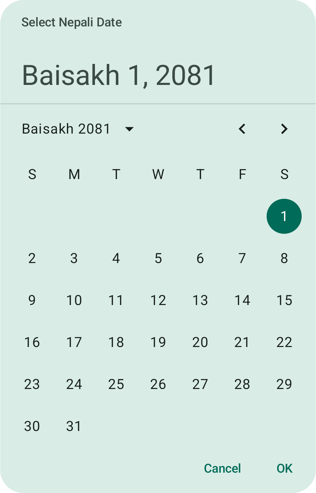
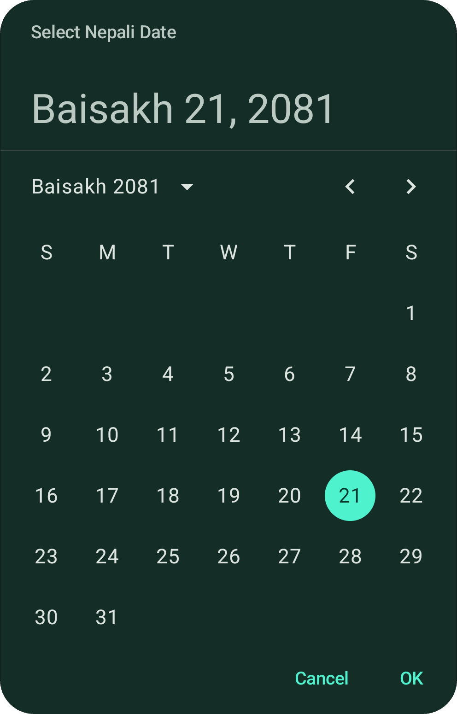
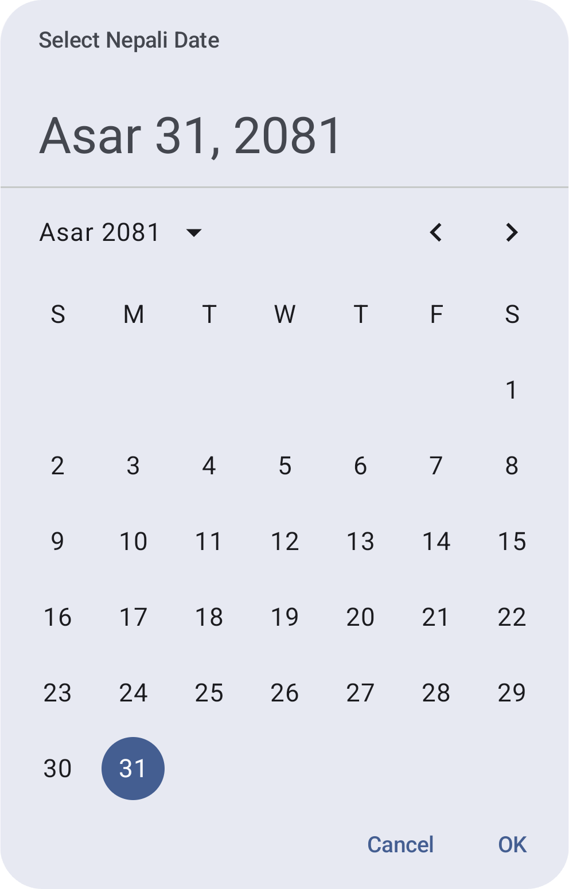
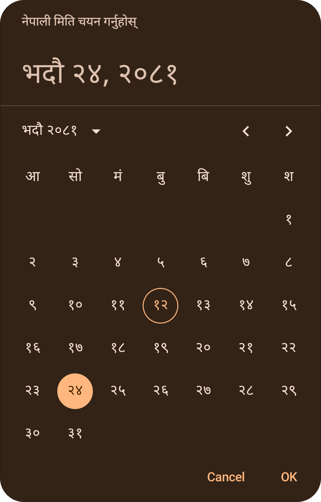
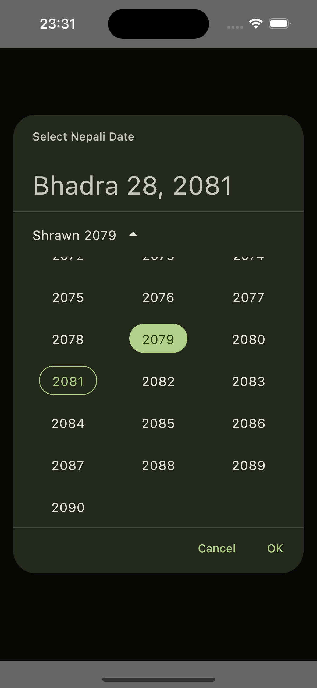
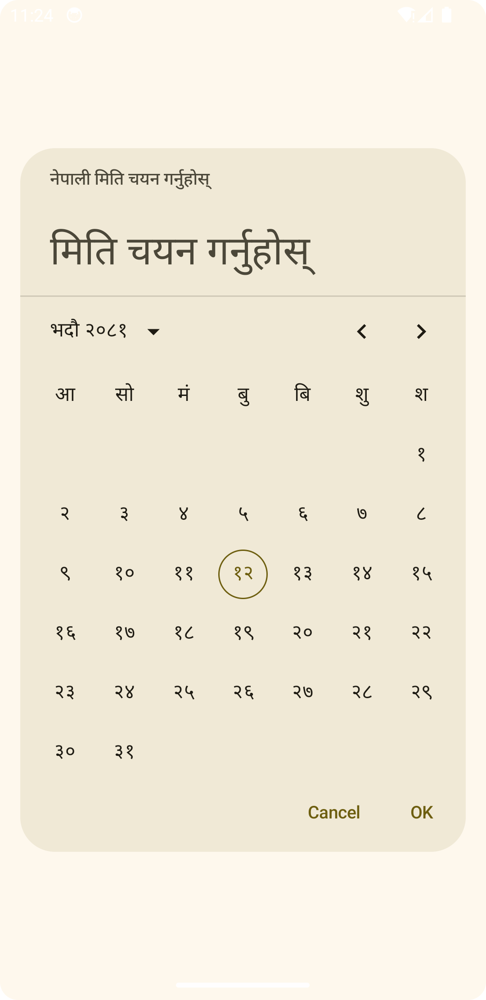
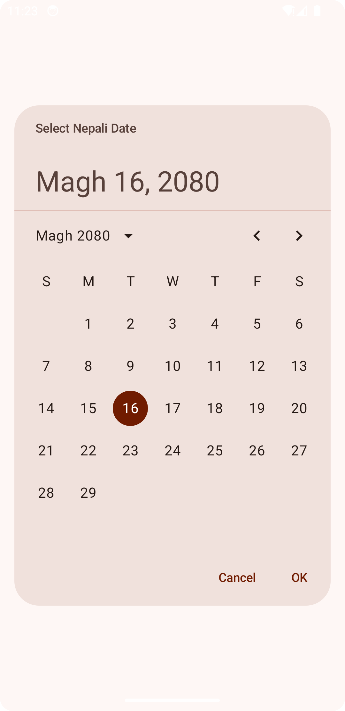
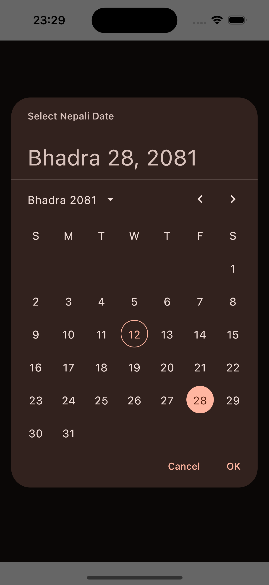

# Nepali-Date-Picker (Android and/or iOS) - KMP

<p align="center">
  
</p>

KMP Nepali Date Picker for both Android and/or iOS which aligns with the Material3 Date Picker. This library provides UI and various utilities to work with Nepali Dates, and acts as a bridge between Nepali Calendar and Gregorian Calendar.

[Using in your project.](#using-in-your-projects) &nbsp;&nbsp;&nbsp;&nbsp; [See screenshot of Nepali Date Picker](#screenshots) &nbsp;&nbsp;&nbsp;&nbsp;
Read on Medium: [](https://medium.com/@shivathapaa/nepali-date-picker-for-android-and-ios-kotlin-multiplatform-a739ea0caf47)

## Design overview

This library strictly follows `Material` (Material3) design principles. Considering UI/UX, `nepali-date-picker` aligns with new `androidx.compose.material3.DatePicker`.

If you are familiar with the Material3 Date Picker then you will find it very similar, and you can adapt it with little to no time.

This library puts Nepali Calendar in light as OpenSource for developers involved in both Android and/or iOS and/or KMP.

You can use this library independent to any platform or in common Kotlin Multiplatform code.

## Types/Features

This library provides variery of features for working with date picker. It is not only limited to date picker but many utilities that serves its purpose with extended support for date and time. 
Some of them are listed below:

- `CustomCalendar` - Calendar which represents both English and Nepali dates.
- `NepaliMonthCalendar` - Nepali Month Calendar which consists of the month details.
- `NepaliDateLocale` - To control language, dateFormat, weekDayName, and monthName.
- `NepaliDatePickerLang` - Set of supported language (English & Nepali for now).
- `NepaliDateConverter` - Provides utilities for date conversions (english to nepali and vice versa), get formatted date(6), get time, get date-time in ISO 8601 format, calculate days in between two date, and many more.
- `rememberNepaliDatePickerState()` - To read, write, and manage state of the date picker.
- `NepaliSelectableDates` - To control selectable dates i.e. enable/disable certain dates.
- `NepaliDatePickerColors` - Takes `Material3` ?: **Material** colors by **default**. All the colors it uses are taken from your app colors if you've defined Material colors in your project. Also, there's always `.copy()` to modify the color.  

## Operations Highlight

Using this library you can get following things done.

### Getting today's date and current time

```kotlin
NepaliDateConverter.todayNepaliDate

NepaliDateConverter.todayEnglishDate

NepaliDateConverter.currentTime
```

### Converting English date to Nepali date

```kotlin
NepaliDateConverter.convertEnglishToNepali(2024, 6, 21)
```

### Converting Nepali date to English date

```kotlin
NepaliDateConverter.convertNepaliToEnglish(2081, 3, 21)
```

### Other utilities

"This library uses a `1-based index` where 1 represents Sunday or January/Baisakh, 7 represents Saturday or July/Kartik, and 12 represents December/Chaitra."

```kotlin
NepaliDateConverter.getTotalDaysInNepaliMonth(2081, 3)

NepaliDateConverter.getNepaliMonthCalendar(2081, 3)

NepaliDateConverter.getWeekdayName(1)  // Sunday or आईतबार

NepaliDateConverter.getMonthName(1) // Baisakh or बैशाख

NepaliDateConverter.getEnglishMonthName(1) // January

"year 2024 month 06 day 21".localizeNumber(NepaliDatePickerLang.NEPALI) // year २०२४ month ०६ day २१

"year 2024".convertToNepaliNumber() // year २०२४

"year २०२४".convertToEnglishNumber() // year 2024

```

```kotlin
// Convert date and time in ISO 8061 format
val date = SimpleDate(2024, 5, 15)
val time = SimpleTime(10, 30, 45, 0)
val isoDateTime = formatToIsoDateTime(date, time)
println(isoDateTime) // Output: 2024-05-15T04:45:45Z

// Or, use current time
val date = SimpleDate(2024, 5, 15)
val isoDateTime = formatToIsoDateTime(date)
println(isoDateTime) // Output: 2024-05-15T23:45:45Z

// Calculate number of day in between two dates
val englishStartDate = SimpleDate(1998, 4, 12)
val englishEndDate = SimpleDate(2024, 9, 21)
val nepaliStartDate = SimpleDate(2054, 12, 30)
val nepaliEndDate = SimpleDate(2081, 6, 5)

val nepaliDaysBetween = NepaliDateConverter.getNepaliDaysInBetween(nepaliStartDate, nepaliEndDate) // Output: 9659
val englishDaysBetween = NepaliDateConverter.getEnglishDaysInBetween(englishStartDate, englishEndDate) // Output: 9659
```

```kotlin
// Date formatter

val customCalendar = CustomCalendar(year = 2080, month = 3, day = 11, weekday = 2, ....)
val locale = NepaliDateLocale(
        language = NepaliDatePickerLang.ENGLISH,
        dateFormat = NepaliDateFormatStyle.FULL, // 6 options
        weekDayName = NameFormat.FULL,
        monthName = NameFormat.FULL
            )
val formattedDate = NepaliDateConverter.formatNepaliDate(customCalendar, locale)
// formattedDate: "Monday, Asar 11, 2080"


// Time formatter

NepaliDateConverter.getFormattedTimeInNepali(NepaliDateConverter.currentTime) // Output: "साँझ ४ : ३०"

NepaliDateConverter.getFormattedTimeInNepali(NepaliDateConverter.currentTime, use12HourFormat = false) // Output: "१६ : ३०"

NepaliDateConverter.getFormattedTimeInEnglish(NepaliDateConverter.currentTime) // Output: "4:30 PM"

NepaliDateConverter.getFormattedTimeInEnglish(NepaliDateConverter.currentTime, use12HourFormat = false) // Output: "16:30"
```

## Using in your projects

The library is published to [Maven Central. You can find all artifacts here.](https://central.sonatype.com/namespace/io.github.shivathapaa)

### Common Gradle

In multiplatform projects, add a dependency to the commonMain source set dependencies

```kotlin
kotlin {
    sourceSets {
        commonMain {
             dependencies {
                 implementation("io.github.shivathapaa:nepali-date-picker:1.2.0")
             }
        }
    }
}
```

### Android

To add the nepali-date-picker library to your Android project, include the following dependency in your module/app-level build.gradle file:

```kotlin
dependencies {
    implementation("io.github.shivathapaa:nepali-date-picker-android:1.2.0")
}
```

### iOS

The library supports various iOS architectures, including `iosarm64`, `iossimulatorarm64`, and `iosx64`.

To integrate this library into your iOS project using CocoaPods:

> Will be updated very soon....

> ### Desktop/Web
> Will work on it if it will be helpful to community. [Let me know](https://github.com/shivathapaa/Nepali-Date-Picker/issues/new/choose) if I should!

## License

This project is licensed under [Mozilla Public License 2.0 (MPL 2.0)](https://github.com/shivathapaa/Nepali-Date-Picker/blob/main/LICENSE)
```
License

This project is licensed under the Mozilla Public License 2.0 (MPL 2.0).
MPL 2.0 is a permissive open-source license that allows you to use,
modify, and distribute the code, provided that any modifications to
the MPL-licensed files are also made available under the same license.
This license is used to ensures that improvements to the code remain open
and accessible to the community.
```
For more details, see the [LICENSE](https://github.com/shivathapaa/Nepali-Date-Picker/blob/main/LICENSE) file.

## Example usage

Don't forget about the DateRange before using.

You can check this inside library under `NepaliDatePickerDefaults.NepaliYearRange` and `NepaliDatePickerDefaults.EnglishYearRange`

```
// This will be changed overtime to support wider dates.
EnglishYearRange: IntRange = IntRange(1913, 2043)
NepaliYearRange: IntRange = IntRange(1970, 2100) 
```

#### NepaliDatePicker
```kotlin
val defaultNepaliDatePickerState = rememberNepaliDatePickerState()

NepaliDatePicker(state = defaultNepaliDatePickerState)
```

#### NepaliDatePickerDialog

```kotlin
var showNepaliDatePickerDialog by remember { mutableStateOf(false) }
val defaultNepaliDatePickerState = rememberNepaliDatePickerState()

if (showNepaliDatePickerDialog) {
    NepaliDatePickerDialog(
        confirmButton = {
            TextButton(onClick = { showNepaliDatePickerDialog = false }) {
                Text(text = "OK")
            }
        },
        dismissButton = {
            TextButton(onClick = { showNepaliDatePickerDialog = false }) {
                Text(text = "Cancel")
            }
        },
        onDismissRequest = { showNepaliDatePickerDialog = false }
    ) {
        NepaliDatePicker(state = defaultNepaliDatePickerState)
    }
}
```

### Using rememberNepaliDatePickerState()

```kotlin
val defaultNepaliDatePickerState = rememberNepaliDatePickerState()
val customizedDatePickerState =
    rememberNepaliDatePickerState(
        locale = NepaliDateLocale(language = NepaliDatePickerLang.NEPALI),
        nepaliSelectableDates = object : NepaliSelectableDates {
            override fun isSelectableDate(customCalendar: CustomCalendar)
                    : Boolean {
                return customCalendar.dayOfWeek != 7
                        || customCalendar.dayOfMonth != 12
            }

            override fun isSelectableYear(year: Int): Boolean {
                return (year % 5 != 0)
            }
        }
    )

// Or you can utilize helper function (BeforeDate or AfterDate) to disable and enable dates
val datePickerStateWithDateLimiter =
    rememberNepaliDatePickerState(
        nepaliSelectableDates = NepaliDatePickerDefaults.BeforeDate(SimpleDate(2081, 3, 21))
    )

// For Range, minDate and maxDate should make sense i.e., minDate should be less than or equal to maxDate
val nepaliDatePickerStateWithRangeSelectable = rememberNepaliDatePickerState(
    nepaliSelectableDates = DateRangeSelectableDates(
        SimpleDate(2081, 2, 11),
        SimpleDate(2082, 1, 29)
    )
)

NepaliDatePicker(state = defaultNepaliDatePickerState)

NepaliDatePicker(
    state = customizedDatePickerState,
    colors = NepaliDatePickerDefaults.colors().copy(
        containerColor = MaterialTheme.colorScheme.surface
    )
)

NepaliDatePicker(state = datePickerStateWithDateLimiter)

NepaliDatePicker(state = nepaliDatePickerStateWithRangeSelectable)
```

## Support

You have something in mind to change or add? I am open to suggestions. You can support this project by [suggesting changes, requesting enhancement/features, or raising an issue here](https://github.com/shivathapaa/Nepali-Date-Picker/issues/new/choose).

You are free to contribute to this project, do checkout [CONTRIBUTING.md](https://github.com/shivathapaa/Nepali-Date-Picker/blob/main/CONTRIBUTING.md) before starting.

Giving a Star⭐ to this repository is also a way to support this project. 😊


---

> Thanks to Google and KMP developers for Material3, Jetpack Compose, kotlinx-datetime and other different Apis. :)

---
Thank you for star! 😉

---

## Screenshots

<p align="center">
  &nbsp;
  &nbsp;
  &nbsp;
  
</p>
<br>
<p align="center">
  &nbsp;
  &nbsp;
  &nbsp;
  
</p>
