# Nepali Date Picker

<p align="center">
  
</p>

A Nepali (Bikram Sambat) date picker for Kotlin Multiplatform, aligned with the Material3
`DatePicker`, plus a Compose-free engine for converting, comparing and formatting dates across the
Bikram Sambat and Gregorian calendars. Runs on Android, iOS, desktop JVM, web (JS and Wasm), macOS,
Linux and Windows.

<br>

<p align="center">
  <a href="https://github.com/shivathapaa/Nepali-Date-Picker/releases">
    </a>&nbsp;
  <a href="https://github.com/shivathapaa/Nepali-Date-Picker/blob/main/LICENSE">
    </a>&nbsp;
  <a href="https://medium.com/@shivathapaa/nepali-date-picker-for-android-and-ios-kotlin-multiplatform-a739ea0caf47">
    </a>&nbsp;
  <a href="https://shivathapaa.github.io/Nepali-Date-Picker/">
    </a>&nbsp;
  <a href="https://shivathapaa.github.io/Nepali-Date-Picker/api/">
    </a>
</p>
<br>
<p align="center">
  <a href="https://central.sonatype.com/namespace/io.github.shivathapaa">
  </a>&nbsp;
  <a href="https://klibs.io/project/shivathapaa/Nepali-Date-Picker">
  </a>&nbsp;
  <a href="https://www.npmjs.com/package/@nepali-date-picker/web-component">
  </a>&nbsp;
  <a href="https://www.npmjs.com/package/@nepali-date-picker/core">
  </a>&nbsp;
  <a href="https://pub.dev/packages/nepali_date_picker_kmp">
  </a>&nbsp;
  <a href="#screenshots">
  </a>&nbsp;
  <a href="https://github.com/shivathapaa/Nepali-Date-Picker/releases/latest/download/nepali-date-picker-sample.apk">
    </a>
</p>
<br>

## Documentation for other platforms

This README covers **Kotlin Multiplatform and Android**. The same calendar tables power the Swift,
JavaScript and Python builds, so results match across all of them, and each one has its own complete
guide:

| Platform | Guide | Packages |
| --- | --- | --- |
| **Kotlin / Android / KMP** | This README | [Maven Central](https://central.sonatype.com/namespace/io.github.shivathapaa), [klibs.io](https://klibs.io/project/shivathapaa/Nepali-Date-Picker) |
| **Swift / iOS** | [**README-spm.md**](./README-spm.md) - hosting, options, sizing, and the full Swift API | [Nepali-Date-Picker-SPM](https://github.com/shivathapaa/Nepali-Date-Picker-SPM) |
| **Flutter / Dart** | [**README-flutter.md**](./README-flutter.md) - install, the async engine API, embedded pickers and native dialogs | [`nepali_date_picker_kmp`](https://pub.dev/packages/nepali_date_picker_kmp) |
| **JavaScript / TypeScript / web** | [**README-js.md**](./README-js.md) - custom elements, attributes, events, theming, and the headless engine | [`@nepali-date-picker/web-component`](https://www.npmjs.com/package/@nepali-date-picker/web-component), [`@nepali-date-picker/core`](https://www.npmjs.com/package/@nepali-date-picker/core) |
| **Python / backend** | [nepali_calendar_utils](https://github.com/shivathapaa/nepali_calendar_utils) | [PyPI](https://pypi.org/project/nepali_calendar_utils/) |

Runnable demos for every one of these live in [`sample/`](./sample) (Android, desktop, web, Compose
on iOS, native SwiftUI, Flutter, and the web components). See the [samples guide](./sample/README.md).

Live: the [Compose demo](https://shivathapaa.github.io/Nepali-Date-Picker/), the
[web-component demo](https://shivathapaa.github.io/Nepali-Date-Picker/demo/), and the
[API reference](https://shivathapaa.github.io/Nepali-Date-Picker/api/).

<br>

<details>
  <summary><b>Table of Contents</b></summary>

* [Documentation for other platforms](#documentation-for-other-platforms)
* [Design overview](#design-overview)
* [Types and features](#types-and-features)
* [Using in your projects](#using-in-your-projects)
    * [Artifacts](#artifacts)
    * [Supported KMP targets](#supported-kmp-targets)
    * [Common Gradle](#common-gradle)
    * [Android](#android)
    * [Android setup for API levels below 26](#android-setup-for-api-levels-below-26)
    * [iOS](#ios)
    * [Desktop, Wasm and JS](#desktop-wasm-and-js)
    * [JavaScript and the web (npm)](#javascript-and-the-web-npm)
* [Samples](#samples)
* [Basic usage](#basic-usage)
* [Switching between Bikram Sambat and Gregorian](#switching-between-bikram-sambat-and-gregorian)
    * [Neighbouring months in the empty cells](#neighbouring-months-in-the-empty-cells)
    * [State](#state)
    * [Conversion bounds](#conversion-bounds)
    * [Converting a whole month at once](#converting-a-whole-month-at-once)
* [Detailed examples](#detailed-examples)
* [Utilities](#utilities)
* [Events, policies and day marking](#events-policies-and-day-marking)
    * [Defining events](#defining-events)
    * [An event that runs longer than a day](#an-event-that-runs-longer-than-a-day)
    * [A policy is one institution's calendar](#a-policy-is-one-institutions-calendar)
    * [Reading a day or a month](#reading-a-day-or-a-month)
    * [Marking days with colors and indicators](#marking-days-with-colors-and-indicators)
    * [Marking never blocks](#marking-never-blocks)
    * [Caching a fetched event list](#caching-a-fetched-event-list)
* [Reading the same payload from Swift or JavaScript](#reading-the-same-payload-from-swift-or-javascript)
* [Migrating](#migrating)
    * [From 2.6.x to 3.0.x](#from-26x-to-30x)
    * [From the 3.1.0 holiday API](#from-the-310-holiday-api)
* [Screenshots](#screenshots)
* [Support](#support)
* [License](#license)
</details>

## Design overview

The UI follows Material3, and the composables mirror `androidx.compose.material3.DatePicker` in
naming, parameter order and state handling. If you have used the Material3 date picker, this one
needs almost no learning.

The library splits along that line. `nepali-date-picker-ui` holds the composables;
`nepali-date-picker-core` holds the calendar engine and carries **no Compose dependency at all**, so
it ships to backend, CLI and native targets the UI cannot reach. Use either on its own, from
platform code or from common Kotlin Multiplatform code.

## Types and features

The library is not limited to the picker UI. The `-core` artifact is a complete Bikram Sambat
engine that runs with no Compose on the classpath.

### Data and conversion

- `CustomCalendar` - A fully resolved date in either calendar: year, month, day, `era`, the month's shape, and the day's position in week, month and year.
- `SimpleDate` / `SimpleTime` - A plain year/month/day and a plain wall clock, for when a full `CustomCalendar` says more than you mean.
- `CustomDateTime` - A `CustomCalendar` paired with a `SimpleTime`.
- `NepaliMonthCalendar` - One Bikram Sambat month's details: total days, first and last weekday, and the offset to the first cell of a grid.
- `NepaliEnglishMonthDay` - One Gregorian day paired with its Bikram Sambat calendar, which stays `null` outside the convertible range.
- `CalendarSystem` - `{ BIKRAM_SAMBAT, GREGORIAN }`. Which calendar a date is written in, and which one a picker displays. _(3.2.0)_
- `MonthCalendar` - Calendar-agnostic month geometry, the shape a grid is laid out from in either calendar. _(3.2.0)_
- `NepaliDateConverter` - The public facade over the engine: BS to AD conversion and back, month details and whole-month batch conversion, date arithmetic, comparison, days between two dates, ISO 8601 in both directions, and six formatting entry points.
- `NepaliCalendarDefaults` - The supported year ranges, the boundary calendars, and the exact convertible Gregorian window.

### Localization

- `NepaliDateLocale` - Language, date format style, weekday-name width, month-name width and digit script in one value.
- `NepaliDatePickerLang` - `{ ENGLISH, NEPALI }`, carrying every label, month name and weekday name the picker draws.
- `DigitScript` - `{ LATIN, DEVANAGARI }`. Decouples the numeral script from the language, so locales that share the Devanagari digits (Maithili, Newari, Hindi, Marathi, Bhojpuri) reuse the same rendering. Comes with `String.localizeDigits(...)` and `String.toLatinDigits()`. _(3.1.0)_
- `NepaliDateFormatter` - Text-field parse and format primitive with slash and dash patterns (`YYYY_...`, `DD_...`) that accepts both Latin and Devanagari input. `YYYY_DASH_MM_DASH_DD` with `LATIN` is also the canonical `SimpleDate` wire form. _(3.1.0)_
- `NepaliTimeFormatter` - The matching time-of-day primitive: `format` and `parse` for `HH:mm:ss` with an optional nine-digit fractional part, the form a `SimpleTime` takes on the wire. Ships on every target, so Swift and JavaScript reach it without `kotlinx-serialization`. _(3.3.0)_

### Events and working days _(3.3.0)_

- `NepaliCalendarEvent` / `NepaliEventKind` - One thing on one Bikram Sambat day: a public holiday, a festival, a school programme, a deadline, a birthday. `closesOffices` says whether the institution is actually shut for it, and `id` / `payload` carry an app's own record back untouched. An event covers one day, so `spanningDays(10)` and `spanningThrough(end)` expand one that runs longer into per-day entries.
- `NepaliEventProvider` - The SPI an app implements to supply events. **No event data ships with the library, by design.** `plus` and `filtered` compose a national list with an institution's own.
- `NepaliCalendarPolicy` - One institution's closed days: the weekly off days it never opens plus the events it keeps. Answers `statusOf`, `eventsOn`, `eventsIn` and `monthStatus`, turns into a picker rule with `asSelectableDates()`, and drives the working-day helpers, so a week is stated once.
- `NepaliDayStatus` - What one day is under a policy: weekly off, closed, the events on it, and the closures among them.
- `workingDaysBetween`, `nextWorkingDay`, `addWorkingDays` - Working-day arithmetic with Excel `WORKDAY` semantics, as extensions on `NepaliDateConverter`. Each takes either a `NepaliCalendarPolicy` or a `(provider, weekend)` pair.
- `NepaliSelectableDates` - Which dates a picker enables. `excludingWeekends` and `excludingClosures` narrow an existing rule.

The 3.1.0 `holiday` package remains as deprecated aliases, so old imports keep resolving. See
[Migrating from the 3.1.0 holiday API](#from-the-310-holiday-api).

### Serialization _(optional)_

- `nepali-date-picker-serialization` provides `KSerializer`s for `SimpleDate`, `SimpleTime`, `CustomCalendar`, `NepaliMonthCalendar`, `MonthCalendar`, `CalendarSystem`, `NepaliCalendarEvent`, `NepaliEventKind` and `NepaliDayStatus`, registered together by `NepaliDatePickerSerializersModule`. Kotlin-only by design: Swift and JavaScript consumers reach the identical payloads through `-core`'s formatters. See [Reading the same payload from Swift or JavaScript](#reading-the-same-payload-from-swift-or-javascript). _(3.1.0, extended in 3.2.0 and 3.3.0)_

Every event carries two fields the library never reads: `id`, which correlates it to the app's own record and gathers a span into one line of a list, and `payload`, an opaque string. A calendar that shows pictures keeps its image URLs in the payload and draws them itself: the library hands the string back untouched when a day or a line is tapped, on Kotlin, Swift, Android views, Flutter and the browser alike, and never fetches anything.

### Picker UI

Calendar-grid pickers:
- `NepaliDatePicker()` - Pick a Nepali date via a calendar UI which displays Nepali dates. Takes `secondaryDateLocale` to pair every day with the other calendar, `showCalendarSystemToggle` for the `B.S.` / `A.D.` switch, and `showAdjacentMonthDays` to fill the grid's empty cells with the neighbouring months. _(3.2.0)_
- `NepaliDatePickerWithEnglishDate()` - Calendar UI which displays both the Nepali and the English day per cell.
- `NepaliDateRangePicker()` - Pick a Nepali date range. Months can be laid out vertically or horizontally. _(experimental)_
- `NepaliDateRangePickerWithEnglishDate()` - Range picker which displays both Nepali and English dates. _(experimental)_
- `NepaliCalendarSystemToggle()` - The `B.S.` / `A.D.` switch on its own, for driving the calendar from your own chrome. _(experimental, 3.2.0)_

The month calendar, where events are the point rather than an accent:
- `NepaliCalendar()` - A browsable month calendar that fills the width it is given and pages month by month. Takes a `NepaliCalendarPolicy` directly, shows both calendars' numbers and the neighbouring months' days by default, and reports the tapped day together with its `NepaliDayStatus`. Draws at a fixed height and never scrolls, so it sits as one block of a screen's own scrolling content. _(experimental, 3.3.0)_
- `NepaliDaySummary()` - One day written out: whether the institution is shut, why, and everything named on it. Takes a date, or follows a calendar's selection. _(experimental, 3.3.0)_
- `NepaliMonthEventList()` - The visible month's events in date order, a festival that runs several days collapsed into one line carrying its range, and the picked day's lines highlighted. _(experimental, 3.3.0)_
- `rememberNepaliCalendarState()` - What the calendar shows and what is picked, saved across configuration changes. Events are never stored in it; they arrive with the policy each surface is given. Has a plain factory twin for use outside composition. _(experimental, 3.3.0)_

Alternative experiences:
- `NepaliWheelDatePicker()` - Scroll/wheel picker with three snapping columns (Year, Month, Day). Great for birth dates and dates far from today. _(experimental)_
- `NepaliDatePickerDocked()` - Compact read-only field with a dropdown calendar. The Material3 "docked" pattern for forms. _(experimental)_

Dialogs / hosts:
- `NepaliDatePickerDialog()` - Centered modal host for any of the pickers above.
- `NepaliDatePickerFullScreenDialog()` - Full-screen host with a top bar. Fits a range selection on a phone. _(experimental)_

Text-field entry:
- `NepaliDateTextField()` / `NepaliDateField()` - Outlined text field editing a `SimpleDate` (accepts Latin and Devanagari digits, four patterns). `NepaliDateField` adds a trailing calendar icon that opens the dialog.
- `NepaliDateRangeTextField()` / `NepaliDateRangeField()` - Two stacked fields for a date range with start <= end validation. _(experimental)_

Styling and state:
- `NepaliDatePickerDefaults` - Colors, shapes, locales, headlines and the decorator factories, following the Material3 defaults pattern.
- `NepaliDatePickerColors` - Every color role the picker draws, resolved from `MaterialTheme.colorScheme` by default. Override individual roles with `.copy()`.
- `NepaliDayDecorator` - Marks a day: a colour for a closed day and up to three dots for the events on it, so a Saturday carrying a wedding reads as both. Comes with `NepaliDayDecoration`, a `NepaliDayMarkerColors` palette, a `NepaliEventDisplayStyle` of switches, `.then(...)` to layer status and events, and the ready-made `NepaliDatePickerDefaults.eventDecorator(...)` / `dayDecorator(...)`. Every grid picker takes it. _(3.3.0)_
- `rememberNepaliDatePickerState()` / `rememberNepaliDateRangePickerState()` - Read, write and manage the picker state, saved across configuration changes. Both have a plain factory twin for use outside composition.

> Anything marked _(experimental)_ requires `@OptIn(ExperimentalNepaliDatePickerApi::class)` and may change in a future release.

## Using in your projects

Every Kotlin artifact is published to
[Maven Central](https://central.sonatype.com/namespace/io.github.shivathapaa). The web packages are
on npm, see [JavaScript and the web](#javascript-and-the-web-npm) below.

> **Compose version.** `-ui` is built against Compose Multiplatform 1.12. If Gradle reports a
> Compose runtime conflict, raise your own Compose version to match rather than pinning this
> library back. `-core` has no Compose dependency, so it never conflicts.

### Artifacts

Starting with **3.0.0** the library ships as separate artifacts instead of one umbrella. **3.1.0** adds an optional `-serialization` artifact:

| Artifact | Contents | When to depend on it |
| --- | --- | --- |
| `io.github.shivathapaa:nepali-date-picker-core` | `NepaliDateConverter`, `NepaliCalendarModel`, `CustomCalendar`, `NepaliCalendarDefaults`, `NepaliSelectableDates`, `DigitScript`, `NepaliDateFormatter`, `NepaliTimeFormatter`, the `event` SPI, and other data utilities. Pure Kotlin + `kotlinx-datetime`, with **zero Compose / UI dependencies**. | Backend / CLI / embedded modules that only need date conversion, or any non-Compose Kotlin target. |
| `io.github.shivathapaa:nepali-date-picker-ui` | All composables - `NepaliDatePicker`, `NepaliDatePickerDialog`, `NepaliDateRangePicker`, `NepaliWheelDatePicker`, `NepaliDatePickerDocked`, `NepaliDateTextField`, `NepaliDateField`, `NepaliDatePickerDefaults`, etc. Transitively brings in `-core`. | Any module that renders the picker UI. |
| `io.github.shivathapaa:nepali-date-picker-serialization` _(3.1.0+, optional)_ | `kotlinx-serialization` `KSerializer`s for `SimpleDate`, `SimpleTime`, `CustomCalendar`, `NepaliMonthCalendar`, `MonthCalendar`, `CalendarSystem`, `NepaliCalendarEvent`, `NepaliEventKind` and `NepaliDayStatus`, in string and struct flavors, registered together by `NepaliDatePickerSerializersModule`. Ships the full `-core` target matrix. Maven only: a `KSerializer` does not cross to Objective-C or JavaScript, and neither platform needs one to read the same payload. | Modules that serialize Nepali date types over JSON / Protobuf / CBOR (Ktor, Room `TypeConverter`, DataStore, etc.). |

### Supported KMP targets

`-core` targets a strict superset of `-ui` because `-core` carries no Compose dependency.

| Target | `-core` | `-ui` |
| --- | :---: | :---: |
| `android` | yes | yes |
| `jvm` | yes | yes |
| `js` (IR) | yes | yes |
| `wasmJs` | yes | yes |
| `iosArm64`, `iosSimulatorArm64` | yes | yes |
| `macosArm64` | yes | yes |
| `iosX64` | yes | no (Compose Multiplatform dropped Apple x86_64 in 1.11) |
| `linuxX64`, `linuxArm64` | yes | no |
| `mingwX64` (Windows native) | yes | no |
| `watchosArm64`, `watchosSimulatorArm64` | yes | no |
| `tvosArm64`, `tvosSimulatorArm64` | yes | no |
| `wasmWasi` | yes | no |

If you used `io.github.shivathapaa:nepali-date-picker:2.x` before, the drop-in replacement is `nepali-date-picker-ui:3.0.0` - see the [migration guide](#from-26x-to-30x) below.

### Common Gradle

In multiplatform projects, add the UI artifact to the commonMain source set dependencies (it transitively brings the core converter utilities):

```kotlin
kotlin {
    sourceSets {
        commonMain {
            dependencies {
                implementation("io.github.shivathapaa:nepali-date-picker-ui:<latest-version>")

                // Or, if you only need the date converter / calendar utilities (no UI):
                // implementation("io.github.shivathapaa:nepali-date-picker-core:<latest-version>")

                // Optional kotlinx-serialization support for the Nepali date types (3.1.0+):
                // implementation("io.github.shivathapaa:nepali-date-picker-serialization:<latest-version>")
            }
        }
    }
}
```
Targeting Android API 25 or below? See
[Android setup for API levels below 26](#android-setup-for-api-levels-below-26).

### Android

To add the nepali-date-picker library to your Android project, include the following dependency in your module/app-level build.gradle file:

```kotlin
// Add the Compose compiler Gradle plugin to the Gradle version catalog
[versions]
# ...
kotlin = "2.4.20"
nepaliDatePicker = "3.3.0" // Check for latest release

[libraries]
nepali-date-picker-ui = { module = "io.github.shivathapaa:nepali-date-picker-ui", version.ref = "nepaliDatePicker" }
# Optional, only if you need the converter without the UI artifact:
# nepali-date-picker-core = { module = "io.github.shivathapaa:nepali-date-picker-core", version.ref = "nepaliDatePicker" }

[plugins]
# ...
compose-compiler = { id = "org.jetbrains.kotlin.plugin.compose", version.ref = "kotlin" }
```

```kotlin
// Add the Gradle plugin to the root/project level build.gradle.kts file
plugins {
    // ...
    alias(libs.plugins.compose.compiler) apply false // Kotlin version after 2.0.0
}
```

```kotlin
// Apply the plugin and dependency to app level build.gradle.kts file
plugins {
    // ...
    alias(libs.plugins.compose.compiler)
}

dependencies {
    // ...
    implementation(libs.nepali.date.picker.ui)
}
```

### Android setup for API levels below 26

The library uses `kotlinx-datetime`, which relies on `java.time`. Those APIs are only available
natively from Android API 26, so on API 25 and below they have to be backported by **core library
desugaring**. See
[Java 8+ API desugaring support](https://developer.android.com/studio/write/java8-support#library-desugaring)
and the [kotlinx-datetime notes](https://github.com/Kotlin/kotlinx-datetime?tab=readme-ov-file#using-in-your-projects),
or follow the two steps below:

```kotlin
// Enable Desugaring in your build.gradle (app-level) file
android {
    compileOptions {
        // Enable core library desugaring for java.time (kotlinx-datetime) APIs
        isCoreLibraryDesugaringEnabled = true

        sourceCompatibility = JavaVersion.VERSION_1_8
        targetCompatibility = JavaVersion.VERSION_1_8
    }
}
```

```kotlin
// Add the Desugaring Dependency in the dependencies {} block of the same build.gradle file
dependencies {
    // Add this dependency for desugaring java.time(kotlinx-datetime) APIs
    coreLibraryDesugaring("com.android.tools:desugar_jdk_libs:2.1.3") // check for the latest

    // Other dependencies...
}
```

### iOS

Add the Swift package in Xcode through **File -> Add Package Dependencies**, paste the repository
URL, and pick a version:

```
https://github.com/shivathapaa/Nepali-Date-Picker-SPM.git
```

Then import the module. Note the underscores: the module name comes from the framework binary, not
from the product name.

```swift
import SwiftUI
import nepali_date_picker
```

The UI artifact targets `iosArm64` (device) and `iosSimulatorArm64` (Apple silicon simulator). There
is no `iosX64` slice, so an Intel Mac, or the Rosetta simulator, cannot link it. See the
[target table](#supported-kmp-targets).

> **Writing the iOS app in Swift, not Compose?** The pickers are exposed to Swift as
> `UIViewController` factories you can drop into SwiftUI or UIKit. Hosting, sizing, the options
> objects, and the complete Swift API are documented in [**README-spm.md**](./README-spm.md), with a
> working app in [`sample/iosSwiftApp`](./sample/iosSwiftApp).

### Desktop, Wasm and JS

Desktop (JVM), Wasm and JS need nothing beyond the [common Gradle setup](#common-gradle): add
`nepali-date-picker-ui` to `commonMain` and the targets resolve. Supported since
[2.5.0-beta01](https://github.com/shivathapaa/Nepali-Date-Picker/releases/tag/2.5.0-beta01).

> **Plain web app, no Compose?** For React, Vue, Angular, Svelte, or plain HTML, use the npm
> packages instead, described next.

### JavaScript and the web (npm)

For the web platform there are two npm packages, both generated from this same Kotlin `:core` module,
so their BS↔AD tables and formatting match the Kotlin, Android, and Python builds exactly.

| Package | Contents | When to depend on it |
| --- | --- | --- |
| [`@nepali-date-picker/core`](https://www.npmjs.com/package/@nepali-date-picker/core) ([source](js/packages/core)) | The conversion and formatting engine (`convertAdToBs`, `formatBsDateByPattern`, `getTodayBs`, …), compiled from Kotlin. Zero runtime dependencies, ships TypeScript types. | Node / browser code that needs BS↔AD conversion without any UI. |
| [`@nepali-date-picker/web-component`](https://www.npmjs.com/package/@nepali-date-picker/web-component) ([source](js/packages/web-component)) | A framework-agnostic `<nepali-date-picker>` calendar element (Lit) that works in React, Vue, Angular, Svelte, and plain HTML. | Rendering a Nepali date picker on the web. |

```bash
npm install @nepali-date-picker/web-component   # UI + engine
npm install @nepali-date-picker/core            # engine only
```

```html
<script type="module">import '@nepali-date-picker/web-component';</script>
<nepali-date-picker value="2081-05-24" language="ne"></nepali-date-picker>
```

With no bundler, swap that import for the self-contained build (82 kB gzipped, every element):
`<script type="module" src="https://cdn.jsdelivr.net/npm/@nepali-date-picker/web-component"></script>`.

The web component ships every variant (inline, dialog, docked, range, field, range-field, wheel). See
the [live showcase](https://shivathapaa.github.io/Nepali-Date-Picker/demo/) and the full web guide in
[README-js.md](./README-js.md); build and publishing details live in [`js/README.md`](js/README.md).

## Samples

Runnable apps for every distribution live in [`sample/`](./sample), each consuming the library the
way a real project would:

| Sample | What it shows | Run |
| --- | --- | --- |
| [`composeApp`](./sample/composeApp) | The shared Compose showcase: every picker, field, dialog and utility | `./gradlew :sample:composeApp:run` |
| [`androidApp`](./sample/androidApp) | The showcase in a real Android app | `./gradlew :sample:androidApp:installDebug` |
| [`iosApp`](./sample/iosApp) | Compose Multiplatform hosted in SwiftUI | Open `sample/iosApp/iosApp.xcodeproj` |
| [`iosSwiftApp`](./sample/iosSwiftApp) | A native SwiftUI app consuming the XCFramework | Open `sample/iosSwiftApp/iosSwiftApp.xcodeproj` |
| [`jsApp`](./sample/jsApp) | The web components and the headless engine | `cd js && npm run build`, then `cd sample/jsApp && npm run dev` |

Prerequisites and the details for each are in the [samples guide](./sample/README.md).

## Basic usage

**Indexing is 1-based.** Month `1` is Baisakh (or January) and `12` is Chaitra (or December);
weekday `1` is Sunday and `7` is Saturday. `era` is `1` for AD and `2` for BS.

**Supported range.** Conversion is table-driven, and the table bounds it:

```kotlin
NepaliCalendarDefaults.NepaliYearRange   // 1970..2100 (Bikram Sambat)
NepaliCalendarDefaults.EnglishYearRange  // 1913..2043 (Gregorian)
```

Both moved from `NepaliDatePickerDefaults` in 3.0.0, see the
[migration guide](#from-26x-to-30x). A later release may widen them. The two calendars start
mid-year relative to each other, so `EnglishYearRange` alone is not a sufficient check for a
Gregorian date: see [Conversion bounds](#conversion-bounds).

### Placing a picker

```kotlin
Column {
    NepaliDatePicker(rememberNepaliDatePickerState())
}

// Every day paired with its Gregorian equivalent
Column {
    NepaliDatePickerWithEnglishDate(rememberNepaliDatePickerState())
}

// A range instead of a single date
Column {
    NepaliDateRangePicker(rememberNepaliDateRangePickerState())
}

Column {
    NepaliDateRangePickerWithEnglishDate(rememberNepaliDateRangePickerState())
}
```

Hold the state in a variable when you need to read the selection:

```kotlin
val datePickerState = rememberNepaliDatePickerState()

NepaliDatePicker(state = datePickerState)

datePickerState.selectedDate        // CustomCalendar?, Bikram Sambat
datePickerState.selectedEnglishDate // the same day in Gregorian
```

### Showing a picker in a dialog

`NepaliDatePickerDialog` hosts any of the pickers. `NepaliDatePickerDefaults.DialogButton` is a
ready-made button, but both slots take any composable. Give each picker its own state.

```kotlin
var showNepaliDatePickerDialog by remember { mutableStateOf(false) }
val defaultNepaliDatePickerState = rememberNepaliDatePickerState()
val defaultNepaliDateRangePickerState = rememberNepaliDateRangePickerState()

if (showNepaliDatePickerDialog) {
    NepaliDatePickerDialog(
        confirmButton = {
            NepaliDatePickerDefaults.DialogButton(
                text = "OK",
                onButtonClick = { showNepaliDatePickerDialog = false }
            )
        },
        dismissButton = {
            NepaliDatePickerDefaults.DialogButton(
                text = "Cancel",
                onButtonClick = { showNepaliDatePickerDialog = false }
            )
        },
        onDismissRequest = { showNepaliDatePickerDialog = false }
    ) {
        NepaliDatePicker(state = defaultNepaliDatePickerState)
        // NepaliDatePickerWithEnglishDate(defaultNepaliDatePickerState)
        // NepaliDateRangePicker(defaultNepaliDateRangePickerState)
        // NepaliDateRangePickerWithEnglishDate(defaultNepaliDateRangePickerState)
    }
}
```

### Configuring the state

Every parameter has a default, so set only what you need.

```kotlin
val state = rememberNepaliDatePickerState(
    initialSelectedDate = SimpleDate(2082, 2, 16),
    initialDisplayedMonth = SimpleDate(2082, 3),
    yearRange = IntRange(2082, 2083),
    initialDisplayMode = DisplayMode.Input,          // open on typed entry instead of the grid
    locale = NepaliDateLocale(language = NepaliDatePickerLang.NEPALI),
    nepaliSelectableDates = NepaliDateConverter.DateRangeSelectable(
        minDate = SimpleDate(2082, 2, 11),
        maxDate = SimpleDate(2083, 1, 29)
    )
)

NepaliDatePicker(state = state)
```

`rememberNepaliDateRangePickerState()` mirrors it, taking
`initialSelectedStartNepaliDate` and `initialSelectedEndNepaliDate` instead of a single date and
defaulting to `NepaliDatePickerDefaults.DefaultRangePickerLocale`.

An out-of-range or invalid initial value is coerced rather than rejected: the displayed month is
clamped into `yearRange`, and an initial selected date outside it resolves to no selection. For the
full range of selectable-date rules, see
[Restricting selectable dates](#restricting-selectable-dates).

## Switching between Bikram Sambat and Gregorian

Every calendar-grid picker, the wheel, and the text fields can display either calendar. Only the
display changes: **a selected date is always stored as Bikram Sambat**, so switching keeps the same
day selected and every `NepaliSelectableDates` rule you wrote keeps working untouched.

Both knobs are off by default, so a picker that does not ask for them looks and behaves exactly as
it did before.

```kotlin
val state = rememberNepaliDatePickerState()

// One grid, either calendar, with the B.S. / A.D. switch and both dates in every cell.
NepaliDatePicker(
    state = state,
    secondaryDateLocale = NepaliDatePickerDefaults.DefaultLocale,
    showCalendarSystemToggle = true
)

// Open on the Gregorian grid instead, with no switch.
val englishFirstState = rememberNepaliDatePickerState(
    initialCalendarSystem = CalendarSystem.GREGORIAN
)

// Whatever is displayed, the selection reads the same way.
state.selectedDate        // CustomCalendar in Bikram Sambat (era = 2)
state.selectedEnglishDate // the same day in Gregorian (era = 1)
```

Drive it yourself when the switch belongs in your own chrome rather than inside the picker:

```kotlin
NepaliCalendarSystemToggle(
    calendarSystem = state.displayedCalendarSystem,
    onCalendarSystemChange = { state.displayedCalendarSystem = it }
)
```

Switching is animated: the headline, the month navigation and the grid fade and scale in together.
Nothing to configure, and the platform's own "remove animations" setting suppresses it.

The same two parameters exist on `NepaliDateRangePicker`, `NepaliDatePickerDocked`,
`NepaliDatePickerWithEnglishDate` and `NepaliDateRangePickerWithEnglishDate`. The wheel and the text
fields take `initialCalendarSystem` / `calendarSystem` instead, since they have no state holder to
read it from:

```kotlin
NepaliWheelDatePicker(
    showCalendarSystemToggle = true,
    onDateChange = { bikramSambatDate -> /* always Bikram Sambat */ }
)

NepaliDateField(
    value = value,                              // a Bikram Sambat SimpleDate
    onValueChange = { value = it },             // also Bikram Sambat
    calendarSystem = CalendarSystem.GREGORIAN,  // but typed and shown in Gregorian
    showCalendarSystemToggle = true             // and switchable inside the dialog it opens
)
```

### Neighbouring months in the empty cells

`showAdjacentMonthDays` fills the blank cells around a month with the days either side of it, drawn
faded, the way a wall calendar does. Tapping one selects that day and moves the grid to its month.
The fill reaches the end of the last row that holds a day of the displayed month and stops there, so
a short month still ends on a blank row rather than showing a whole extra week.

```kotlin
NepaliDatePicker(
    state = rememberNepaliDatePickerState(),
    showAdjacentMonthDays = true
)
```

A borrowed day is announced with its own month and year plus a note that choosing it moves the grid,
since the fading that says so to a sighted user says nothing to a screen reader. One the picker
cannot select, because of `NepaliSelectableDates` or the year range, is drawn faded and inert: it
neither selects nor moves the grid. At the first and last month the picker
covers there is no neighbour to borrow from, so those cells stay blank. The parameter exists on
`NepaliDatePicker`, `NepaliDateRangePicker`, `NepaliDatePickerDocked`, `NepaliDateField`,
`NepaliDateRangeField` and both `WithEnglishDate` variants, and is off by default so an existing
picker's grid is unchanged.

### State

| Member | Meaning |
| --- | --- |
| `displayedCalendarSystem` | Which calendar the grid shows. Assigning it re-anchors the grid on the selection. |
| `displayedMonthCalendar` | The month on screen, as a `MonthCalendar` in that calendar. |
| `displayedMonth` | Unchanged: the **Bikram Sambat** month holding the first day of the visible grid. |
| `englishYearRange` | Gregorian years derived from `yearRange`, clamped into `NepaliCalendarDefaults.EnglishYearRange`. |

### Conversion bounds

The two calendars start mid-year relative to each other: Bikram Sambat 1970-01-01 is 13 April 1913.
A Gregorian grid therefore shows 1 to 12 April 1913 as disabled rather than hiding the month, and
`NepaliCalendarDefaults.minConvertibleEnglishDate` / `maxConvertibleEnglishDate` name the exact
bounds. `NepaliDateConverter.isEnglishDateConvertible(...)` answers the question for a single date,
since `EnglishYearRange` alone is not a sufficient check.

### Converting a whole month at once

These resolve a whole month in a single pass instead of converting day by day. Reach for them
whenever you need a full month mapped across calendars:

```kotlin
NepaliDateConverter.getEnglishMonthCalendar(2026, 9)          // Gregorian month geometry
NepaliDateConverter.getEnglishCalendar(2026, 9, 17)           // a Gregorian CustomCalendar directly
NepaliDateConverter.getNepaliCalendarsInEnglishMonth(2026, 9) // BS for every day of a Gregorian month
NepaliDateConverter.getEnglishCalendarsInNepaliMonth(2083, 6) // and the mirror of it

// The same month with each day paired to its calendar, so a day with no Bikram Sambat
// equivalent stays distinguishable. This is also the form Swift callers get.
NepaliDateConverter.getNepaliCalendarsInEnglishMonthByDay(2026, 9)

// Every day of one Gregorian month, as Gregorian calendars.
NepaliDateConverter.getEnglishCalendarsInMonth(2026, 9)
```

## Detailed examples

Every option below is optional. A picker with nothing but a state is a complete picker; reach for
these when you need to narrow the selectable dates, change the language, or restyle the grid. For
the shortest version, see [Basic usage](#basic-usage); for the non-UI API, see
[Utilities](#utilities).

### Customizing colors

Colors come from `MaterialTheme.colorScheme`, so a theme change restyles the picker. Override
individual roles with `copy()`:

```kotlin
NepaliDatePicker(
    state = rememberNepaliDatePickerState(),
    colors = NepaliDatePickerDefaults.colors()
        .copy(
            containerColor = MaterialTheme.colorScheme.surfaceContainer,
            dayContentColor = MaterialTheme.colorScheme.onSurface
        )
)
```

### Changing the language

One `NepaliDateLocale` drives the language, the headline format, the name widths and the digit
script. The picker's own labels, month names and weekday names follow it.

```kotlin
val nepaliLocale = NepaliDateLocale(
    language = NepaliDatePickerLang.NEPALI,
    dateFormat = NepaliDateFormatStyle.SHORT_YMD,
    weekDayName = NameFormat.MEDIUM,
    monthName = NameFormat.FULL
)

NepaliDatePicker(state = rememberNepaliDatePickerState(locale = nepaliLocale))
```

### Restricting selectable dates

`BeforeDateSelectable`, `AfterDateSelectable` and `DateRangeSelectable` cover the common windows;
implement `NepaliSelectableDates` directly for anything else. A disallowed date renders greyed out
rather than disappearing. `rememberNepaliDateRangePickerState()` takes the same parameters.

```kotlin
val todayNepaliDate = NepaliDateConverter.todayNepaliSimpleDate

// Everything up to and including today
val customDatePickerStateWithBeforeSelectable = rememberNepaliDatePickerState(
    initialSelectedDate = SimpleDate(2080, 3, 21),
    initialDisplayedMonth = SimpleDate(2081, 1, 1),
    yearRange = IntRange(1998, 2100),
    nepaliSelectableDates = NepaliDateConverter.BeforeDateSelectable(
        simpleDate = SimpleDate(
            todayNepaliDate.year,
            todayNepaliDate.month,
            todayNepaliDate.dayOfMonth
        ), includeDate = true
    ),
    locale = NepaliDateLocale(
        language = NepaliDatePickerLang.NEPALI,
        dateFormat = NepaliDateFormatStyle.SHORT_YMD,
        weekDayName = NameFormat.MEDIUM,
        monthName = NameFormat.FULL
    )
)

// Everything strictly after today
val customDatePickerStateWithAfterSelectable = rememberNepaliDatePickerState(
    yearRange = IntRange(1979, 2094),
    nepaliSelectableDates = NepaliDateConverter.AfterDateSelectable(
        simpleDate = SimpleDate(
            todayNepaliDate.year, todayNepaliDate.month, todayNepaliDate.dayOfMonth
        ),
        includeDate = false
    ),
    locale = NepaliDateLocale(
        language = NepaliDatePickerLang.ENGLISH,
        dateFormat = NepaliDateFormatStyle.COMPACT_YMD,
        weekDayName = NameFormat.FULL
    )
)

// A window between two dates
val customDatePickerStateWithRangeSelectable = rememberNepaliDatePickerState(
    initialDisplayedMonth = SimpleDate(2081, 12, 12),
    yearRange = IntRange(2079, 2090),
    nepaliSelectableDates = NepaliDateConverter.DateRangeSelectable(
        minDate = SimpleDate(
            todayNepaliDate.year, todayNepaliDate.month, todayNepaliDate.dayOfMonth
        ),
        maxDate = SimpleDate(2090, 1, 1),
        includeMinDate = false,
        includeMaxDate = true
    ),
    locale = NepaliDateLocale(
        language = NepaliDatePickerLang.ENGLISH,
        dateFormat = NepaliDateFormatStyle.COMPACT_YMD,
        weekDayName = NameFormat.FULL
    )
)

// Any rule of your own
val customSelectableDatePickerState = rememberNepaliDatePickerState(
    nepaliSelectableDates = object : NepaliSelectableDates {
        override fun isSelectableDate(customCalendar: CustomCalendar): Boolean {
            return customCalendar.month != 3 || (customCalendar.dayOfWeek != 7 && customCalendar.dayOfMonth != 15)
        }

        override fun isSelectableYear(year: Int): Boolean {
            return year >= 2054
        }
    }
)
```

### Building state outside composition

`rememberNepaliDatePickerState()` has a plain factory twin for a `ViewModel`, a state holder, or a
lambda, where there is no composition to remember into:

```kotlin
val stateForPicker = NepaliDatePickerState(
    initialSelectedDate = SimpleDate(2081, 8, 21),
    initialDisplayedMonth = SimpleDate(2081, 7, 21),
    yearRange = IntRange(1998, 2100),
    nepaliSelectableDates = NepaliDatePickerDefaults.AllDates,
    initialDisplayMode = DisplayMode.Picker,
    locale = NepaliDatePickerDefaults.DefaultLocale
)

val stateForRangePicker = NepaliDateRangePickerState(
    initialSelectedStartNepaliDate = SimpleDate(2081, 8, 21),
    initialSelectedEndNepaliDate = SimpleDate(2081, 9, 21),
    initialDisplayedMonth = SimpleDate(2081, 7, 21),
    yearRange = IntRange(1998, 2100),
    nepaliSelectableDates = NepaliDatePickerDefaults.AllDates,
    initialDisplayMode = DisplayMode.Picker,
    locale = NepaliDatePickerDefaults.DefaultRangePickerLocale
)

NepaliDatePicker(state = stateForPicker)
NepaliDateRangePicker(state = stateForRangePicker)
```

## Utilities

`NepaliDateConverter` is the Compose-free facade over the calendar engine, so everything in this
section works from a `ViewModel`, a server, or a CLI with only the `-core` artifact on the
classpath. Each member carries KDoc with its own contract and examples.

### The core types
```kotlin
// Simple date representation
data class SimpleDate(
    val year: Int,
    val month: Int,
    val dayOfMonth: Int = 1
)

// Simple time representation 
data class SimpleTime(
    val hour: Int,
    val minute: Int,
    val second: Int,
    val nanosecond: Int
)

// Custom Calendar for both English and Nepali dates
data class CustomCalendar(
    val year: Int,
    val month: Int,
    val dayOfMonth: Int,
    val era: Int,  // 1 for AD, 2 for BS
    val firstDayOfMonth: Int,
    val lastDayOfMonth: Int,
    val totalDaysInMonth: Int,
    val dayOfWeekInMonth: Int,
    val dayOfWeek: Int,
    val dayOfYear: Int,
    val weekOfMonth: Int,
    val weekOfYear: Int
)

// Nepali Month Calendar for month details
data class NepaliMonthCalendar(
    val year: Int,
    val month: Int,
    val totalDaysInMonth: Int,
    val firstDayOfMonth: Int,
    val lastDayOfMonth: Int,
    val daysFromStartOfWeekToFirstOfMonth: Int = firstDayOfMonth - 1
)

 // A data holder representing a CustomCalendar and SimpleTime
data class CustomDateTime(
    val customCalendar: CustomCalendar,
    val simpleTime: SimpleTime
)

// there are various extension function readily available to utilize all of them.
```

### Today's date
```kotlin
val todayNepaliDate = NepaliDateConverter.todayNepaliSimpleDate // returns SimpleDate
val todayNepaliCalendar = NepaliDateConverter.todayNepaliCalendar // returns CustomCalendar

val todayEnglishDate = NepaliDateConverter.todayEnglishSimpleDate // returns SimpleDate
val todayEnglishCalendar = NepaliDateConverter.todayEnglishCalendar // returns CustomCalendar
```

### Current time
```kotlin
val currentTime = NepaliDateConverter.currentTime // returns SimpleTime
```

### Date conversions
```kotlin
val convertedNepaliDate = NepaliDateConverter.convertEnglishToNepali(2021, 6, 21) // returns CustomCalendar

val convertedEnglishDate = NepaliDateConverter.convertNepaliToEnglish(2081, 3, 21) // returns CustomCalendar
```

### Get CustomCalendar details for a Nepali date
```kotlin
NepaliDateConverter.getNepaliCalendar(2082, 4, 16) // returns CustomCalendar
```

### Get month details
```kotlin
val totalDaysInMagh2081 = NepaliDateConverter.getTotalDaysInNepaliMonth(2081, 10) // returns 30 (Int)

val getCompleteDetailsOfAsar2078Month = NepaliDateConverter.getNepaliMonthCalendar(2078, 3) // returns NepaliMonthCalendar
```

### Add or subtract days

Month and year overflow and underflow are handled for you, in both directions.

```kotlin
// Add 10 days to 2081-03-15
NepaliDateConverter.getNepaliCalendarAfterAdditionOrSubtraction(2081, 3, 15, 10)
// CustomCalendar(year = 2081, month = 3, dayOfMonth = 25, ...)

// Subtract 5 days from 2081-03-15
NepaliDateConverter.getNepaliCalendarAfterAdditionOrSubtraction(2081, 3, 15, -5)
// CustomCalendar(year = 2081, month = 3, dayOfMonth = 10, ...)

// Add 50 days, crossing into the next year
NepaliDateConverter.getNepaliCalendarAfterAdditionOrSubtraction(2081, 11, 15, 50)
// CustomCalendar(year = 2082, month = 1, dayOfMonth = 5, ...)
```

### Date comparison
```kotlin
val compareDate = NepaliDateConverter.compareDates(convertedNepaliDate, SimpleDate(2090, 2, 12)) // returns 1, 0, -1 according to conditions
```

### Days between two dates
```kotlin
val noOfDaysBetweenTwoNepaliDates = NepaliDateConverter.getNepaliDaysInBetween(SimpleDate(1998, 11, 23), SimpleDate(2098, 4, 21))  // returns 36313

val noOfDaysBetweenTwoEnglishDates = NepaliDateConverter.getEnglishDaysInBetween(SimpleDate(2009, 6, 21), SimpleDate(2500, 3, 23)) // returns 179244
```

### Write a date and time as ISO 8601 UTC

For storing an instant in a database, or for handing it to code that works in another time zone.

```kotlin
val currentTime = NepaliDateConverter.currentTime
val todayEnglishDate = NepaliDateConverter.todayEnglishSimpleDate
val todayNepaliDate = NepaliDateConverter.todayNepaliCalendar

val formattedEnglishDate = NepaliDateConverter.formatEnglishDateNepaliTimeToIsoFormat(todayEnglishDate, currentTime) // returns "2024-09-09T23:22:21Z"
val formattedNepaliDate = NepaliDateConverter.formatNepaliDateTimeToIsoFormat(todayNepaliDate.toSimpleDate(), currentTime) // returns "2024-09-09T23:22:21Z"
```

### Read an ISO 8601 UTC string back

`CustomDateTime` pairs a `CustomCalendar` with a `SimpleTime`, both read in Nepal time.

```kotlin
// A Bikram Sambat calendar and a Nepal-time clock reading.
NepaliDateConverter.getNepaliDateTimeFromIsoFormat("2024-09-09T09:00:15Z")
// CustomDateTime(customCalendar = CustomCalendar(year = 2081, month = 5, ...), simpleTime = SimpleTime(...))

// The Gregorian equivalent. Neither half needs the conversion table, so any year parses; the
// Bikram Sambat reading above is bounded by EnglishYearRange.
NepaliDateConverter.getEnglishDateNepaliTimeFromIsoFormat("2024-09-09T09:00:15Z")
// CustomDateTime(customCalendar = CustomCalendar(year = 2024, month = 9, ...), simpleTime = SimpleTime(...))
```

### Weekday and month names
```kotlin
val weekday = NepaliDateConverter.getWeekdayName(2, NameFormat.FULL, NepaliDatePickerLang.NEPALI) // returns "सोमबार"
val weekdayEnglish = NepaliDateConverter.getWeekdayName(5, NameFormat.MEDIUM, NepaliDatePickerLang.ENGLISH) // returns Thu

val nepaliMonthName = NepaliDateConverter.getMonthName(12, NameFormat.FULL, NepaliDatePickerLang.NEPALI) // returns "चैत"
val nepaliMonthNameInEnglish = NepaliDateConverter.getMonthName(3, NameFormat.SHORT, NepaliDatePickerLang.ENGLISH) // returns Asa

val englishMonthName = NepaliDateConverter.getEnglishMonthName(6, NameFormat.FULL, NepaliDatePickerLang.NEPALI) // returns "जुन"
```

### Format a date for display
```kotlin
val currentTime = NepaliDateConverter.currentTime
val todayNepaliDate = NepaliDateConverter.todayNepaliCalendar

val customFormatLocale = NepaliDateLocale(
    language = NepaliDatePickerLang.NEPALI,
    dateFormat = NepaliDateFormatStyle.FULL,
    weekDayName = NameFormat.FULL,
    monthName = NameFormat.FULL
)

// From a CustomCalendar, which already knows its own weekday.
NepaliDateConverter.formatNepaliDate(todayNepaliDate, customFormatLocale)
// "सोमबार, असार २१, २०८२"
NepaliDateConverter.formatNepaliDate(todayNepaliDate, NepaliDatePickerDefaults.DefaultLocale)
// "Asar 21, 2082"

// From loose parts. The 4th argument is the weekday, which this overload does not derive, so
// pass the real one or the name will not match the date.
NepaliDateConverter.formatNepaliDate(2081, 3, 21, 6, NepaliDatePickerDefaults.DefaultLocale)
// "Asar 21, 2081"
NepaliDateConverter.formatEnglishDate(2024, 10, 3, 5, customFormatLocale)
// "बिहिबार, अक्टोबर ३, २०२४"

// Numerals follow the locale's digitScript when it is set, and its language when it is not, so a
// locale can pair Nepali month names with Latin digits or the reverse.
val nepaliNamesLatinDigits = NepaliDateLocale(
    language = NepaliDatePickerLang.NEPALI,
    dateFormat = NepaliDateFormatStyle.LONG,
    digitScript = DigitScript.LATIN
)
val mixedScriptDate = NepaliDateConverter.formatNepaliDate(2081, 5, 24, 2, nepaliNamesLatinDigits) // returns "भदौ 24, 2081"
```

### Format a time for display
```kotlin
val formattedNepaliTime = NepaliDateConverter.getFormattedTimeInNepali(simpleTime = currentTime, use12HourFormat = true) // returns "राति १२ : ०४"
val formattedEnglishTime = NepaliDateConverter.getFormattedTimeInEnglish(simpleTime = currentTime, use12HourFormat = false) // returns "0:04"
```

### Format date time using a Unicode pattern
```kotlin
// The function supports the following placeholders in the unicodePattern:

// Date Components
// yyyy - Four-digit year (e.g., "2025" or "२०२५")
// yy - Two-digit year (e.g., "25" or "२५")
// MMMM - Full month name (e.g., "January" or "जनवरी")
// MMM - Abbreviated month name (e.g., "Jan" or "जन")
// MM - Two-digit month (e.g., "01" or "०१")
// M - Month number, no padding (e.g., "1" or "१")
// dd - Two-digit day of month (e.g., "04" or "०४")
// d - Day of month, no padding (e.g., "4" or "४")
// D - Day of the year (1–366) (e.g., "123" or "१२३")
// w - Week of the year (e.g., "23" or "२३")

// Weekday Components
// EEEE - Full weekday name (e.g., "Monday" or "सोमबार")
// E - Medium weekday name (e.g., "Mon" or "सोम")
// EEEEE - Short weekday name, if defined (e.g., "M" or "स")
// ee - Two-digit day of week (e.g., "02" or "०२")
// e - Day of week, no padding (e.g., "2" or "२")

// Time Components (24-hour and 12-hour)
// HH - Hour in 24-hour format (00–23) (e.g., "08" or "०८")
// H - Hour in 24-hour format, no padding (e.g., "8" or "८")
// hh - Hour in 12-hour format (01–12) (e.g., "01" or "०१")
// h - Hour in 12-hour format, no padding (e.g., "1" or "१")
// mm - Minutes, two-digit (e.g., "05" or "०५")
// m - Minutes, no padding (e.g., "5" or "५")
// ss - Seconds, two-digit (e.g., "09" or "०९")
// s - Seconds, no padding (e.g., "9" or "९")

// Fractional Seconds
// SSSS - Four-digit nanosecond precision (e.g., "1234" or "१२३४")
// SSS - Millisecond precision (e.g., "123" or "१२३")
// SS - Two-digit fractional seconds (e.g., "12" or "१२")
// S - One-digit fractional second (e.g., "1" or "१")

// Period Markers
// a - Lowercase AM/PM or localized period (e.g., "am" or "बिहान")
// A - Uppercase AM/PM or localized period (e.g., "AM" or "साँझ")

// Format time using a Unicode pattern
val time = NepaliDateConverter.currentTime

val result = NepaliDateConverter.formatTimeByUnicodePattern(
    unicodePattern = "hh:mm:ss a",
    time = time,
    language = NepaliDatePickerLang.NEPALI
) // result: "०२:४५:१५ दिउँसो"

val result = NepaliDateConverter.formatTimeByUnicodePattern(
    unicodePattern = "hh:mm:ss A",
    time = time,
    language = NepaliDatePickerLang.ENGLISH
) // result: "02:45:15 AM"

// Format only Nepali date using a Unicode pattern
val nepaliCalendar = NepaliDateConverter.todayNepaliCalendar

val result = NepaliDateConverter.formatNepaliDateByUnicodePattern(
    unicodePattern = "EEEE, MMM dd yyyy",
    calendar = nepaliCalendar,
    language = NepaliDatePickerLang.NEPALI // use ENGLISH for English
) // result: "सोमबार, भदौ २४ २०८१"

// Format only English date using a Unicode pattern
val englishCalendar = NepaliDateConverter.todayEnglishCalendar

val result = NepaliDateConverter.formatEnglishDateByUnicodePattern(
    unicodePattern = "E, MMM dd yyyy",
    calendar = englishCalendar,
    language = NepaliDatePickerLang.ENGLISH // use NEPALI for Nepali
) // result: "Sat, May 24 2025"

// Format full Nepali date and time using a Unicode pattern
val nepaliCalendar = NepaliDateConverter.todayNepaliCalendar
val time = NepaliDateConverter.currentTime

val result = NepaliDateConverter.formatNepaliDateTimeByUnicodePattern(
    unicodePattern = "yyyy MMMM dd, EEEE a hh:mm:ss",
    calendar = nepaliCalendar,
    time = time,
    language = NepaliDatePickerLang.NEPALI // use ENGLISH for English
) // result: "२०८१ भदौ २४, सोमबार दिउँसो ०२:४५:१५"

// Format full English date and time using a Unicode pattern
val englishCalendar = NepaliDateConverter.todayEnglishCalendar
val time = NepaliDateConverter.currentTime

val result = NepaliDateConverter.formatEnglishDateTimeByUnicodePattern(
    unicodePattern = "yyyy MMMM dd, EEEE hh:mm:ss A",
    calendar = englishCalendar,
    time = time,
    language = NepaliDatePickerLang.ENGLISH // use NEPALI for Nepali
) // result: "2025 May 24, Monday 02:45:15 PM"
```

### Localize digits to Latin or Devanagari

The numeral script is independent of the language, so a locale can pair Nepali month names with
Latin digits or the reverse. _(3.1.0)_

```kotlin
val nepaliString = "Today is 2024".localizeDigits(DigitScript.DEVANAGARI) // returns "Today is २०२४"
val nepaliStringOnlyDigits = "2024".localizeDigits(DigitScript.DEVANAGARI) // returns "२०२४"
val englishString = "२०२४ सोमबार".toLatinDigits() // returns "2024 सोमबार"

// Or resolve the script from a locale
val localizeString = "Today is 2024".localizeDigits(NepaliDateLocale(language = NepaliDatePickerLang.NEPALI)) // returns "Today is २०२४"

// Deprecated (still functional, with ReplaceWith):
// "Today is 2024".convertToNepaliNumber()  ->  localizeDigits(DigitScript.DEVANAGARI)
// "२०२४".convertToEnglishNumber()          ->  toLatinDigits()
```

### Replace a delimiter

The delimiter to replace defaults to `/`; pass a third argument for anything else.

```kotlin
NepaliDateConverter.replaceDelimiter("2024/06/21", "-")     // "2024-06-21"
NepaliDateConverter.replaceDelimiter("२०२४/०६/२१", "-")      // "२०२४-०६-२१"
NepaliDateConverter.replaceDelimiter("09:45 AM", " ", ":")  // "09 45 AM"
```

## Events, policies and day marking

The library ships **no event data, by design**. Nepal's holiday list changes year to year and
every school and office keeps its own besides, so an app supplies its own through the `event`
package's provider interface. Everything below is in `dev.shivathapaa.nepalidatepickerkmp.event`
unless stated otherwise. _(3.3.0)_

### Defining events

An event is one thing on one day. A holiday is an event like any other; what separates the two is
`closesOffices`.

```kotlin
val dashain = NepaliCalendarEvent(
    date = SimpleDate(2082, 6, 25),
    name = "Vijaya Dashami",
    kind = NepaliEventKind.Religious,   // colours the day, and sets the default below
    closesOffices = true,               // the event has the final say, not its kind
    id = "evt-42",                      // handed back untouched, to find your own record
    payload = """{"images":["dashain.png"]}"""   // opaque; the library never parses it
)

object OfficeCalendar : NepaliEventProvider {
    private val byYear = mapOf(2082 to setOf(dashain))
    override fun events(year: Int): Set<NepaliCalendarEvent> = byYear[year].orEmpty()
}
```

`closesOffices` defaults from the kind (`GovernmentPublic`, `Religious` and `Regional` close;
`Observance` does not) and is overridable per event, which is what lets a regional holiday close one
district and not the next, and a school programme close nothing at all. A programme, a birthday or a
deadline needs no kind of its own: it is whichever kind fits, with `closesOffices = false`.

### An event that runs longer than a day

An event covers one day, so a span is a list of entries rather than a range. Expand it once, and
every day of it colours, counts and serializes like any other event:

```kotlin
val dashain = NepaliCalendarEvent(
    date = SimpleDate(2082, 6, 17),
    name = "Dashain",
    kind = NepaliEventKind.Religious,
    id = "dashain-2082"       // set it, so the days can be recognized as one thing again
)

dashain.spanningDays(10)                           // ten entries, Asoj 17 through 26
dashain.spanningThrough(SimpleDate(2082, 6, 26))   // the same span, stated by its end

// Fold the days back into one agenda row.
office.eventsIn(2082, 6).distinctBy { it.id ?: it.name }
```

A span running out of Chaitra into Baisakh yields entries in both years, so each one is reported by
the year `events(year)` is asked for. Nepal's published holiday lists name each day of a festival
separately (Ghatasthapana, Fulpati, Maha Ashtami, Maha Navami, Vijaya Dashami), so prefer those real
names where they exist and keep the span helpers for a run your app owns: a leave, a booking, a
programme week.

### A policy is one institution's calendar
```kotlin
// The week an institution never opens, plus the events it keeps. Stated once, used everywhere.
val office = NepaliCalendarPolicy(provider = OfficeCalendar)                   // Saturday off
val school = NepaliCalendarPolicy(setOf(7, 1), OfficeCalendar)                 // Sat + Sun off
val merged = NepaliCalendarPolicy(setOf(7, 1), OfficeCalendar + schoolsOwnList) // two lists at once

// Weekday numbers are 1-based-Sunday. A set written to JavaScript's 0-based convention would close
// nothing at all, so it throws instead of failing quietly.
NepaliCalendarPolicy(weeklyOffDays = setOf(0, 6))  // IllegalArgumentException

// Narrow a shared list to what one screen cares about.
val closuresOnly = OfficeCalendar.filtered { it.closesOffices }
```

The same policy drives the working-day arithmetic, so a school and an office count the same span
differently without either stating its week twice. These three are extensions on
`NepaliDateConverter` declared in the `event` package, so they need that package imported:

```kotlin
import dev.shivathapaa.nepalidatepickerkmp.event.addWorkingDays
import dev.shivathapaa.nepalidatepickerkmp.event.nextWorkingDay
import dev.shivathapaa.nepalidatepickerkmp.event.workingDaysBetween

NepaliDateConverter.workingDaysBetween(start, end, school)  // end exclusive
NepaliDateConverter.nextWorkingDay(from, school)            // `from` itself if it is a working day
NepaliDateConverter.addWorkingDays(from, 10, school)        // Excel WORKDAY semantics, negatives walk back
```

A day that is both a weekly off day and a holiday is skipped once, not twice, and an event that does
not close is not skipped at all: a week of school programmes is still five working days. The
`(provider, weekend)` overloads remain for when you would rather pass the two separately.

`isNonWorkingDay(date)` asks the provider's `closesOn` directly, while `statusOf(date).isNonWorking`
reads the events the provider listed. The two agree for every provider that names what it closes
for, which is the usual case. They part only for a provider that overrides `closesOn` without
listing the event behind it: the arithmetic skips that day, and the status has no event to report
it by. List the event when you want both to see it.

### Reading a day or a month

A day cell draws a colour and dots, never text. Everything else is a query, so the detail panel
beside the grid is yours to build:

```kotlin
val status = office.statusOf(SimpleDate(2082, 6, 3))
status.isWeeklyOff    // the week closes the day
status.isNonWorking   // closed for either reason, counted once
status.primaryKind    // null when the day is only a weekly off day
status.names          // ["Constitution Day"], strongest kind first
status.events         // the same events in full, with your id and payload
status.closures       // only the ones that actually shut the door

office.eventsOn(SimpleDate(2082, 6, 3))  // one day
office.eventsIn(2082, 6)                 // a whole month, in date order
office.monthStatus(2082, 6)              // one entry per day; index 0 is day 1
```

Prefer `monthStatus` when laying out a month: it resolves the month's first weekday once and walks
the week forward, so a six-by-seven grid costs one conversion instead of forty-two.

```kotlin
// A day-detail panel, the way the sample's Events tab draws it.
val selected = state.selectedDate?.toSimpleDate()
val status = selected?.let { office.statusOf(it) }
when {
    status == null -> Text("Pick a day")
    status.names.isNotEmpty() -> Text(status.names.joinToString())
    status.isWeeklyOff -> Text("Weekly day off")
    else -> Text("A working day")
}
```

### Marking days with colors and indicators

Two channels, and they never collide: **a colour says what the day is, dots say what is scheduled on
it.** A weekly off day repeats fifty-two times a year, so it is coloured and never dotted, which
leaves all three dot slots for an app's own events.

```kotlin
// Holidays and the weekly rule, coloured from MaterialTheme.colorScheme.
NepaliDatePicker(
    state = rememberNepaliDatePickerState(),
    dayDecorator = NepaliDatePickerDefaults.eventDecorator(policy = office)
)
```

A named closure outranks the week, because "Dashain" says more about the day than "Saturday" does.
An event that leaves the institution open does not, so a Saturday carrying only a programme still
reads as a Saturday. Several events on one day give the colour of the strongest kind and the names
of all of them.

```kotlin
// Every channel is a switch, and every colour falls back to the theme unless you override it, so
// light and dark both work untouched.
NepaliDatePicker(
    state = rememberNepaliDatePickerState(),
    dayDecorator = NepaliDatePickerDefaults.eventDecorator(
        policy = school,
        colors = NepaliDatePickerDefaults.markerColors(
            weeklyOffColor = MaterialTheme.colorScheme.outline,
            religiousColor = MaterialTheme.colorScheme.tertiary
        ),
        style = NepaliDatePickerDefaults.eventDisplayStyle(
            tintContainer = true,                                     // a tinted disc as well
            indicateKinds = setOf(NepaliEventKind.GovernmentPublic)   // opt this kind into a dot
        )
    )
)

// Your own events, straight from maps keyed by date.
NepaliDatePicker(
    state = rememberNepaliDatePickerState(),
    dayDecorator = NepaliDatePickerDefaults.dayDecorator(
        markers = mapOf(SimpleDate(2082, 6, 3) to listOf(MaterialTheme.colorScheme.primary)),
        descriptions = mapOf(SimpleDate(2082, 6, 3) to "Standup, Aama's birthday")
    )
)

// A holiday and a meeting on the same day: `then` layers them, the leader keeps the colour and
// both keep their dots.
NepaliDatePicker(
    state = rememberNepaliDatePickerState(),
    dayDecorator = NepaliDatePickerDefaults.eventDecorator(policy = office)
        .then(NepaliDatePickerDefaults.dayDecorator(markers = myEventsByDate))
)

// Anything else: one lambda per day. It runs outside composition, so read the theme before it.
val eventColor = MaterialTheme.colorScheme.primary
val decorator = remember(events, eventColor) {
    NepaliDayDecorator { day ->                       // day: NepaliDayInfo
        val onThatDay = events[day.date.toSimpleDate()] ?: return@NepaliDayDecorator null
        NepaliDayDecoration(
            contentColor = eventColor,                 // Color.Unspecified keeps the theme's
            indicators = onThatDay.map { eventColor }, // three dots at most, two in a dual-date grid
            contentDescription = onThatDay.joinToString { it.title }  // spoken after the date
        )
    }
}
NepaliDatePicker(state = rememberNepaliDatePickerState(), dayDecorator = decorator)
```

A decoration never fights the picker's own states: a selected day, and a day inside a selected
range, keep their Material colours and have their dots repainted to stay legible on them, while a
day the rules disable stays grey and fades its dots. `NepaliDatePickerWithEnglishDate`,
`NepaliDateRangePicker`, `NepaliDateRangePickerWithEnglishDate`, `NepaliDatePickerDocked`,
`NepaliDateField` and `NepaliDateRangeField` all take the same `dayDecorator`. The wheel does not:
it has no day cells.

### Marking never blocks

Colouring a day and refusing it are separate decisions, so a school can mark Saturday and still let
a teacher record attendance on it. Opt in when you want both:

```kotlin
val state = rememberNepaliDatePickerState(
    nepaliSelectableDates = school.asSelectableDates()   // weekly off days and closures greyed out
)
NepaliDatePicker(state = state, dayDecorator = NepaliDatePickerDefaults.eventDecorator(school))
```

`asSelectableDates()` blocks the weekly off days and the events that close; an event that leaves the
institution open leaves its day selectable. The wrappers it is built from still compose by hand, so
a booking screen can start from a built-in factory and narrow it the same way:

```kotlin
val bookable = NepaliDateConverter.AfterDateSelectable(today, includeDate = true)
    .excludingWeekends(school.weeklyOffDays)
    .excludingClosures(school.provider)
```

### Caching a fetched event list

The optional `nepali-date-picker-serialization` artifact covers the event types, so a list fetched
once round-trips the same way a date does:

```kotlin
@Serializable
data class CachedYear(val year: Int, val events: List<@Contextual NepaliCalendarEvent>)

val json = Json { serializersModule = NepaliDatePickerSerializersModule }
json.encodeToString(CachedYear(2082, listOf(dashain)))
// {"year":2082,"events":[{"date":"2082-06-25","name":"Vijaya Dashami","kind":"Religious","id":"evt-42", ...}]}
```

`closesOffices` is written only when it disagrees with what the kind usually means, and `id` and
`payload` only when they are set, so the common entry stays three fields wide.

## Reading the same payload from Swift or JavaScript

A `KSerializer` is a Kotlin-only construct, so the `-serialization` artifact is not in the
XCFramework or the npm package and does not need to be. What crosses is the string itself: the
`-core` artifact's `NepaliDateFormatter` and `NepaliTimeFormatter` ship on every target and produce
exactly what the serializers write, so Swift can use `Codable` and JavaScript `JSON.parse` against
the same bytes.

| Type | On the wire | Written by |
| --- | --- | --- |
| `SimpleDate` | `"2082-02-14"` | `SimpleDateSerializer`, `NepaliDateFormatter.format(date, YYYY_DASH_MM_DASH_DD, LATIN)` |
| `SimpleDate` (struct form) | `{"year":2082,"month":2,"dayOfMonth":14}` | `SimpleDateStructSerializer` |
| `SimpleTime` | `"09:30:00"`, `"23:59:59.123456789"` | `SimpleTimeSerializer`, `NepaliTimeFormatter.format(time)` |
| `CustomCalendar` | 12-field object, the last five optional and defaulting to `-1` | `CustomCalendarSerializer` |
| `CalendarSystem` | `1` for AD, `2` for BS | `CalendarSystemSerializer` |
| `NepaliCalendarEvent` | `{"date":"…","name":"…","kind":"…"}` plus the three optional fields | `NepaliCalendarEventSerializer` |
| `NepaliDayStatus` | `{"isWeeklyOff":false,"events":[…]}` | `NepaliDayStatusSerializer` |

`kind` is the one field a client has to translate: Kotlin writes the enum name, `GovernmentPublic`,
while the Swift and JavaScript APIs both spell it `governmentPublic`. Decoding an unrecognized name
fails rather than guessing, since the guess would decide whether a day closes an office.

Per-platform detail, with paste-ready `Codable` structs and the npm helpers, is in
[README-spm.md](README-spm.md) and [README-js.md](README-js.md).

## Migrating

### From 2.6.x to 3.0.x

**3.0.0 splits the single `nepali-date-picker` artifact into two modules and is a breaking release.** All consumer code stays in the same package (`dev.shivathapaa.nepalidatepickerkmp.*`), so most projects only need to update the dependency coordinate plus a handful of qualified references. See the [3.0.0 release notes](https://github.com/shivathapaa/Nepali-Date-Picker/releases/tag/3.0.0) for the full diff.

#### 1. Replace the dependency coordinate

```diff
- implementation("io.github.shivathapaa:nepali-date-picker:2.6.2")
+ implementation("io.github.shivathapaa:nepali-date-picker-ui:3.0.0")
```

`-ui` transitively pulls `-core`, so a single line covers projects that previously used the umbrella artifact. If you only need date conversion utilities (no Compose UI), depend on `nepali-date-picker-core` directly instead.

#### 2. Move calendar-range constants to `NepaliCalendarDefaults`

Five symbols moved from the UI-side `NepaliDatePickerDefaults` to the new Compose-free `NepaliCalendarDefaults` in `:core`:

| Before (`2.6.x`) | After (`3.0.x`) |
| --- | --- |
| `NepaliDatePickerDefaults.NepaliYearRange` | `NepaliCalendarDefaults.NepaliYearRange` |
| `NepaliDatePickerDefaults.EnglishYearRange` | `NepaliCalendarDefaults.EnglishYearRange` |
| `NepaliDatePickerDefaults.startingNepaliCalendar` | `NepaliCalendarDefaults.startingNepaliCalendar` |
| `NepaliDatePickerDefaults.endNepaliCalendar` | `NepaliCalendarDefaults.endNepaliCalendar` |
| `NepaliDatePickerDefaults.startingEnglishCalendar` | `NepaliCalendarDefaults.startingEnglishCalendar` |

Add the import `dev.shivathapaa.nepalidatepickerkmp.calendar_model.NepaliCalendarDefaults` and rename the qualifier - `NepaliDatePickerDefaults` keeps everything else (colors, typography, dialog defaults, headlines).

#### 3. Visibility changes

`NepaliCalendarModel` and its two `compareDates` overloads were `internal` to the single module before; they are now public so the UI module can call into the core module across the artifact boundary. Existing call sites continue to work; you may now reference these from your own code as well.

#### Nothing else changes

* Package name (`dev.shivathapaa.nepalidatepickerkmp.*`) is unchanged.
* All composables (`NepaliDatePicker`, `NepaliDatePickerDialog`, range pickers, inputs, headlines) keep the same signatures.
* `NepaliDateConverter`, `NepaliSelectableDates`, `NepaliDateLocale`, `CustomCalendar`, etc. keep the same API surface.
* The iOS XCFramework still ships as `nepali-date-picker.xcframework` (now produced by the `:ui` module).

### From the 3.1.0 holiday API

The old names still resolve, deprecated, so existing call sites keep compiling:

| 3.1.0 | 3.3.0 |
| --- | --- |
| `HolidayEntry` | `NepaliCalendarEvent` |
| `HolidayKind` | `NepaliEventKind` |
| `NepaliHolidayProvider` | `NepaliEventProvider` |
| `NepaliHolidayPolicy` | `NepaliCalendarPolicy` |
| `NoOpHolidayProvider` | `NoOpEventProvider` |
| `excludingHolidays(provider)` | `excludingClosures(provider)` |
| `dev.shivathapaa.nepalidatepickerkmp.holiday` | `dev.shivathapaa.nepalidatepickerkmp.event` |

A typealias cannot rename a member, so an **implementation** of the old provider has to be updated:
`holidays(year)` becomes `events(year)`, and `isHoliday(date)` becomes `closesOn(date)`.

Swift consumers have to rename the types as well. A Kotlin typealias produces no Objective-C name,
so none of the old names reaches Swift at all. See
[README-spm.md](./README-spm.md#migrating-from-310).

## Screenshots

Every shot below is the sample app in [`sample/`](./sample) on a real device, simulator, window or
browser.

### One engine, six samples

The same calendar on Android, on iOS twice (once as Compose Multiplatform, once as native SwiftUI
over the XCFramework), on the desktop JVM, in the browser as Compose for Web, and in the browser as
a framework-agnostic custom element.

<p align="center">
  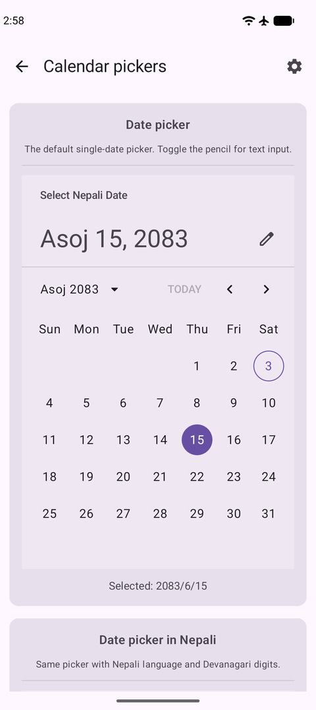&nbsp;
  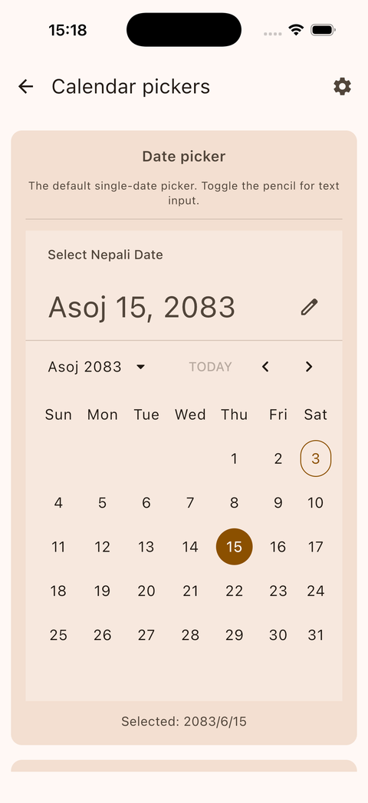&nbsp;
  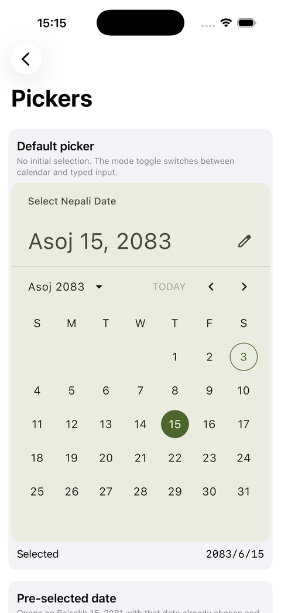
</p>
<p align="center">
  <em>Android &nbsp;·&nbsp; iOS (Compose Multiplatform) &nbsp;·&nbsp; iOS (native SwiftUI)</em>
</p>

<p align="center">
  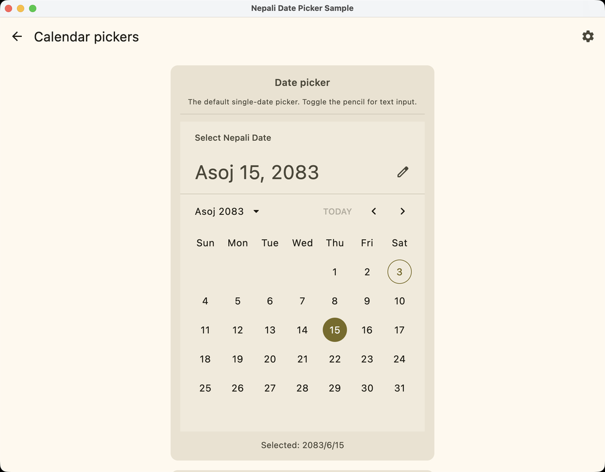&nbsp;
  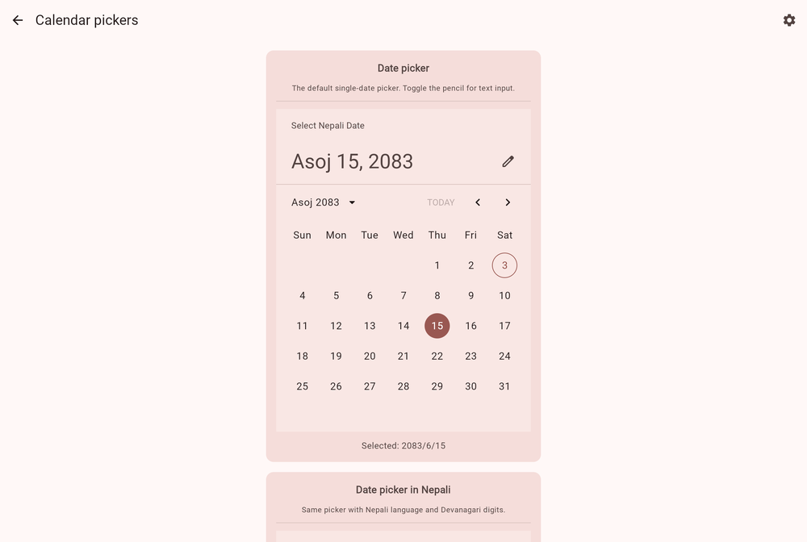
</p>
<p align="center">
  <em>Desktop (JVM) &nbsp;·&nbsp; Web (Compose / Wasm)</em>
</p>

<p align="center">
  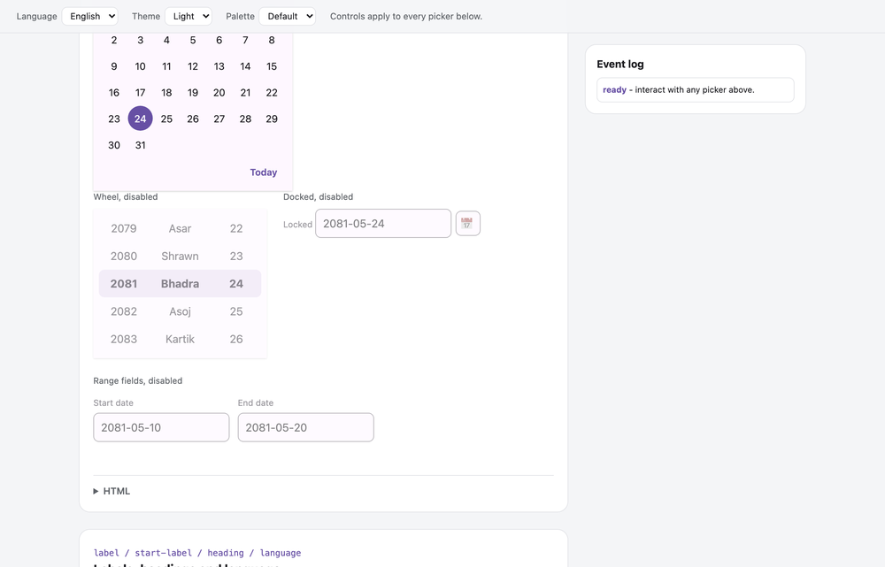
</p>
<p align="center">
  <em>Web (<code>&lt;nepali-date-picker&gt;</code> custom element, no framework)</em>
</p>

### Pickers

A calendar grid, the same grid localized into Nepali with Devanagari digits, Bikram Sambat with the
Gregorian day under each cell, the scrolling wheel, a compact field with a dropdown calendar, a
range in a modal, a modal single-date dialog, and typed entry.

<p align="center">
  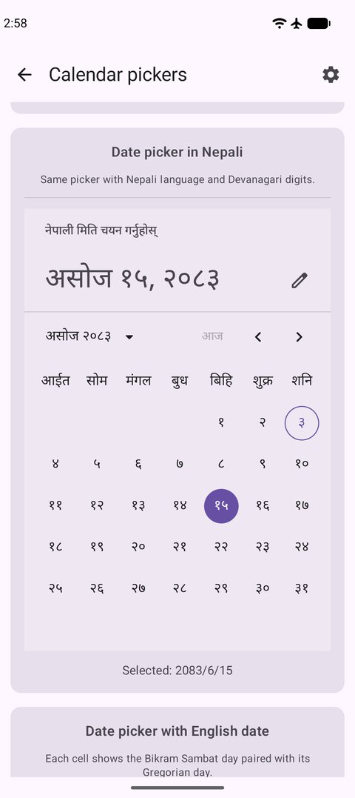&nbsp;
  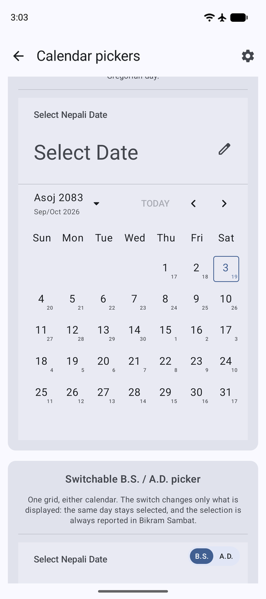&nbsp;
  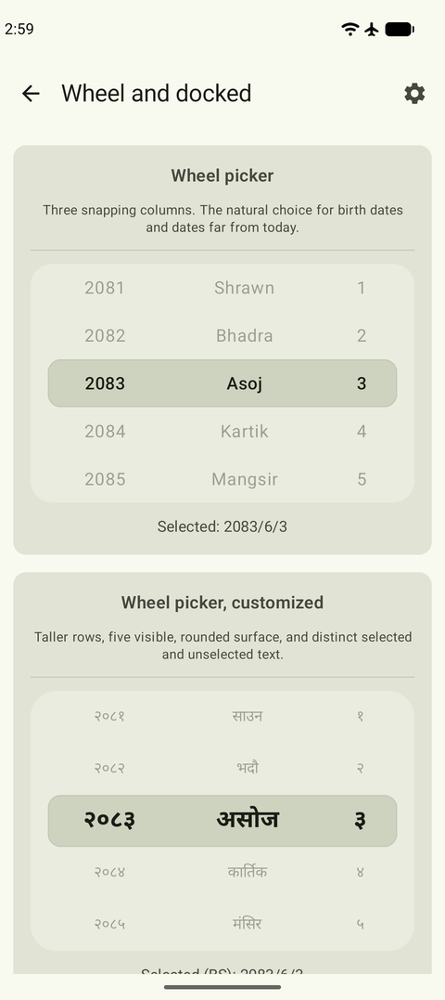&nbsp;
  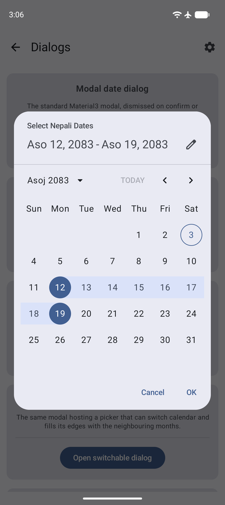&nbsp;
  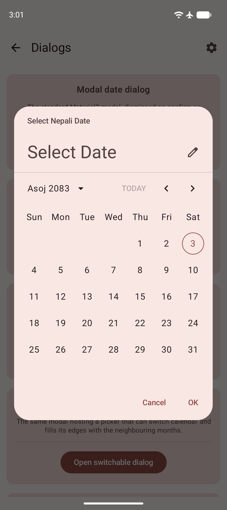
</p>
<p align="center">
  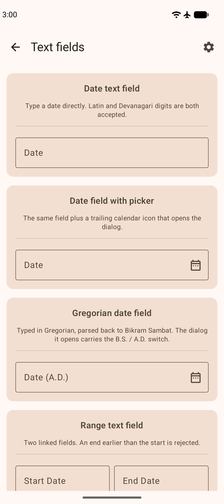&nbsp;
  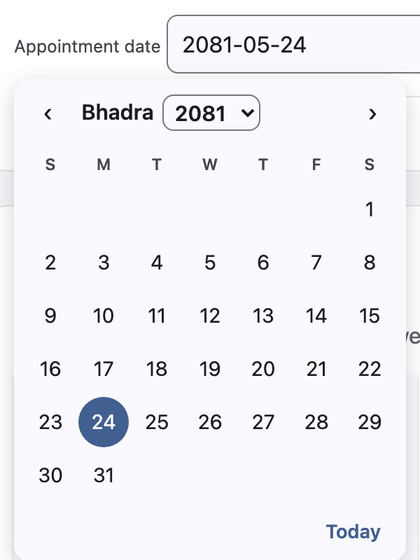
</p>

### Events and closures

A provider supplies the days. The picker colours a closed day, dots an event, and layers the two;
`NepaliCalendarPolicy` answers the working-day arithmetic behind it. No event data ships with the
library.

<p align="center">
  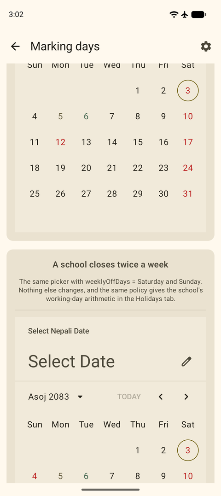&nbsp;
  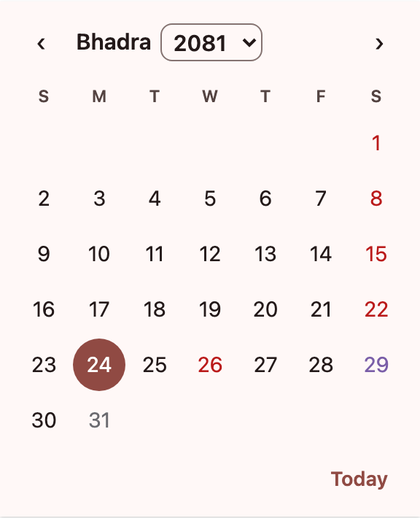
</p>

### Theming

The pickers take every colour from `MaterialTheme.colorScheme`, so a palette swap restyles the
grids, the fields, the dialogs and the event markers together. The same six palettes drive the
Compose sample, the SwiftUI sample and the web components.

<p align="center">
  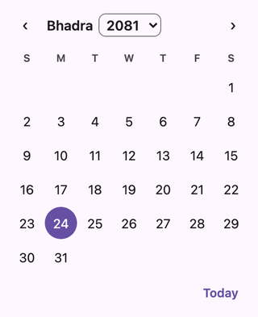&nbsp;
  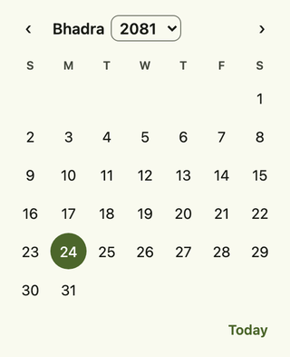&nbsp;
  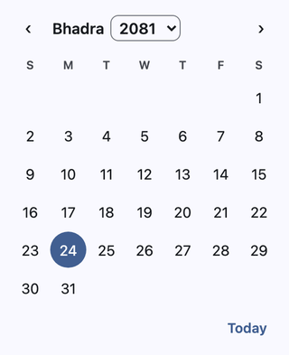&nbsp;
  &nbsp;
  &nbsp;
  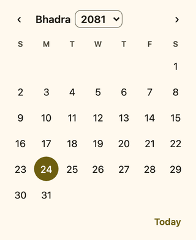
</p>
<p align="center">
  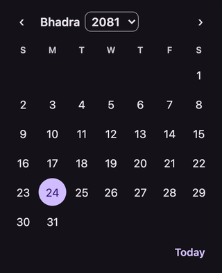&nbsp;
  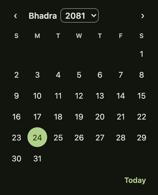&nbsp;
  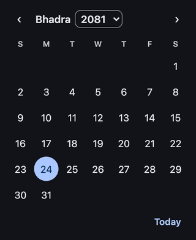&nbsp;
  &nbsp;
  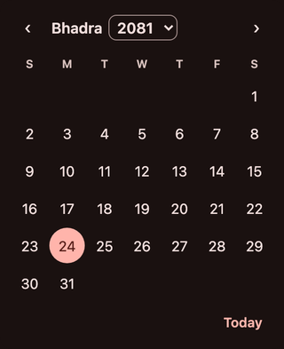&nbsp;
  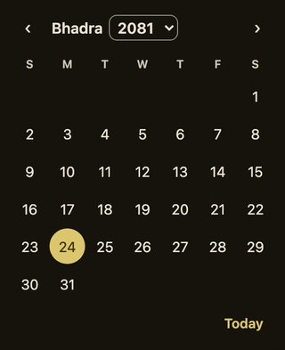
</p>

### Dark mode

Light and dark are the same code path: the scheme changes, nothing else does.

<p align="center">
  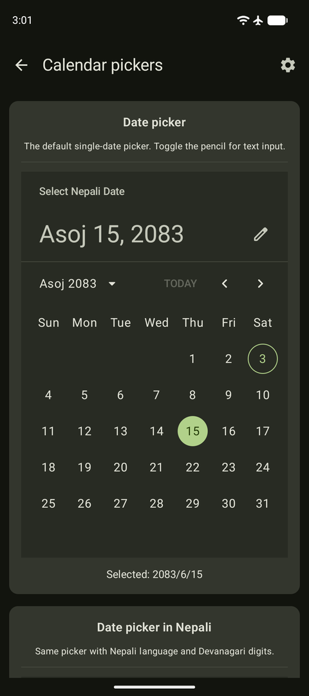&nbsp;
  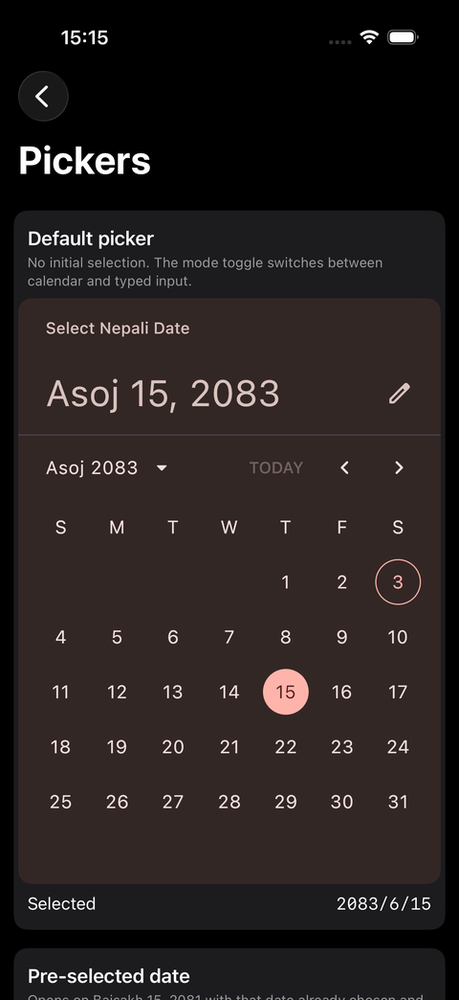&nbsp;
  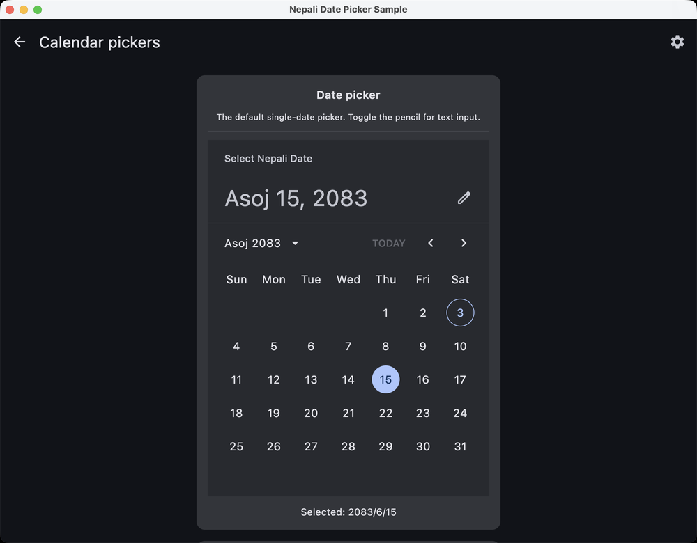
</p>

> Reproduce any of these by running the sample for that platform and using the appearance menu in
> its top bar. See the [samples guide](./sample/README.md).

## Support

- Found a bug, or want a feature? [Open an issue](https://github.com/shivathapaa/Nepali-Date-Picker/issues/new/choose).
- Contributing directly is welcome. Read [CONTRIBUTING.md](https://github.com/shivathapaa/Nepali-Date-Picker/blob/main/CONTRIBUTING.md) first.
- Sharing the project, or starring the repository, helps others find it.

Thanks to the Google and JetBrains teams behind Material3, Jetpack Compose and kotlinx-datetime.

## License

Licensed under the [Mozilla Public License 2.0 (MPL 2.0)](https://github.com/shivathapaa/Nepali-Date-Picker/blob/main/LICENSE).

MPL 2.0 permits use, modification and distribution, including inside a proprietary application, on
one condition: if you modify a file of this library, the source of that modification must be made
available to everyone who receives the modified library, under this same license. Your own files
are unaffected.

See the [LICENSE](https://github.com/shivathapaa/Nepali-Date-Picker/blob/main/LICENSE) file for the
full text.

