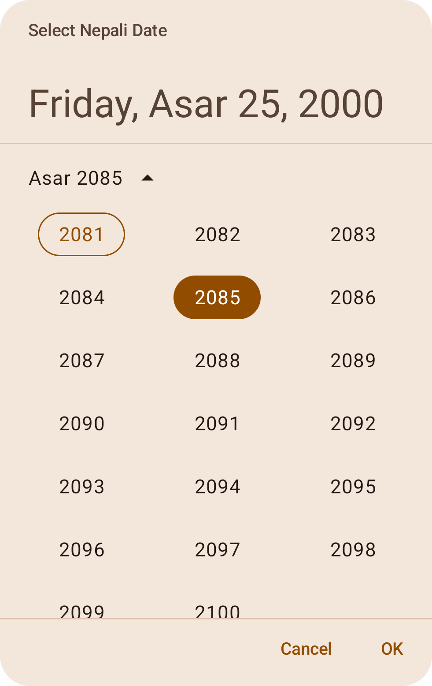
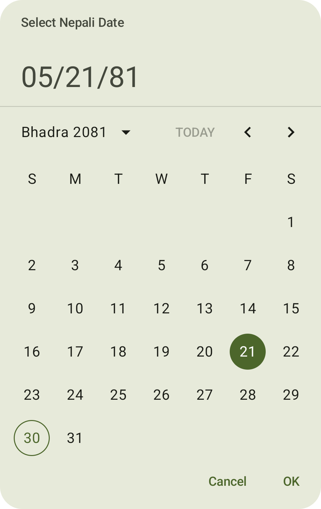
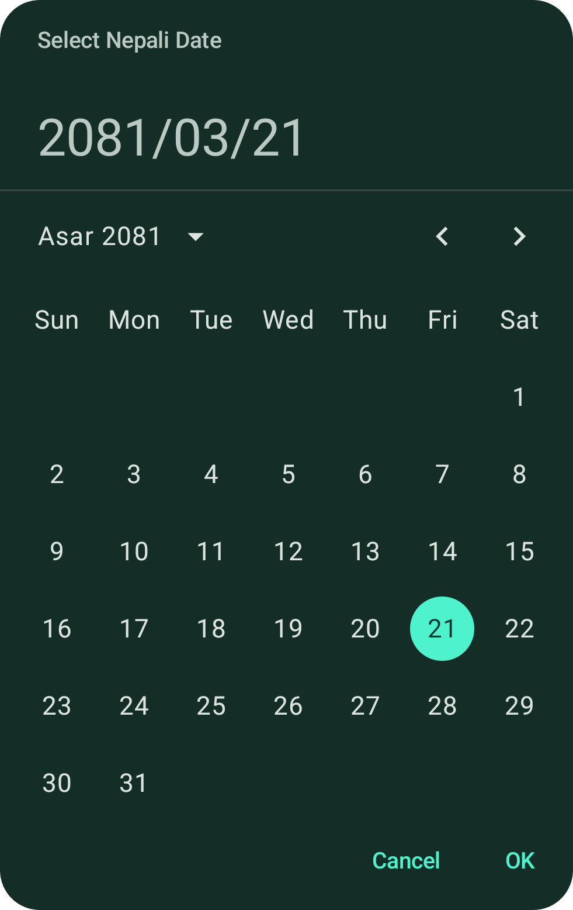
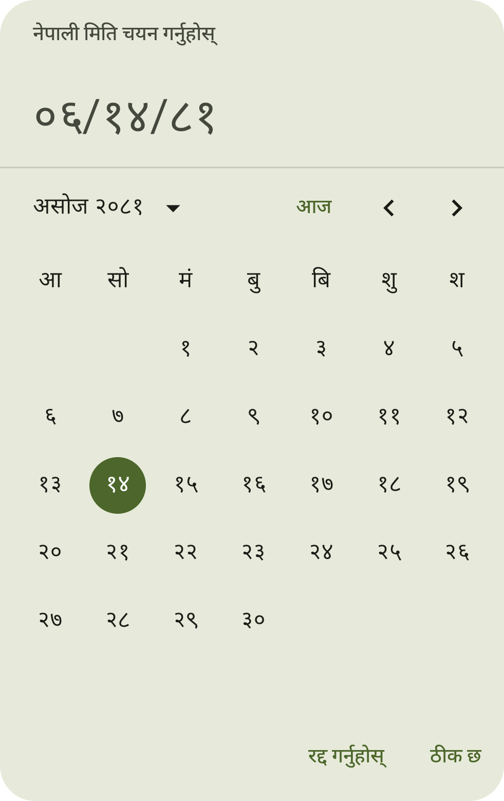

# Nepali-Date-Picker (Android and/or iOS) - KMP

<p align="center">
  
</p>

KMP Nepali Date Picker for both Android and/or iOS which aligns with the Material3 Date Picker. This library provides UI and various utilities to work with Nepali Dates, and acts as a bridge between Nepali Calendar and Gregorian Calendar.

<br>

<p align="center">
  <a href="https://github.com/shivathapaa/Nepali-Date-Picker/releases">
    </a>&nbsp;
  <a href="https://github.com/shivathapaa/Nepali-Date-Picker/blob/main/LICENSE">
    </a>&nbsp;
  <a href="https://medium.com/@shivathapaa/nepali-date-picker-for-android-and-ios-kotlin-multiplatform-a739ea0caf47">
    </a>
</p>
<br>
<p align="center">
<!--     <a href="https://github.com">
    </a>&nbsp; -->
  <a href="https://central.sonatype.com/namespace/io.github.shivathapaa">
  </a>&nbsp;
  <a href="#screenshots">
  </a>&nbsp;
  <a href="https://github.com/shivathapaa/Nepali-Date-Picker/releases/download/2.1.0-alpha03/NepaliDatePicker.Multi-Theme.-v2.1.0-alpha03.apk">
    </a>
</p>
<br>

<details>
  <summary><b>Table of Contents</b></summary>

* [Design overview](#design-overview)
* [Types/features](#typesfeatures)
* [Using in your projects](#using-in-your-projects)
    * [Common Gradle](#common-gradle)
    * [Android](#android)
    * [iOS](#ios)
    * [Desktop/Web](#desktopweb)
* [License](#license)
* [Brief simple example usage](#brief-simple-example-usage)
* [Detailed examples to explore more](#detailed-examples-to-explore-more)
* [Utilities to explore](#utilities-to-explore)
* [Support](#support)
* [Screenshots](#screenshots)
</details>

## Design overview

This library strictly follows `Material` (Material3) design principles. Considering UI/UX, `nepali-date-picker` aligns with new `androidx.compose.material3.DatePicker`.

If you are familiar with the Material3 Date Picker then you will find it very similar, and you can adapt it with little to no time.

This library puts Nepali Calendar in light as OpenSource for developers involved in both Android and/or iOS and/or KMP.

You can use this library independent to any platform or in common Kotlin Multiplatform code.

## Types/Features

This library provides variety of features for working with date picker. It is not only limited to date picker but many utilities that serves its purpose with extended support for date and time.
Few of them are listed below:

- `CustomCalendar` - Calendar which represents both English and Nepali dates.
- `SimpleDate` and  `SimpleTime` - Simple representation of date and time.
- `NepaliMonthCalendar` - Nepali Month Calendar which consists of the month details.
- `NepaliDateLocale` - To control language, dateFormat, weekDayName, and monthName.
- `NepaliDatePickerLang` - Set of supported language (English & Nepali for now).
- `NepaliDateConverter` - Provides utilities for date conversions (english to nepali and vice versa), get formatted date(6), get time, get date-time in ISO 8601 format, calculate days in between two date, and many more.
- `NepaliSelectableDates` - To control selectable dates i.e. enable/disable certain dates.
- `NepaliDatePickerColors` - Takes `Material3` ?: **Material** colors by **default**. All the colors it uses are taken from your app colors if you've defined Material colors in your project. Also, there's always `.copy()` to modify the color.

Core UI specific,
- `NepaliDatePicker()` - Lets you pick a Nepali date via a calendar UI which displays Nepali dates.
- `NepaliDatePickerWithEnglishDate()` - Nepali date picker lets you pick a Nepali date via a calendar UI which displays both Nepali and English dates.
- `NepaliDateRangePicker()` - Nepali date picker lets you pick Nepali dates (range) via a calendar UI which displays Nepali dates.
- `NepaliDateRangePickerWithEnglishDate()` - Nepali date picker lets you pick Nepali dates (range) via a calendar UI which displays both Nepali and English dates.
- `rememberNepaliDatePickerState()` - To read, write, and manage state of the **date picker** i.e., NepaliDatePicker()_ and NepaliDatePickerWithEnglishDate()_.
- `rememberNepaliDateRangePickerState()` - To read, write, and manage state of the **date range picker** i.e., _NepaliDateRangePicker()_ and _NepaliDateRangePickerWithEnglishDate()_.
- `NepaliDatePickerDialog()` - A dialog for displaying all four types of date and date range pickers. (or, you can directly use in the layout.)

## Using in your projects

The library is published to [Maven Central. You can find all artifacts here.](https://central.sonatype.com/namespace/io.github.shivathapaa)

This library is almost stable with the release of version `2.0.0-rc01`. However, it currently depends on JetBrains Compose `1.7.0-beta01 or later`.
I expect to release a fully stable version once JetBrains Compose reaches a stable release. In the meantime, `2.0.0-rc01` is considered `stable` and highly reliable for production use.

> If you encounter version conflicts using this library, you can solve this in two ways:
> - Use an earlier version of the Nepali-Date-Picker library (`2.0.0-beta06 or before`) if stability is required and your project is using a lower version of JetBrains Compose or Android Compose.
> - Alternatively, you can update your JetBrains Compose or Android Compose version to `1.7.0-beta01 or later` to resolve the conflict.
    For more details on this release, check [this release](https://github.com/shivathapaa/Nepali-Date-Picker/releases/tag/2.0.0-rc01).

### Common Gradle

In multiplatform projects, add a dependency to the commonMain source set dependencies

```kotlin
kotlin {
    sourceSets {
        commonMain {
            dependencies {
                implementation("io.github.shivathapaa:nepali-date-picker:2.0.0-rc01")
            }
        }
    }
}
```

### Android

To add the nepali-date-picker library to your Android project, include the following dependency in your module/app-level build.gradle file:

```kotlin
// For app using Kotlin version before 2.0.0

dependencies {
    implementation("io.github.shivathapaa:nepali-date-picker-android:2.0.0-rc01")
}

// Or use version catalog like below
```


```kotlin
// For app using Kotlin version after 2.0.0

// Add the Compose compiler Gradle plugin to the Gradle version catalog
[versions]
# ...
kotlin = "2.0.20"
nepaliDatePickerAndroid = "2.0.0-rc01"

[libraries]
nepali-date-picker-android = { module = "io.github.shivathapaa:nepali-date-picker-android", version.ref = "nepaliDatePickerAndroid" }

[plugins]
# ...
compose-compiler = { id = "org.jetbrains.kotlin.plugin.compose", version.ref = "kotlin" }


// Add the Gradle plugin to the root/project level build.gradle.kts file
plugins {
    // ...
    alias(libs.plugins.compose.compiler) apply false
}


// Apply the plugin and dependency to app level build.gradle.kts file
plugins {
    // ...
    alias(libs.plugins.compose.compiler)
}

dependencies {
    // ...
    implementation(libs.nepali.date.picker.android)
}
```

### iOS

The library supports various iOS architectures, including `iosarm64`, `iossimulatorarm64`, and `iosx64`.

To integrate this library into your iOS project using CocoaPods:

> Will be updated very soon....

> ### Desktop/Web
> Will work on it if it will be helpful to community. [Let me know](https://github.com/shivathapaa/Nepali-Date-Picker/issues/new/choose) if I should!

## License

This project is licensed under [Mozilla Public License 2.0 (MPL 2.0)](https://github.com/shivathapaa/Nepali-Date-Picker/blob/main/LICENSE)
```
Mozilla Public License 2.0 (MPL 2.0)

This project is licensed under the Mozilla Public License 2.0 (MPL 2.0).
MPL 2.0 is a permissive open-source license that allows you to use, modify,
and distribute the code, provided that any modifications to the MPL-licensed
files are also made available under the same license and shared with the community.
This license ensures that improvements to the code remain open and accessible to the community.
```

```
Additional Modification and Distribution Terms

To ensure that improvements to the core library benefit the community,
I would like to emphasize the following:

1. Library Modifications:
Any modifications made to the files of this Library (the "Covered Software") are
subject to the terms of this License. If you modify the Library, you must make the
source code of your modifications available to all recipients of the modified Library
under the terms of this License.

2. Larger Works:
Larger works that incorporate this Library may be licensed under different terms,
provided that modifications to the Library files themselves remain subject to this
License and are made available to all recipients of the modified Library.
```
For more details, see the [LICENSE](https://github.com/shivathapaa/Nepali-Date-Picker/blob/main/LICENSE) file.


##  Brief simple example usage

This library uses a `1-based index` where 1 represents Sunday or January/Baisakh, 7 represents Saturday or July/Kartik, and 12 represents December/Chaitra.

Don't forget about the **DateRange** before using. 

You can check this inside library under `NepaliDatePickerDefaults.NepaliYearRange` and `NepaliDatePickerDefaults.EnglishYearRange`

```
// This will be changed overtime to support wider dates.
EnglishYearRange: IntRange = IntRange(1913, 2043)
NepaliYearRange: IntRange = IntRange(1970, 2100) 
```

For detailed examples and utilities, [explore more](#detailed-examples-to-explore-more).

#### Nepali Date Picker and Nepali Date Range Picker
```kotlin
val defaultNepaliDatePickerState = rememberNepaliDatePickerState()

NepaliDatePicker(state = defaultNepaliDatePickerState)
// NepaliDatePickerWithEnglishDate(defaultNepaliDatePickerState)

val defaultNepaliDateRangePickerState = rememberNepaliDateRangePickerState()

// NepaliDateRangePicker(defaultNepaliDateRangePickerState)
// NepaliDateRangePickerWithEnglishDate(defaultNepaliDateRangePickerState)
```

#### Using directly in your main layout
```kotlin
// NepaliDatePicker
Column {
    NepaliDatePicker(rememberNepaliDatePickerState())
}

// NepaliDatePickerWithEnglishDate
Column {
    NepaliDatePickerWithEnglishDate(rememberNepaliDatePickerState())
}

// NepaliDateRangePicker
Column {
    NepaliDateRangePicker(rememberNepaliDateRangePickerState())
}

// NepaliDateRangePickerWithEnglishDate
Column {
    NepaliDateRangePickerWithEnglishDate(rememberNepaliDateRangePickerState())
}
```

#### Nepali Date Picker Dialog

```kotlin
var showNepaliDatePickerDialog by remember { mutableStateOf(false) }
val defaultNepaliDatePickerState = rememberNepaliDatePickerState() // Use separate state for each
val defaultNepaliDateRangePickerState = rememberNepaliDateRangePickerState() // Use separate state for each

// You can use provided template or use any composable you like for both confirm and dismiss button
if (showNepaliDatePickerDialog) {
    NepaliDatePickerDialog(
        confirmButton = {
            NepaliDatePickerDefaults.DialogButton(
                text = "OK",
                onButtonClick = { showNepaliDatePickerDialog = false }
            )
        },
        dismissButton = {
            NepaliDatePickerDefaults.DialogButton(
                text = "Cancel",
                onButtonClick = { showNepaliDatePickerDialog = false }
            )
        },
        onDismissRequest = { showNepaliDatePickerDialog = false }
    ) {
        NepaliDatePicker(state = defaultNepaliDatePickerState)
        // NepaliDatePickerWithEnglishDate(defaultNepaliDatePickerState)
        // NepaliDateRangePicker(defaultNepaliDateRangePickerState)
        // NepaliDateRangePickerWithEnglishDate(defaultNepaliDateRangePickerState)
    }
}

```

#### Using rememberNepaliDatePickerState() and rememberNepaliDateRangePickerState()

```kotlin
val defaultNepaliDatePickerState = rememberNepaliDatePickerState()
val defaultNepaliDateRangePickerState = rememberNepaliDateRangePickerState()

val customizedDatePickerState = rememberNepaliDatePickerState(
    initialSelectedDate = SimpleDate(2082, 2, 16),
    initialDisplayedMonth = SimpleDate(2082, 3),
    yearRange = IntRange(2082, 2083),
    nepaliSelectableDates = object : NepaliSelectableDates {
        override fun isSelectableDate(customCalendar: CustomCalendar): Boolean {
            return customCalendar.dayOfWeek != 7 || customCalendar.dayOfMonth != 12
        }

        override fun isSelectableYear(year: Int): Boolean {
            return (year % 5 != 0)
        }
    },
    locale = NepaliDateLocale(language = NepaliDatePickerLang.NEPALI)
)
val customizedNepaliDateRangePickerState = rememberNepaliDateRangePickerState(
    initialSelectedStartNepaliDate = SimpleDate(2081, 2, 11),
    initialSelectedEndNepaliDate = SimpleDate(2083, 4, 25),
    initialDisplayedMonth = SimpleDate(2081, 1, 1),
    yearRange = IntRange(2078, 2084),
    nepaliSelectableDates = NepaliDateConverter.BeforeDateSelectable(
        simpleDate = SimpleDate(2083, 12, 10),
        includeDate = true
    ),
    locale = NepaliDatePickerDefaults.DefaultLocale
)

// Or you can utilize helper function (BeforeDateSelectable or AfterDateSelectable or DateRangeSelectable) to disable and enable dates
val datePickerStateWithDateLimiter = rememberNepaliDatePickerState(
    nepaliSelectableDates = NepaliDateConverter.DateRangeSelectable(
        SimpleDate(2078, 1, 15), SimpleDate(2085, 1, 15)
    )
)

// For Range, minDate and maxDate should make sense i.e., minDate should be less than or equal to maxDate
val nepaliDatePickerStateWithRangeSelectable = rememberNepaliDatePickerState(
    nepaliSelectableDates = DateRangeSelectableDates(
        SimpleDate(2081, 2, 11),
        SimpleDate(2082, 1, 29)
    )
)

NepaliDatePicker(state = defaultNepaliDatePickerState)

NepaliDatePicker(
    state = customizedDatePickerState,
    colors = NepaliDatePickerDefaults.colors().copy(
        containerColor = MaterialTheme.colorScheme.surface
    )
)

NepaliDatePicker(state = datePickerStateWithDateLimiter)

NepaliDatePicker(state = nepaliDatePickerStateWithRangeSelectable)
// NepaliDatePickerWithEnglishDate(customizedDatePickerState)

NepaliDateRangePicker(customizedNepaliDateRangePickerState)
// NepaliDateRangePickerWithEnglishDate(customizedNepaliDateRangePickerState)
```

## Detailed examples to explore more
Here are some examples to help you get started. The library's documentation provides further, detailed explanations.

This library uses a `1-based index` where 1 represents Sunday or January/Baisakh, 7 represents Saturday or July/Kartik, and 12 represents December/Chaitra.

Don't worry, it's not too complex! In the examples below, I've utilized various customization options to showcase multiple use cases, which might seem overwhelming. However, your specific needs may not require all of these options.

For basic use cases, [refer to the section above](#brief-simple-example-usage). Or, jump into [utilities](#utilities-to-explore).

#### Nepali Date Picker in main layout
```kotlin
// Simple use without dialog
NepaliDatePicker(rememberNepaliDatePickerState())
NepaliDatePickerWithEnglishDate(rememberNepaliDatePickerState())
NepaliDateRangePicker(rememberNepaliDateRangePickerState())
NepaliDateRangePickerWithEnglishDate(rememberNepaliDateRangePickerState())

// Defining state in variable
val datePickerState = rememberNepaliDatePickerState()
    
NepaliDatePicker(datePickerState)
// NepaliDatePickerWithEnglishDate(datePickerState)
    
val dateRangePickerState = rememberNepaliDateRangePickerState()
    
NepaliDateRangePicker(dateRangePickerState)
// NepaliDateRangePickerWithEnglishDate(dateRangePickerState)

// Customizing color
NepaliDatePicker(
    state = rememberNepaliDatePickerState(),
    colors = NepaliDatePickerDefaults.colors()
        .copy(
            containerColor = MaterialTheme.colorScheme.surfaceContainer,
            dayContentColor = MaterialTheme.colorScheme.onSurface
        )
)
```

#### Using with dialog
```kotlin
// Using with dialog
var showNepaliDatePickerDialog by remember { mutableStateOf(false) }
val nepaliDatePickerState = rememberNepaliDatePickerState(locale = NepaliDateLocale(language = NepaliDatePickerLang.NEPALI))

Button(onClick = { showNepaliDatePickerDialog = true }) { Text(text = "Show Dialog") }

// You can use provided template or use any composable you like for both confirm and dismiss button
if (showNepaliDatePickerDialog) {
    NepaliDatePickerDialog(
        onDismissRequest = { showNepaliDatePickerDialog = false },
        confirmButton = {
            NepaliDatePickerDefaults.DialogButton(
                text = "OK",
                onButtonClick = { showNepaliDatePickerDialog = false }
            )
        },
        dismissButton = {
            NepaliDatePickerDefaults.DialogButton(
                text = "Cancel",
                onButtonClick = { showNepaliDatePickerDialog = false }
            )
        }
    ) {
        NepaliDatePicker(state = nepaliDatePickerState)
    }
}
```

#### Using rememberNepaliDatePickerState() for different cases (similar for rememberNepaliDateRangePickerState())
```kotlin
// Using rememberNepaliDatePickerState() for different cases 
val todayNepaliDate = NepaliDateConverter.todayNepaliDate

// Remember that, "BeforeSelectable", "AfterSelectable", and "RangeSelectable" are helper Selectables
// that helps with enabling and disabling dates before or after today, or before or
// after certain dates, or in between certain dates, and many other use cases.
// You have full control of the dates that you want to enable or disable.

// Using Before Selectable
val customDatePickerStateWithBeforeSelectable = rememberNepaliDatePickerState(
    initialSelectedDate = SimpleDate(2080, 3, 21),
    initialDisplayedMonth = SimpleDate(2081, 1, 1),
    yearRange = IntRange(1998, 2100),
    nepaliSelectableDates = NepaliDateConverter.BeforeDateSelectable(
        simpleDate = SimpleDate(
            todayNepaliDate.year,
            todayNepaliDate.month,
            todayNepaliDate.dayOfMonth
        ), includeDate = true
    ),
    locale = NepaliDateLocale(
        language = NepaliDatePickerLang.NEPALI,
        dateFormat = NepaliDateFormatStyle.SHORT_YMD,
        weekDayName = NameFormat.MEDIUM,
        monthName = NameFormat.FULL
    )
)

// Using After selectable
val customDatePickerStateWithAfterSelectable = rememberNepaliDatePickerState(
    yearRange = IntRange(1979, 2094),
    nepaliSelectableDates = NepaliDateConverter.AfterDateSelectable(
        simpleDate = SimpleDate(
            todayNepaliDate.year, todayNepaliDate.month, todayNepaliDate.dayOfMonth
        ),
        includeDate = false
    ),
    locale = NepaliDateLocale(
        language = NepaliDatePickerLang.ENGLISH,
        dateFormat = NepaliDateFormatStyle.COMPACT_YMD,
        weekDayName = NameFormat.FULL
    )
)

// Using Range selectable
val customDatePickerStateWithRangeSelectable = rememberNepaliDatePickerState(
    initialDisplayedMonth = SimpleDate(2081, 12, 12),
    yearRange = IntRange(2079, 2090),
    nepaliSelectableDates = NepaliDateConverter.DateRangeSelectable(
        minDate = SimpleDate(
            todayNepaliDate.year, todayNepaliDate.month, todayNepaliDate.dayOfMonth
        ),
        maxDate = SimpleDate(2090, 1, 1),
        includeMinDate = false,
        includeMaxDate = true
    ),
    locale = NepaliDateLocale(
        language = NepaliDatePickerLang.ENGLISH,
        dateFormat = NepaliDateFormatStyle.COMPACT_YMD,
        weekDayName = NameFormat.FULL
    )
)

// Using your own selectable preferences
val customSelectableDatePickerState = rememberNepaliDatePickerState(
    nepaliSelectableDates = object : NepaliSelectableDates {
        override fun isSelectableDate(customCalendar: CustomCalendar): Boolean {
            return customCalendar.month != 3 || (customCalendar.dayOfWeek != 7 && customCalendar.dayOfMonth != 15)
        }

        override fun isSelectableYear(year: Int): Boolean {
            return year >= 2054
        }
    }
)
```

### Utilities to explore
The library itself provides more detailed explanation and examples, so do checkout library's documentation for each property you use.

#### Backbone of this library
```kotlin
// Simple date representation
data class SimpleDate(
    val year: Int,
    val month: Int,
    val dayOfMonth: Int = 1
)

// Simple time representation 
data class SimpleTime(
    val hour: Int,
    val minute: Int,
    val second: Int,
    val nanosecond: Int
)

// Custom Calendar for both English and Nepali dates
data class CustomCalendar(
    val year: Int,
    val month: Int,
    val dayOfMonth: Int,
    val era: Int,  // 1 for AD, 2 for BS
    val firstDayOfMonth: Int,
    val lastDayOfMonth: Int,
    val totalDaysInMonth: Int,
    val dayOfWeekInMonth: Int,
    val dayOfWeek: Int,
    val dayOfYear: Int,
    val weekOfMonth: Int,
    val weekOfYear: Int
)

// Nepali Month Calendar for month details
data class NepaliMonthCalendar(
    val year: Int,
    val month: Int,
    val totalDaysInMonth: Int,
    val firstDayOfMonth: Int,
    val lastDayOfMonth: Int,
    val daysFromStartOfWeekToFirstOfMonth: Int = firstDayOfMonth - 1
)

// there are various extension function readily available to utilize will all of them.
```

#### Get today's date
```kotlin
// Get today's date
val todayNepaliDate = NepaliDateConverter.todayNepaliDate

val todayEnglishDate = NepaliDateConverter.todayEnglishDate
```

#### Get current time
```kotlin
// Get current time
val currentTime = NepaliDateConverter.currentTime // returns SimpleTime
```

#### Date conversions
```kotlin
// Date conversions
val convertedNepaliDate = NepaliDateConverter.convertEnglishToNepali(2021, 6, 21) // returns CustomCalendar

val convertedEnglishDate = NepaliDateConverter.convertNepaliToEnglish(2081, 3, 21) // returns CustomCalendar
```

### Get CustomCalendar for details using Nepali Date
```kotlin
NepaliDateConverter.getNepaliCalendar(2082, 4, 16) // returns CustomCalendar
```

#### Get month details
```kotlin
// Get month details
val totalDaysInMagh2081 = NepaliDateConverter.getTotalDaysInNepaliMonth(2081, 10) // returns 30 (Int)

val getCompleteDetailsOfAsar2078Month = NepaliDateConverter.getNepaliMonthCalendar(2078, 3) // returns NepaliMonthCalendar
```

#### Date comparison
```kotlin
// Date comparison
val compareDate = NepaliDateConverter.compareDates(convertedNepaliDate, SimpleDate(2090, 2, 12)) // returns 1, 0, -1 according to conditions
```

#### Get number of days between two dates
```kotlin
// Get number of days between two days
val noOfDaysBetweenTwoNepaliDates = NepaliDateConverter.getNepaliDaysInBetween(SimpleDate(1998, 11, 23), SimpleDate(2098, 4, 21))  // returns 36313

val noOfDaysBetweenTwoEnglishDates = NepaliDateConverter.getEnglishDaysInBetween(SimpleDate(2009, 6, 21), SimpleDate(2500, 3, 23)) // returns 179244
```

#### Format date time into ISO 2601 UTC to save date in database or have reference
```kotlin
// Format date time into ISO 2601 UTC to save date in database or have reference for other timezone calculations
val currentTime = NepaliDateConverter.currentTime
val todayEnglishDate = NepaliDateConverter.todayEnglishDate
val todayNepaliDate = NepaliDateConverter.todayNepaliDate

val formattedEnglishDate = NepaliDateConverter.formatEnglishDateNepaliTimeToIsoFormat(todayEnglishDate, currentTime) // returns "2024-09-09T23:22:21Z"
val formattedNepaliDate = NepaliDateConverter.formatNepaliDateTimeToIsoFormat(todayNepaliDate.toSimpleDate(), currentTime) // returns "2024-09-09T23:22:21Z"
```

#### Get names of the weekdays, and month according to your choice
```kotlin
// Get names of the weekdays, and month according to your choice
val weekday = NepaliDateConverter.getWeekdayName(2, NameFormat.FULL, NepaliDatePickerLang.NEPALI) // returns "सोमबार"
val weekdayEnglish = NepaliDateConverter.getWeekdayName(5, NameFormat.MEDIUM, NepaliDatePickerLang.ENGLISH) // returns Thu

val nepaliMonthName = NepaliDateConverter.getMonthName(12, NameFormat.FULL, NepaliDatePickerLang.NEPALI) // returns "चैत"
val nepaliMonthNameInEnglish = NepaliDateConverter.getMonthName(3, NameFormat.SHORT, NepaliDatePickerLang.ENGLISH) // returns Asa

val englishMonthName = NepaliDateConverter.getEnglishMonthName(6, NameFormat.FULL, NepaliDatePickerLang.NEPALI) // returns "जुन"
```

#### Format date to make ready for UI
```kotlin
// Format date to make ready for UI
val currentTime = NepaliDateConverter.currentTime
val todayEnglishDate = NepaliDateConverter.todayEnglishDate
val todayNepaliDate = NepaliDateConverter.todayNepaliDate

val customFormatLocale = NepaliDateLocale(
    language = NepaliDatePickerLang.NEPALI,
    dateFormat = NepaliDateFormatStyle.FULL,
    weekDayName = NameFormat.FULL,
    monthName = NameFormat.FULL
)

val nepaliFormattedDate = NepaliDateConverter.formatNepaliDate(todayNepaliDate, customFormatLocale) // returns "सोमबार, असार २१, २०८४"
val nepaliDefaultFormattedDate = NepaliDateConverter.formatNepaliDate(todayNepaliDate, NepaliDatePickerDefaults.DefaultLocale)  // returns "Asar 21, 2082"
val todayFormattedDate = NepaliDateConverter.formatNepaliDate(todayNepaliDate) // returns "Asar 21, 2082"
val formattedNepaliDate = NepaliDateConverter.formatNepaliDate(2081, 3, 21, 5, NepaliDatePickerDefaults.DefaultLocale) // returns "Asar 21, 2081"
val englishFormattedDate = NepaliDateConverter.formatEnglishDate(todayEnglishDate.year, todayEnglishDate.month, todayEnglishDate.dayOfMonth, 5, customFormatLocale) // returns "बिहिबार, अक्टोबर ३, २०२४
```

#### Format time to make ready for UI
```kotlin
// Format time to make ready for UI
val formattedNepaliTime = NepaliDateConverter.getFormattedTimeInNepali(simpleTime = currentTime, use12HourFormat = true) // returns "राति १२ : ०४"
val formattedEnglishTime = NepaliDateConverter.getFormattedTimeInEnglish(simpleTime = currentTime, use12HourFormat = false) // returns "0:04"
```

#### Localize strings to English or Nepali
```kotlin
// Localize strings to English or Nepali
val nepaliString = "Today is 2024".convertToNepaliNumber() // returns "Today is २०२४"
val nepaliStringOnlyDigits = "2024".convertToNepaliNumber() // returns "२०२४"
val englishString = "२०२४ सोमबार".convertToEnglishNumber() // returns "2024 सोमबार"

val localizeString = "Today is 2024".localizeNumber(NepaliDatePickerLang.NEPALI) // returns "Today is २०२४"
```

#### Replace delimiter for displaying or saving as you prefer
```kotlin
// Replace delimiter for displaying or saving as you prefer
val originalDate = "2024/06/21"
val newDelimiter = "-"
val formattedDate = NepaliDateConverter.replaceDelimiter(originalDate, newDelimiter) // returns "2024-06-21"

val originalDate = "२०२४/०६/२१"
val newDelimiter = "-"
val formattedDate = NepaliDateConverter.replaceDelimiter(originalDate, newDelimiter) // returns "२०२४-०६-२१"

val originalTime = "09:45 AM"
val newDelimiterSpace = " "
val oldDelimiter = ":"
val formattedTimeWithSpace = NepaliDateConverter.replaceDelimiter(originalTime, newDelimiterSpace, oldDelimiter) // returns "09 45 AM"
```


And there is always more to explore... ;)

## Support

You can contribute to this project in several ways:

- Have an idea for an improvement or a new feature? I'm open to suggestions! Feel free to suggest changes, request enhancements, or report issues [here](https://github.com/shivathapaa/Nepali-Date-Picker/issues/new/choose).
- Share the project with your network to help others discover it.
- Want to contribute directly? You're welcome to open a pull request! Be sure to review the [CONTRIBUTING.md](https://github.com/shivathapaa/Nepali-Date-Picker/blob/main/CONTRIBUTING.md) guide before getting started.
- Show your support by giving this repository a Star⭐. It means a lot! 😊

> Thanks to Google and KMP developers for Material3, Jetpack Compose, kotlinx-datetime and other different Apis. :)

## Screenshots

<p align="center">
  &nbsp;
  &nbsp;
  &nbsp;
  
</p>
<br>
<p align="center">
  &nbsp;
  &nbsp;
  &nbsp;
  
</p>
<br>
<p align="center">
  &nbsp;
  &nbsp;
  &nbsp;
  &nbsp;
  &nbsp;
  &nbsp;
  
</p>
<br>
<p align="center">
  &nbsp;
  &nbsp;
  &nbsp;
  &nbsp;
  &nbsp;
  
</p>

### In alpha, [checkout latest releases](https://github.com/shivathapaa/Nepali-Date-Picker/releases)
<p align="center">
  &nbsp;
  &nbsp;
  
</p>

<p align="center">
  &nbsp;
  &nbsp;
  &nbsp;
  
</p>


---

Thank you for star! 😉
